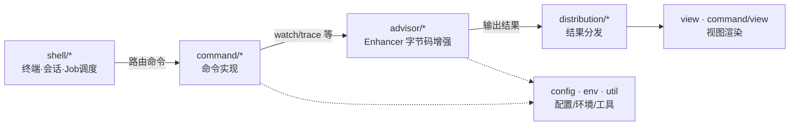
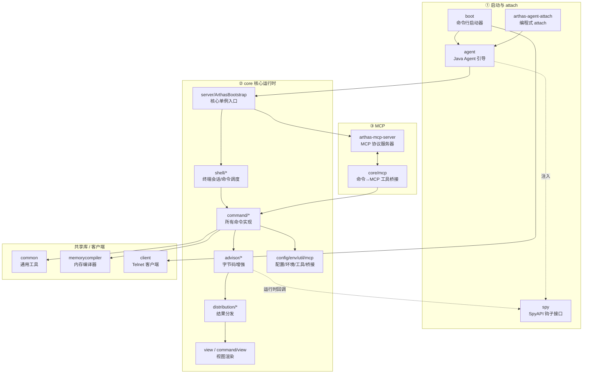

# Part 18 · 上游 arthas 文档摘抄与 K8S 测试床脚本

> 本附录摘录 reference/arthas-docs（上游 arthas MCP 文档摘抄，原则八先决研究产出）+ test-env/k8s（测试床脚本/清单）。

## 上游 arthas 文档摘抄（reference/arthas-docs/）


---

### `reference/arthas-docs/01-启动与attach/agent.md`

```markdown
# agent 模块 · Java Agent 引导

> 路径：`agent/src/main/java/`（包 `com.taobao.arthas.agent` 与 `com.taobao.arthas.agent334`）
> 在整体中的位置：**进入目标 JVM 后的第一站**，负责加载 `arthas-core` 并反射初始化 `ArthasBootstrap`。

## 职责

`arthas-agent.jar` 是被注入目标 JVM 的那个 agent（通过 `-javaagent` 或运行时 attach）。它代码极少，核心就两件事：

1. 提供 JVM Agent 入口：`premain`（启动时挂载）/ `agentmain`（运行时 attach）；
2. 用一个**隔离的类加载器**加载 `arthas-core.jar`，再反射调用 `ArthasBootstrap.getInstance()`，把控制权交给 core。

> 注意包名 `agent334`：这是为了在 JDK 9+（Java 9/10/11...）上使用兼容的 Agent API 而做的版本隔离命名（3.3.4 起的历史遗留命名），实际逻辑与启动方式一致。

## 关键类

### `AgentBootstrap`
`agent/src/main/java/com/taobao/arthas/agent334/AgentBootstrap.java` — **Agent 启动引导类**。

- `premain(String args, Instrumentation inst)` — JVM 启动时 `-javaagent` 入口。
- `agentmain(String args, Instrumentation inst)` — 运行时 attach 入口（`arthas-boot` 走的就是这条）。
- `main(String args, Instrumentation inst)` — **统一启动逻辑**：检查 `SpyAPI.isInited()`（避免重复绑定）→ 解析参数 → 在专用线程里 `bind()`。
- `bind(Instrumentation inst, ClassLoader agentLoader, String args)` — **核心**：反射调用 `ArthasBootstrap.getInstance(inst, args)` 并校验绑定结果。
- `resetArthasClassLoader()` — 重置类加载器，允许下次重新加载（用于热更新 arthas 自身）。

### `ArthasClassloader`
`agent/src/main/java/com/taobao/arthas/agent/ArthasClassloader.java` — **arthas 专用隔离类加载器**（继承 `URLClassLoader`）。

- `ArthasClassloader(URL[] urls)` — 以系统 ClassLoader 的父加载器为父，构造隔离加载器。
- `appendURL(URL)` — 动态追加 jar 到类路径。
- `loadClass(String name, boolean resolve)` — 自定义双亲委派：`java.*`/`sun.*` 等系统类走父加载器，其余**优先自身加载**，保证 arthas 的依赖与目标应用隔离。

## 启动调用链（运行时 attach 场景）

```
boot/ProcessUtils.startArthasCore()
  → 目标 JVM 收到 attach，加载 arthas-agent.jar
    → AgentBootstrap.agentmain(args, inst)
      → AgentBootstrap.main(args, inst)
        · if (SpyAPI.isInited()) return;   // 已在运行则跳过
        · 构造 ArthasClassloader（加载 arthas-core.jar）
        → AgentBootstrap.bind(inst, agentLoader, args)
          · 反射 ArthasBootstrap.getInstance(inst, configureString)
          · 校验返回的 bootstrap 非空
        · SpyAPI 在 core 初始化内被 init()
```

## 与其它模块的关系

- 反射进入 [`core/.../server/ArthasBootstrap`](../02-核心运行时/core/core-入口与全局选项.md) —— 此处是 agent 与 core 的边界。
- 依赖 [`spy`](./spy.md) 的 `SpyAPI.isInited()` 作为"是否已启动"的全局开关。
- 与 [`arthas-agent-attach`](./arthas-agent-attach.md) 是平行的两条 attach 入口（命令行 vs 编程式）。

## 定位提示

> "目标 JVM 被 attach 后，arthas 第一个执行的代码在哪？" → `agent/.../agent334/AgentBootstrap.agentmain()`。
> "arthas 怎么避免污染目标应用的依赖？" → `agent/.../ArthasClassloader.loadClass()`。
```


---

### `reference/arthas-docs/01-启动与attach/arthas-agent-attach.md`

```markdown
# arthas-agent-attach 模块 · 编程式 Attach

> 路径：`arthas-agent-attach/src/main/java/com/taobao/arthas/agent/attach/`
> 在整体中的位置：**第二条 attach 入口**——不需要命令行，直接在应用代码里把 arthas 挂到当前 JVM。

## 职责

当用户希望在自己的应用代码中**主动**启动 arthas（例如 Spring Boot 启动时自动 attach，或集成测试里用），就依赖这个模块。它对外暴露一个极简 API：`ArthasAgent.attach()`。

其内部做的事与 [`agent`](./agent.md) 的运行时 attach 本质相同，只是入口从"外部进程 attach"变成了"同 JVM 内通过 ByteBuddyAgent 拿 Instrumentation"。

> 这也是 `arthas-spring-boot-starter`（不在本文档范围）底层依赖的 attach 实现。

## 关键类

### `ArthasAgent`
`arthas-agent-attach/src/main/java/com/taobao/arthas/agent/attach/ArthasAgent.java` — **编程式 attach 入口**。

- `attach()` — 无参：用默认配置 attach。
- `attach(Map<String,String> configMap)` — 带配置（ip/port/tunnel/认证等）attach。
- `attach(String arthasHome)` — 指定 arthas 目录 attach。
- `init()` — **核心初始化**：
  1. 检查 `SpyAPI.isInited()`（已运行则跳过）；
  2. `ByteBuddyAgent.install()` 获取 `Instrumentation`；
  3. 查找/解压 `arthas-bin.zip`；
  4. 创建 `AttachArthasClassloader`；
  5. 反射调用 `ArthasBootstrap.getInstance(inst, configMap)`。

### `AttachArthasClassloader`
`arthas-agent-attach/src/main/java/com/taobao/arthas/agent/attach/AttachArthasClassloader.java` — **编程式 attach 专用类加载器**，逻辑与 `agent/ArthasClassloader` 一致。

- `AttachArthasClassloader(URL[] urls)` — 隔离加载。
- `appendURL(URL)` / `loadClass(String, boolean)` — 同 `ArthasClassloader` 的双亲委派策略。

> 与 `agent` 模块的 `ArthasClassloader` 几乎是镜像，只是用在"编程式 attach"这条链路上、类加载器来源（解压 zip vs 已有 jar）略有差异。

## 调用链（编程式 attach）

```
应用代码: ArthasAgent.attach(configMap)
  → ArthasAgent.init()
     · if (SpyAPI.isInited()) return;
     · instrumentation = ByteBuddyAgent.install();
     · 解压 arthas-bin.zip → 构造 AttachArthasClassloader
     · 反射 ArthasBootstrap.getInstance(instrumentation, configMap)
        └─ 后续与命令行启动完全相同（见 core 入口文档）
```

## 与其它模块的关系

- 反射进入 [`core/.../server/ArthasBootstrap`](../02-核心运行时/core/core-入口与全局选项.md)。
- 依赖 [`spy`](./spy.md) 的 `SpyAPI.isInited()`。
- 与 [`agent`](./agent.md) 互为替代：命令行走 agent，编程式走本模块。

## 定位提示

> "我想在应用启动时自动 attach arthas，代码怎么写？" → `ArthasAgent.attach(configMap)`。
> "它和命令行 `arthas-boot.jar` 的区别？" → 入口不同，最终都到 `ArthasBootstrap`；本模块在同 JVM 内用 ByteBuddyAgent 拿 Instrumentation，无需外部进程。
```


---

### `reference/arthas-docs/01-启动与attach/boot.md`

```markdown
# boot 模块 · 命令行启动器

> 路径：`boot/src/main/java/com/taobao/arthas/boot/`
> 在整体中的位置：**最外层入口**。用户执行 `java -jar arthas-boot.jar` 时的 main 类就在这里。

## 职责

`boot` 是一个独立的可执行 jar（`arthas-boot.jar`），它**本身不诊断任何东西**，只负责：

1. 列出本机 Java 进程，让用户选一个目标；
2. 查找本地已下载的 arthas 目录，没有则从远程下载（按版本）；
3. 拉起一个 `arthas-core.jar` 进程，通过 attach API 把 arthas agent 注入目标 JVM；
4. 启动本地 Telnet 客户端连上 arthas 的 telnet 服务，进入交互界面。

它运行在**用户自己的 JVM**里，与目标 JVM 是两个独立进程。

## 关键类

### `Bootstrap`
`boot/src/main/java/com/taobao/arthas/boot/Bootstrap.java` — **命令行启动主类**（`main` 方法所在）。

- `main(String[] args)` — 入口：解析命令行参数 → 选 PID → 查找/下载 arthas → 启动 core 进程 → 启动 telnet 客户端。
- `setPid(long)` / `setTelnetPort(int)` / `setHttpPort(int)` / `setArthasHome(String)` / `setUseVersion(String)` — 通过 middleware-cli 注解注入的命令行参数（默认 telnet 3658 / http 8563）。

### `ProcessUtils`
`boot/src/main/java/com/taobao/arthas/boot/ProcessUtils.java` — **进程管理工具**。

- `select(boolean verbose, long telnetPortPid, String select)` — 交互式列出并选择目标 Java 进程。
- `startArthasCore(long targetPid, List<String> attachArgs)` — **核心**：启动 `arthas-core.jar` 进程并 attach 到目标 JVM。
- `startArthasClient(String arthasHomeDir, List<String> telnetArgs, OutputStream out)` — 启动 `arthas-client.jar` 连接 arthas 服务（即调用 [`client` 模块](../02-核心运行时/client.md)）。
- `findJavaHome()` — 定位 `JAVA_HOME`，处理 JDK8 的 `tools.jar`。
- `listProcessByJcmd()` / `listProcessByJps()` — 用 `jcmd`/`jps` 枚举 Java 进程（后者已废弃）。

### `DownloadUtils`
`boot/src/main/java/com/taobao/arthas/boot/DownloadUtils.java` — **arthas 下载工具**。

- `readLatestReleaseVersion()` — 读取远程最新版本号。
- `readRemoteVersions()` — 获取可用版本列表。
- `downArthasPackaging(repoMirror, version, savePath)` — 下载指定版本压缩包并解压。
- `saveUrl(filename, urlString, printProgress)` — HTTP 下载文件（带进度）。

## 与其它模块的关系

- 调用 [`client`](../02-核心运行时/client.md) 的 `TelnetConsole` 连接 telnet。
- 依赖 [`common`](../02-核心运行时/common.md) 的 `PidUtils`/`OSUtils`/`JavaVersionUtils` 等工具。
- 通过拉起 `arthas-core.jar` 间接进入 [`agent`](./agent.md) → [`core`](../02-核心运行时/core/README.md)。

## 定位提示

> "我想看 `arthas-boot.jar` 启动时怎么选进程、怎么把 arthas 挂上去" → `boot/.../Bootstrap.main()` + `ProcessUtils.startArthasCore()`。
```


---

### `reference/arthas-docs/01-启动与attach/README.md`

```markdown
# 01 · 启动与 Attach

本组模块回答一个核心问题：**arthas 是怎么"挂"到目标 Java 进程上去的？**

涉及 4 个模块，它们共同构成启动/attach 链路：

| 模块 | 路径 | 角色 |
|---|---|---|
| [boot](./boot.md) | `boot/` | 命令行入口（`java -jar arthas-boot.jar`） |
| [agent](./agent.md) | `agent/` | Java Agent 引导：`premain`/`agentmain`，隔离类加载 |
| [arthas-agent-attach](./arthas-agent-attach.md) | `arthas-agent-attach/` | 编程式 attach（在应用代码里 `ArthasAgent.attach()`） |
| [spy](./spy.md) | `spy/` | `SpyAPI` 钩子接口，注入目标 JVM，供字节码增强回调 |

---

## 启动 / Attach 总链路

arthas 有两种典型的挂载方式，最终都汇聚到 `core` 的 `ArthasBootstrap`。

### 方式一：命令行启动（`java -jar arthas-boot.jar`）

```
用户执行 java -jar arthas-boot.jar [pid]
  │
  ▼  boot/Bootstrap.main()
  │   解析参数 → boot/ProcessUtils.select() 选目标进程
  │           → 查找/下载 arthas 目录（boot/DownloadUtils）
  ▼  boot/ProcessUtils.startArthasCore(targetPid, args)
  │   拉起一个 arthas-core.jar 进程，通过 attach API 注入目标 JVM
  │
  ╔════════════════ 新进程（在目标 JVM 内） ════════════════╗
  ║ agent/.../agent334/AgentBootstrap.agentmain(args, inst)  ║
  ║   → AgentBootstrap.main()                                 ║
  ║     · 检查 spy/SpyAPI.isInited()（避免重复启动）           ║
  ║     · 创建隔离类加载器 agent/.../ArthasClassloader         ║
  ║   → AgentBootstrap.bind(inst, agentLoader, args)          ║
  ║     · 反射调用 core/.../server/ArthasBootstrap             ║
  ║        .getInstance(inst, configureString)                ║
  ║       └─ ArthasBootstrap 构造：                           ║
  ║            · initSpy()：把 arthas-spy.jar 追加到           ║
  ║              BootstrapClassLoader（spy 全局可见）          ║
  ║            · enhanceClassLoader()（按需增强 ClassLoader）  ║
  ║            · bind(configure)：启动 Shell(Telnet/HTTP)/MCP ║
  ║            · SpyAPI.init()                                ║
  ╚══════════════════════════════════════════════════════════╝
  │
  ▼  回到 boot：boot/ProcessUtils.startArthasClient()
      启动 client/TelnetConsole 连接 127.0.0.1:3658
```

### 方式二：编程式 attach（应用代码内）

```
应用代码调用 arthas-agent-attach/.../ArthasAgent.attach(configMap)
  → ArthasAgent.init()
     · 检查 SpyAPI.isInited()
     · ByteBuddyAgent.install() 拿到 Instrumentation
     · 解压 arthas-bin.zip
     · 创建 AttachArthasClassloader
     · 反射调用 ArthasBootstrap.getInstance(inst, configMap)
        └─ 后续与方式一相同
```

---

## 关键设计：为什么 spy 要单独成包并放在 `java.arthas`

这是理解 arthas 字节码增强的**第一块基石**，详见 [`spy.md`](./spy.md) 的"设计说明"小节。简述：

- `spy` 模块只有一个类 `SpyAPI`，且它的包名故意是 `java.arthas`。
- 启动时通过 `Instrumentation.appendToBootstrapClassLoaderSearch()` 把 `arthas-spy.jar` 加到 **BootstrapClassLoader**，使 `SpyAPI` 对目标 JVM 内**所有 ClassLoader** 都可见、且全局唯一。
- 字节码增强（`core/advisor/Enhancer`）在被观测方法里插入的是对 `SpyAPI` 静态方法的调用；运行时 `SpyAPI` 把回调委托给由 ArthasClassloader 加载的 `core/advisor/SpyImpl`。
- 这样目标业务代码的 ClassLoader 不需要能加载到 arthas 的实现类，**只依赖一个轻量的 `SpyAPI`**，从而绕过各种自定义 ClassLoader 的隔离问题（见 arthas issue #1596）。

---

## 阅读顺序

1. [`boot.md`](./boot.md) —— 最外层入口，先建立全局观感
2. [`agent.md`](./agent.md) —— 进入目标 JVM 的引导逻辑
3. [`spy.md`](./spy.md) —— 钩子接口与注入机制（承上启下，连接到 core 的字节码增强）
4. [`arthas-agent-attach.md`](./arthas-agent-attach.md) —— 编程式 attach（与 agent 平行的另一条入口）

> 继续深入请前往 [`../02-核心运行时/core/core-入口与全局选项.md`](../02-核心运行时/core/core-入口与全局选项.md)，看 `ArthasBootstrap` 如何完成核心初始化。
```


---

### `reference/arthas-docs/01-启动与attach/spy.md`

```markdown
# spy 模块 · SpyAPI 钩子接口

> 路径：`spy/src/main/java/java/arthas/SpyAPI.java`
> 在整体中的位置：**字节码增强的回调契约**。整个 arthas 只此一个类，却是最关键的基础设施之一。

## 职责

`spy` 模块定义了 arthas 字节码增强注入到目标方法的**回调入口**。当 `watch`/`trace`/`stack` 等命令增强某个方法后，目标方法在"进入 / 返回 / 抛异常 / 内部调用 / 到达指定行"时，会调用 `SpyAPI` 的静态方法，arthas 据此收集数据。

它被设计得**尽可能轻量**：只有一个接口类 + 抽象实现 + 空实现。真正的逻辑在 [`core/advisor/SpyImpl`](../02-核心运行时/core/core-字节码增强.md) 里，运行时通过 `SpyAPI.setSpy()` 注入。

## 唯一的关键类

### `SpyAPI`
`spy/src/main/java/java/arthas/SpyAPI.java`

> ⚠️ 注意它的包名是 **`java.arthas`**（不是 `com.taobao.arthas.*`），这是刻意的，原因见下方"设计说明"。

**生命周期方法：**
- `init()` — 标记为已初始化。
- `isInited()` — 是否已初始化（被 [`agent`](./agent.md)/[`arthas-agent-attach`](./arthas-agent-attach.md) 用作"arthas 是否已在运行"的判断）。
- `setSpy(AbstractSpy spy)` — 注入真正的 Spy 实现（由 core 的 `SpyImpl` 设置）。
- `setNopSpy()` — 设为空操作（清理用）。
- `destroy()` — 销毁，重置初始化标志。

**方法级增强钩子（watch/trace 用）：**
- `atEnter(Class, String methodInfo, Object target, Object[] args)` — 方法进入。
- `atExit(Class, String methodInfo, Object target, Object[] args, Object returnObject)` — 方法正常返回。
- `atExceptionExit(Class, String methodInfo, Object target, Object[] args, Throwable throwable)` — 方法抛异常。

**调用链跟踪钩子（trace 用，针对方法内部的每次方法调用）：**
- `atBeforeInvoke(Class, String invokeInfo, Object target)`
- `atAfterInvoke(Class, String invokeInfo, Object target)`
- `atInvokeException(Class, String invokeInfo, Object target, Throwable)`

**行级增强钩子（watch 行号模式用）：**
- `atLine(Class, String methodInfo, int lineNumber, Object target, Object[] args, String[] argNames, Object[] localVars, String[] localVarNames)`

**内部类：**
- `AbstractSpy` — 抽象基类，声明上述所有钩子（`atEnter` 等在 `SpyAPI` 里转发到 `spyInstance.xxx()`）。
- `NopSpy` — 空实现，所有方法体为空（销毁/清理时使用，避免空指针）。

## 设计说明：为什么是 `java.arthas` 包 + 单独成包

这是 arthas 字节码增强能正常工作的**第一性原理**，务必理解：

1. **注入到 BootstrapClassLoader**：`core/.../server/ArthasBootstrap.initSpy()` 通过 `Instrumentation.appendToBootstrapClassLoaderSearch()` 把 `arthas-spy.jar` 加到 BootstrapClassLoader 的搜索路径。于是 `SpyAPI` 由**最顶层的 BootstrapClassLoader** 加载，对目标 JVM 内**所有 ClassLoader** 可见，且全局唯一。

2. **为什么不能放进 core**：字节码增强会在**目标业务类**的方法里插入 `SpyAPI.atEnter(...)` 调用。如果 `SpyAPI` 由 arthas 自己的 `ArthasClassloader` 加载，那么业务类的 ClassLoader（往往是 Web 容器、自定义加载器）很可能**加载不到** `SpyAPI`，导致 `NoClassDefFoundError`、甚至 JVM 崩溃（见 arthas issue #1596）。放进 BootstrapClassLoader 就彻底回避了这个问题。

3. **轻量契约 + 重型实现分离**：`SpyAPI` 只是个转发壳（`spyInstance` 字段指向真正的实现）。真正的逻辑 `core/advisor/SpyImpl` 由 `ArthasClassloader` 加载，在 `Enhancer` 的静态初始化块里通过 `SpyAPI.setSpy(new SpyImpl())` 注入。这样业务类只依赖一个极轻的 `SpyAPI`，而 arthas 的复杂逻辑被隔离在自己的类加载器里。

4. **配合 ClassLoader 增强**：对于连 BootstrapClassLoader 都加载不到的极端情况（部分被改写的 ClassLoader），`core/.../server/instrument/ClassLoader_Instrument` 会增强 `java.lang.ClassLoader.loadClass`，把 `java.arthas.*` 的加载重定向到 ExtensionClassLoader。

## 运行时回调链路（连接到 core）

```
目标业务方法被调用
  ↓ （Enhancer 之前在方法里织入了静态调用）
SpyAPI.atEnter(clazz, methodInfo, this, args)        ← 本模块
  ↓ 转发到注入的实例
core/.../advisor/SpyImpl.atEnter(...)                ← core
  ↓ 解析 methodInfo → methodName/methodDesc
core/.../advisor/AdviceListenerManager                ← core
  .queryAdviceListeners(classLoader, cls, m, desc)
  ↓
具体命令的 AdviceListener（如 WatchAdviceListener）  ← core/command/monitor200
  ↓ OGNL 求值 → 输出
```

## 与其它模块的关系

- 被 [`agent`](./agent.md) / [`arthas-agent-attach`](./arthas-agent-attach.md) 在启动时 `init()`/`isInited()`。
- 实现侧在 [`core/advisor/SpyImpl`](../02-核心运行时/core/core-字节码增强.md)，织入侧在 [`core/advisor/Enhancer`](../02-核心运行时/core/core-字节码增强.md)。

## 定位提示

> "增强后的方法到底调了什么？" → `spy/.../SpyAPI` 的 `atEnter`/`atExit`/`atExceptionExit` 等。
> "为什么 SpyAPI 在 `java.arthas` 包？" → 见本文"设计说明"。
> "真正的回调逻辑在哪？" → `core/.../advisor/SpyImpl.java`。
```


---

### `reference/arthas-docs/02-核心运行时/client.md`

```markdown
# client 模块 · Telnet 客户端

> 路径：`client/src/main/java/`
> 在整体中的位置：**本地 Telnet 客户端**。用户用它连上 arthas agent 暴露的 telnet 服务（默认 `127.0.0.1:3658`），进入交互式诊断。

## 职责

提供 arthas 的命令行客户端 `arthas-client.jar`。支持两种工作模式：

1. **交互模式**：连上后进入 REPL，手动输入命令；
2. **批量模式**：通过 `-c 'cmd1;cmd2'` 或 `-f batch.as` 一次性下发一批命令（CI/自动化场景常用）。

## 关键类（arthas 自有）

### `TelnetConsole`
`client/src/main/java/com/taobao/arthas/client/TelnetConsole.java` — **客户端主类**。基于 Apache Commons Net `TelnetClient` + JLine `ConsoleReader`。

- **`process(String[] args, ActionListener eotEventCallback)`** — 核心入口：解析参数 → 连服务器 → 启动双向 IO。
- `batchModeRun(TelnetClient, List<String> commands, int executionTimeout)` — 批量模式：逐条发命令，等待 `[arthas@...]` 提示符，支持超时。
- `setTargetIp/setPort/setCommand/setBatchFile/setExecutionTimeout` — CLI 参数（middleware-cli 注入）。
- `setHelp/setWidth/setHeight/setQuiet` — 显示相关参数。

### `IOUtil`
`client/src/main/java/com/taobao/arthas/client/IOUtil.java` — **双向 IO 中继**。

- `readWrite(remoteInput, remoteOutput, localInput, localOutput)` — 启动两个线程：reader（本地输入 → 远程）、writer（远程输入 → 本地输出，优先级 +1，reader 为 daemon）。

## 第三方代码（vendored）

### `org.apache.commons.net.*`
`client/src/main/java/org/apache/commons/net/**` — **内嵌的 Apache Commons Net Telnet 实现**（`TelnetClient`、`TelnetCommand`、`WindowSizeOptionHandler`、`SocketClient` 等）。

- **为什么内嵌**：让 `arthas-client.jar` 不依赖外部 jar 即可独立运行，简化用户使用。
- **处理建议**：阅读源码时无需逐类深究，它是标准的 telnet 协议实现（Apache License 2.0，头部保留 ASF 版权）。只有需要调试 telnet 协议细节（窗口大小协商、选项处理）时才需要进入。

## 与其它模块的关系

- 被 [`boot`](../01-启动与attach/boot.md) 的 `ProcessUtils.startArthasClient()` 调用。
- 依赖 [`common`](./common.md) 工具。

## 定位提示

> "arthas 客户端怎么连服务端、怎么跑批量命令？" → `client/.../TelnetConsole.process()` / `batchModeRun()`。
> "`org.apache.commons.net` 下是什么？" → 内嵌的 telnet 协议实现，第三方代码，通常不用看。
```


---

### `reference/arthas-docs/02-核心运行时/common.md`

```markdown
# common 模块 · 全项目共享工具库

> 路径：`common/src/main/java/com/taobao/arthas/common/`（含 `concurrent` 子包）
> 在整体中的位置：**最底层的依赖**。被 `core`、`memorycompiler`、`client`、`agent` 等几乎所有模块依赖。

## 职责

提供与 arthas 业务无关、跨平台的基础工具：彩色日志、进程 PID、反射、OS/JDK 检测、文件/IO、端口探测、Unsafe 黑科技等。理解这些类有助于在 core 里看到它们时知道"在干嘛"。

## 关键类

### 日志与渲染
- **`AnsiLog`** (`common/.../AnsiLog.java`) — 基于 `java.util.logging` 的 ANSI 彩色日志。
  - `trace/debug/info/warn/error(msg)`、`level(Level)`、`out(PrintStream)`、`enableColor()`、`red/yellow/green/blue(msg)`。
- **`UsageRender`** (`common/.../UsageRender.java`) — CLI 帮助文本彩色渲染。`render(usage)`。

### 进程与运行环境
- **`PidUtils`** (`common/.../PidUtils.java`) — 当前 JVM PID 与主类名。`currentPid()` / `currentLongPid()` / `mainClass()`。
- **`OSUtils`** (`common/.../OSUtils.java`) — OS 与 CPU 架构检测（含 ARM/LoongArch/musl libc）。`isWindows()/isLinux()/isMac()`、`isArm64()/isX86_64()`、`isMuslLibc()`。
- **`JavaVersionUtils`** (`common/.../JavaVersionUtils.java`) — JDK 版本判断。`javaVersion()`、`isJava8()`、`isLessThanJava9()` 等。
- **`PlatformEnum`** (`common/.../PlatformEnum.java`) — OS 类型枚举（`OSUtils` 内部用）。

### 反射与字节码
- **`ReflectUtils`** (`common/.../ReflectUtils.java`) — 源自 Spring 的反射工具集，**支持运行时 defineClass**。
  - `findConstructor/findMethod(desc, classLoader)`、`newInstance(...)`、`getBeanProperties(...)`。
  - **`defineClass(className, byte[], classLoader, protectionDomain, contextClass)`** — 核心入口：运行时定义类，适配 JDK9+ `Lookup.defineClass` 与传统 `ClassLoader.defineClass`（见源码 `SPRING PATCH` 区块）。
- **`ReflectException`** (`common/.../ReflectException.java`) — 反射异常包装（`RuntimeException`）。

### 文件与 IO
- **`FileUtils`** (`common/.../FileUtils.java`) — 参考 Apache Commons IO。`writeByteArrayToFile(...)`、`readFileToByteArray(...)`、`openOutputStream(...)`。
- **`IOUtils`** (`common/.../IOUtils.java`) — 流处理 + 解压。`toString(InputStream)`、`getBytes(...)`、`copy(...)`、`close(...)`、**`unzip(zipFile, extractFolder)`**（带 ZipSlip 防护）。

### 网络与命令执行
- **`SocketUtils`** (`common/.../SocketUtils.java`) — TCP 端口探测。
  - `findAvailableTcpPort(min, max)`、`isTcpPortAvailable(port)`、**`findTcpListenProcess(port)`**（Windows `netstat -ano` / Unix `lsof`，高频被 `boot`/`core` 使用）。
- **`ExecutingCommand`** (`common/.../ExecutingCommand.java`) — `Runtime.exec` 封装。`runNative(cmd)`、`getFirstAnswer(cmd)`、`getAnswerAt(cmd, idx)`。

### 黑科技 / 常量 / 杂项
- **`UnsafeUtils`** (`common/.../UnsafeUtils.java`) — 拿 `sun.misc.Unsafe` 和 `MethodHandles.Lookup.IMPL_LOOKUP`（JDK17+ 绕模块限制用）。字段 `UNSAFE`、方法 `implLookup()`。
- **`VmToolUtils`** (`common/.../VmToolUtils.java`) — JNI 动态库名探测。`detectLibName()`（如 `libArthasJniLibrary-x64.so`）。
- **`ArthasConstants`** (`common/.../ArthasConstants.java`) — 全局常量：`TELNET_PORT=3658`、`MAX_HTTP_CONTENT_LENGTH`、`ASESSION_KEY`、`NETTY_LOCAL_ADDRESS` 等。
- **`Pair<X,Y>`** (`common/.../Pair.java`) — 不可变二元组。`make(a,b)`、`getFirst()/getSecond()`。

### concurrent 子包
- **`ConcurrentWeakKeyHashMap<K,V>`** (`common/.../concurrent/ConcurrentWeakKeyHashMap.java`) — 源自 Netty 的弱键并发 Map（分段锁），被 core 的 `AdviceListenerManager` 用来按 ClassLoader 缓存监听器、避免类加载器泄漏。`purgeStaleEntries()`。
- **`ReusableIterator<E>`** (`common/.../concurrent/ReusableIterator.java`) — 可回退迭代器（`rewind()`），弱键 Map 的迭代器实现此接口。

## 与其它模块的关系

- 几乎被所有模块 import；是 arthas 的"地基"。
- `boot`/`core` 启动期重度依赖 `PidUtils`/`OSUtils`/`JavaVersionUtils`/`SocketUtils`。
- `core` 的字节码增强依赖 `ReflectUtils.defineClass` / `UnsafeUtils`。

## 定位提示

> "arthas 怎么拿当前进程 PID？" → `PidUtils.currentPid()`。
> "怎么找占用某端口的进程？" → `SocketUtils.findTcpListenProcess(port)`。
> "JDK17 下怎么绕模块化做反射/defineClass？" → `UnsafeUtils.implLookup()` / `ReflectUtils.defineClass()`。
```


---

### `reference/arthas-docs/02-核心运行时/core/core-shell交互系统.md`

```markdown
# core · Shell 交互系统

> 覆盖源码包：`core/shell/**`（最大的子系统，参考 vert.x shell 风格分层）
> 解决：**用户在终端敲一行命令，arthas 如何解析、调度、执行、回写；以及 telnet / http / websocket 多种接入怎么统一。**

---

## 一、分层总览

```
shell/             ← Shell / ShellServer 顶层接口
shell/system/      ← Job / Process / JobController 抽象（+impl 实现）
shell/impl/        ← ShellServerImpl / ShellImpl 服务端实现
shell/command/     ← Command / CommandProcess / 注册表（+impl）；internal 管道命令
shell/cli/         ← 命令行分词 CliToken、补全 Completion（+impl）
shell/session/     ← 会话 Session / SessionManager（+impl）
shell/history/     ← 命令历史 HistoryManager（+impl）
shell/handlers/    ← 各类事件 Handler（command/server/shell/term）
shell/term/        ← 终端 Term / TermServer（+impl/http/httptelnet）
shell/future/      ← 异步 Future
```

## 二、命令交互全链路

```
终端输入
  → term/impl/TermImpl.readline()
  → handlers/shell/ShellLineHandler.handle(line)
  → impl/ShellImpl.createJob()
  → system/impl/JobControllerImpl.createJob()     （处理管道/重定向）
  → system/impl/ProcessImpl（包装命令）
  → system/impl/JobImpl.run()
  → shell/command/Command.processHandler().handle(process)
  → command 下具体命令的 process(CommandProcess)
  → CommandProcess.write() / end()
  → ProcessImpl 经 stdoutHandlerChain → Term.write() 回终端
```

---

## 三、各子包详解

### `shell`（根级）· 顶层抽象
- **`Shell`** (`shell/Shell.java`) — 消费者与会话的交互抽象。`createJob(line)`、`jobController()`、`session()`、`close(reason)`。
- **`ShellServer`** (`shell/ShellServer.java`) — 服务器，管多个 TermServer。`registerCommandResolver(...)`、`registerTermServer(...)`、`createShell(term)`、`listen()`、`close()`。
- **`ShellServerOptions`** — 服务器配置。

### `shell/system`(+impl) · Job/Process 抽象
- **`Job`** / **`Process`** / **`JobController`** — 任务/进程/控制器接口。`Job`：`run()`/`interrupt()`/`suspend()`/`resume()`/`toBackground()`/`toForeground()`；`Process`：`run()`/`interrupt()`/`suspend()`/`resume()`/`setTty(...)`/`terminatedHandler(...)`；`JobController`：`createJob()`/`jobs()`/`getJob(id)`/`close()`。
- **`ExecStatus`** — 状态枚举：`READY/RUNNING/STOPPED/TERMINATED`。
- impl：**`JobImpl`**（`run(foreground)`/`suspend()`/`terminate()`/前后台切换）、**`ProcessImpl`**（`run(fg)`/`interrupt()`/`terminate(...)`/`updateStatus()`）、**`JobControllerImpl`**（`createJob()`/`createProcess()` 处理管道重定向/`checkPermission()`）、**`InternalCommandManager`**（`getCommand(name)`/`complete(...)`/`findLastPipe()`）、**`GlobalJobControllerImpl`**。

### `shell/impl` · 服务端实现
- **`ShellServerImpl`** — 主实现：`registerTermServer()`、**`handleTerm(term)`**（建 `ShellImpl`）、`listen()`、`evictSessions()`（清超时会话）。
- **`ShellImpl`** — 单会话：`createJob()`、`readline()`、`init()`（设中断/关闭处理器）、`statusLine()`、`setForegroundJob()`。
- **`BuiltinCommandResolver`** — 解析 `jobs`/`fg`/`bg`/`kill` 等 Shell 内置命令。

### `shell/command`(+impl/internal) · 命令抽象与管道
- **`Command`** — 命令基类。**`create(clazz)`**（从注解类创建）、`name()`、`processHandler()`、`complete(...)`。
- **`CommandProcess`** — 命令执行上下文接口。`args()`/`commandLine()`/`session()`/`write(data)`/`end(status)`。
- **`AnnotatedCommand`** — 注解命令标记接口。
- **`CommandRegistry`** — `registerCommand()`/`registerCommands()`/`unregisterCommand()`。
- **`CommandResolver`** — 命令查找接口（`BuiltinCommandPack` 实现它）。
- impl：`AnnotatedCommandImpl`、`CommandBuilderImpl`、`ShellInternalCommandResolver`。
- internal（管道/重定向内部命令）：**`GrepHandler`**（`apply(input)`/`inject(tokens)`）、**`RedirectHandler`**（`apply(data)`/`close()`）、**`TeeHandler`**、**`WordCountHandler`**、`StatisticsFunction`、`PlainTextHandler`、`StdoutHandler`、`CloseFunction`。

### `shell/cli`(+impl) · 命令行解析与补全
- **`CliToken`** / **`CliTokens`** — 命令行标记；`CliTokens.tokenize(line)` 分词。
- **`Completion`** — 补全接口：`session()`/`lineTokens()`/`complete(candidates)`。
- **`CompletionUtils`** — `completeClassName()`/`completeMethodName()`/`completeFilePath()`/`findLongestCommonPrefix()`。
- **`OptionCompleteHandler`** — 选项补全。
- impl：`CliTokenImpl`。

### `shell/session`(+impl) · 会话状态
- **`Session`** — `put/get`、`getSessionId()`、`getPid()`、`tryLock()`。
- **`SessionManager`** — 管理多会话。
- impl：**`SessionImpl`**（`ConcurrentHashMap` 存数据、`tryLock()`/`unLock()`、`getForegroundJob()`）、`SessionManagerImpl`。

### `shell/history`(+impl) · 命令历史
- **`HistoryManager`** — `addHistory(cmd)`/`getHistory()`/`saveHistory()`/`loadHistory()`。
- impl：`HistoryManagerImpl`。

### `shell/handlers/*` · 事件处理器（`Handler<T>` 接口的各类实现）
- 根级：**`Handler<T>`**（`handle(event)`）、`BindHandler`、`NoOpHandler`。
- `handlers/shell`：**`ShellLineHandler`**（处理命令行 + 内置 `jobs/fg/bg/kill/exit`）、`InterruptHandler`(Ctrl+C)、`SuspendHandler`(Ctrl+Z)、`CloseHandler`、`CommandManagerCompletionHandler`、`QExitHandler`、`FutureHandler`、`ShellForegroundUpdateHandler`。
- `handlers/server`：`TermServerListenHandler`、`TermServerTermHandler`（新终端连接）、`SessionClosedHandler`、`SessionsClosedHandler`。
- `handlers/command`：`CommandInterruptHandler`（命令执行中中断）。
- `handlers/term`：`EventHandler`、`RequestHandler`、`CloseHandlerWrapper`、`SizeHandlerWrapper`、`StdinHandlerWrapper`、`DefaultTermStdinHandler`。

### `shell/term`(+impl/http/httptelnet) · 终端与接入方式 ⭐
**这是多接入方式的核心，也是 Web Console / tunnel 对接的关键。**

- 抽象：**`Term`**（`readline()`/`echo()`/`interruptHandler()`/...）、**`TermServer`**（`createTelnetTermServer()`/`createHttpTermServer()`/`listen()`/`close()`）、`Tty`、`SignalHandler`。
- impl：**`TermImpl`**（基于 termd，`readline()`/`stdinHandler()`/`stdoutHandler()`/`handleIntr()`/`handleSusp()`）、**`TelnetTermServer`**、**`HttpTermServer`**、`CompletionAdaptor`、`CompletionHandler`、`FunctionInvocationHandler`、`Helper`（keymap）。
- **`term/impl/http`**（Web Console / WebSocket）：
  - **`NettyWebsocketTtyBootstrap`** — WebSocket 服务器启动（同时监听网络端口 + 本地 VM 内地址）。
  - `TtyServerInitializer` / `LocalTtyServerInitializer` — Netty pipeline。
  - `TtyWebSocketFrameHandler` — WebSocket 帧处理。
  - `ExtHttpTtyConnection` — 带 session 的 HTTP Tty 连接。
  - `HttpRequestHandler`、`DirectoryBrowser`（静态资源）、`BasicHttpAuthenticatorHandler`（HTTP Basic 认证）。
- **`term/impl/http/api`**（RESTful API，Web Console 后端）⭐：
  - **`HttpApiHandler`** — HTTP API 总入口：`processExecRequest()`（同步执行）、`processAsyncExecRequest()`（异步）、`processPullResultsRequest()`（拉结果）、`processInitSessionRequest()`/`processJoinSessionRequest()`（多客户端共享会话）。
  - `ApiRequest`/`ApiResponse`/`ApiAction`/`ApiState`/`ApiException`/`ObjectVOFilter`。
- **`term/impl/http/session`**：`HttpSession`、`HttpSessionManager`（`getHttpSessionFromContext()`）。
- **`term/impl/httptelnet`**：http-telnet 桥接。

### `shell/future` · 异步
- **`Future<T>`** — `complete(result)`/`fail(t)`/`setHandler(...)`/`isComplete()`/`succeeded()`/`failed()`。

---

## 四、设计要点

1. **统一抽象多接入**：Telnet/HTTP/WebSocket 都实现 `Term`/`TermServer`，上层无感知。
2. **Job/Process 模型**：支持前台/后台、挂起/恢复、管道、重定向（类 Unix shell 体验）。
3. **会话可共享**：HTTP API 的 `joinSession` 让多个客户端（如 Web Console + tunnel）共享同一 arthas 会话。
4. **权限集成**：`JobControllerImpl.checkPermission()` 接 [`security`](./core-入口与全局选项.md)。
5. **补全完善**：命令/类名/方法名/文件路径补全。

## 定位提示

> "命令行输入怎么变成命令调用的？" → `handlers/shell/ShellLineHandler` → `impl/ShellImpl.createJob()`。
> "Web Console / HTTP API 后端在哪？" → `term/impl/http/api/HttpApiHandler`。
> "`watch | grep xxx` 管道怎么实现的？" → `system/impl/JobControllerImpl.createProcess()` + `command/internal/GrepHandler`。
> "Ctrl+C 中断命令处理在哪？" → `handlers/command/CommandInterruptHandler`。
> "telnet/http 服务怎么启动的？" → `impl/ShellServerImpl.listen()` → `term/impl/TelnetTermServer`/`HttpTermServer`。
```


---

### `reference/arthas-docs/02-核心运行时/core/core-命令系统.md`

```markdown
# core · 命令系统

> 覆盖源码包：`core/command/**`（`basic1000`、`klass100`、`monitor200`、`logger`、`express`、`hidden`、`model`、`view` 及根级骨架类）
> 解决：**用户敲的每一条命令（`watch`/`jad`/`thread`…）源码在哪、怎么注册、怎么执行。**

> 📌 想直接查"某命令 → 源码文件"，看 [INDEX.md](../../INDEX.md) 的速查表。

---

## 一、命令骨架（根级）

### `BuiltinCommandPack`
`core/.../command/BuiltinCommandPack.java` — **内置命令注册中心**，实现 `CommandResolver`。

- 在 `initCommands(disabledCommands)` 中**硬编码**所有内置命令类（`HelpCommand.class`、`WatchCommand.class`… 共 40+），通过 `Command.create()` 实例化，并按 `@Name` 注解过滤被禁用的命令。
- `commands()` — 返回所有可用命令，供 Shell 调度。

### `CommandExecutorImpl`
`core/.../command/CommandExecutorImpl.java` — **命令执行引擎**（实现 MCP 的 `CommandExecutor` 接口），提供同步/异步执行、会话管理、结果分发。

- `executeSync(commandLine, timeout, sessionId, authSubject, userId)` — 同步执行（等完成或超时）。
- `executeAsync(commandLine, sessionId)` — 异步执行，返回 jobId。
- `pullResults(sessionId, consumerId)` — 拉取异步命令输出（MCP/HTTP API 用）。
- `interruptJob(sessionId)` — 中断前台任务。
- `createSession(quiet)` / `closeSession(sessionId)` / `setSessionAuth(...)` / `setSessionUserId(...)` — 会话生命周期。

> 这是 MCP / HTTP API 执行 arthas 命令的入口（见 [`core-mcp桥接`](../../03-MCP/core-mcp桥接.md)）。

### `ScriptSupportCommand`
`core/.../command/ScriptSupportCommand.java` — 脚本类命令（如 `tt`、Groovy）的扩展接口。定义 `ScriptListener`（`create`/`before`/`afterReturning`/`afterThrowing`）与 `Output`（`print`/`println`/`finish`）。

### `Constants`
`core/.../command/Constants.java` — 公共文案常量。`EXPRESS_DESCRIPTION`（说明 `target`/`params`/`returnObj`/`throwExp` 上下文变量）、`EXPRESS_EXAMPLES`、`CONDITION_EXPRESS`。

---

## 二、`basic1000` · 基础命令

`core/.../command/basic1000/` — 不涉及字节码增强的工具/系统命令。

| 命令类 | 用户命令 | 作用 |
|---|---|---|
| `HelpCommand` | `help` | 命令列表与单命令帮助 |
| `AuthCommand` | `auth` | 会话内登录认证 |
| `OptionsCommand` | `options` | 查看/设置全局选项（→ [`GlobalOptions`](./core-入口与全局选项.md)） |
| `ResetCommand` | `reset` | 重置已增强的类 |
| `StopCommand` | `stop` | 关闭 arthas |
| `SessionCommand` | `session` | 当前会话信息 |
| `HistoryCommand` | `history` | 命令历史 |
| `VersionCommand` | `version` | 版本 |
| `CatCommand` | `cat` | 查看文件 |
| `GrepCommand` | `grep` | 文本过滤（管道） |
| `TeeCommand` | `tee` | 输出分流 |
| `ClsCommand` | `cls` | 清屏 |
| `PwdCommand` | `pwd` | 当前目录 |
| `EchoCommand` | `echo` | 回显 |
| `Base64Command` | `base64` | Base64 编解码 |
| `KeymapCommand` | `keymap` | 快捷键 |
| `SystemPropertyCommand` | `sysprop` | 系统属性 |
| `SystemEnvCommand` | `sysenv` | 环境变量 |
| `VMOptionCommand` | `vmoption` | 查看/改 JVM 选项 |
| `JFRCommand` | `jfr` | Java Flight Recording（JDK11+，动态加载） |

> 入口统一为 `process(CommandProcess)`；输出走对应 `model/` 下的 VO + `command/view` 渲染。

---

## 三、`klass100` · 类与字节码命令

`core/.../command/klass100/` — 直接操作 `Instrumentation` / 反射 / 编译的命令。

| 命令类 | 用户命令 | 作用 / 关键依赖 |
|---|---|---|
| `SearchClassCommand` | `sc` | 搜索已加载类；`SearchUtils.searchClass()`；输出 `SearchClassModel`/`ClassDetailVO` |
| `SearchMethodCommand` | `sm` | 搜索方法；`getDeclaredMethods()`；`MethodVO` |
| `JadCommand` | `jad` | 反编译；`ClassDumpTransformer` + CFR；`JadModel` |
| `DumpClassCommand` | `dump` | dump 字节码到文件；`ClassDumpTransformer` + `retransformClasses` |
| `GetStaticCommand` | `getstatic` | 查看静态字段；反射 `field.get(null)` + OGNL |
| `OgnlCommand` | `ognl` | 执行 OGNL；`ExpressFactory.unpooledExpress(loader).bind(obj).get(expr)` |
| `MemoryCompilerCommand` | `mc` | 内存编译；[`memorycompiler/DynamicCompiler`](../memorycompiler.md) |
| `ClassLoaderCommand` | `classloader` | 查看 ClassLoader 树/统计；`getAllLoadedClasses()` |
| `RedefineCommand` | `redefine` | 热更新；`inst.redefineClasses(ClassDefinition)` |
| `RetransformCommand` | `retransform` | 重转换；注册 `RetransformClassFileTransformer` + `retransformClasses`；支持 `-l`/`-d`/`--delete-all` |
| `ClassLoaderMetaspaceCommand` | classloader metaspace | Metaspace 管理（JDK11+，动态加载） |
| `ClassDumpTransformer` | （辅助） | retransform 时把字节码 dump 到文件 |

> 这些命令**不继承** `EnhancerCommand`，多数直接调 `Instrumentation`。

---

## 四、`monitor200` · 监控诊断命令（核心）

`core/.../command/monitor200/` — arthas 最核心的功能，监控类命令大多走字节码增强。

### 4.1 增强命令基类

- **`EnhancerCommand`** — **抽象基类**（不直接暴露为命令）。所有监控命令（watch/trace/stack/monitor/line/tt）继承它。
  - `process(process)` — 注册中断/q 退出处理器 → 调 `enhance(process)`。
  - **`enhance(process)`** — 核心：创建 `AdviceListener` → 构造 [`advisor/Enhancer`](./core-字节码增强.md) → `enhancer.enhance(inst, maxNumOfMatchedClass)` → 输出 `EnhancerModel`。

### 4.2 监控命令与各自的 AdviceListener

| 命令类 | 用户命令 | AdviceListener | 作用 |
|---|---|---|---|
| `WatchCommand` | `watch` | `WatchAdviceListener` | 方法调用数据观测；OGNL 求值 |
| `TraceCommand` | `trace` | `TraceAdviceListener` / `PathTraceAdviceListener`(`-p`) | 调用路径与耗时 |
| `StackCommand` | `stack` | `StackAdviceListener` | 方法调用栈 |
| `MonitorCommand` | `monitor` | `MonitorAdviceListener` | 调用次数/成功率/RT 统计（定时） |
| `LineCommand` | `line` | `LineCommandAdviceListener` | 源码行级观测（局部变量）；依赖 `LineEnhanceOptions` |
| `TimeTunnelCommand` | `tt` | `TimeTunnelAdviceListener` | 时光隧道：记录/重放调用现场 |

> `tt` 子功能多：`-t` 记录、`-l` 列表、`-i N` 查看、`-i N -w expr` OGNL、`-i N -p` 重放、`-s expr` 搜索、`--delete-all` 清空。

### 4.3 系统信息命令

| 命令类 | 用户命令 | 作用 |
|---|---|---|
| `DashboardCommand` | `dashboard` | 实时大盘（线程/内存/GC/Tomcat），定时刷新 |
| `ThreadCommand` | `thread` | 线程列表/栈/最忙N个(`-n`)/阻塞(`-b`)/按状态过滤 |
| `JvmCommand` | `jvm` | 各类 MXBean 汇总 |
| `MemoryCommand` | `memory` | 内存池信息 |
| `HeapDumpCommand` | `heapdump` | `HotSpotDiagnosticMXBean.dumpHeap` |
| `ProfilerCommand` | `profiler` | async-profiler 集成（火焰图/JFR）；底层 [`one/profiler/AsyncProfiler`](./core-支撑层.md) |
| `MBeanCommand` | `mbean` | MBean 管理 |
| `PerfCounterCommand` | `perfcounter` | 性能计数器 |
| `VmToolCommand` | `vmtool` | VM 工具（JNI，`gcl`/查对象等） |

### 4.4 监控命令统一执行流程（以 `watch` 为例）

1. `WatchCommand.process()` → `EnhancerCommand.enhance()`
2. 创建 `WatchAdviceListener` → 构造 `Enhancer(listener, classMatcher, methodMatcher)`
3. `Enhancer.enhance(inst, ...)`：搜匹配类 → 过滤 → 织入 [`spy/SpyAPI`](../../01-启动与attach/spy.md) 调用 → 注册监听器到 `AdviceListenerManager` → `retransformClasses`
4. 目标方法运行时回调 → `WatchAdviceListener.before/afterReturning/afterThrowing`
5. `ExpressFactory.threadLocalExpress(advice).get(expr)` 求值 → `output.println()` → 转 `WatchModel` → `WatchView` 渲染

> 详细的字节码织入与回调见 [`core-字节码增强.md`](./core-字节码增强.md)。

---

## 五、`logger` · 动态日志级别

`core/.../command/logger/`

- **`LoggerCommand`** (`logger`) — 查看/更新日志级别。无参列全部；`-n name -l level` 更新。
- **`LogbackHelper`** / **`Log4jHelper`** / **`Log4j2Helper`** — 各框架的具体操作 helper。
- **`LoggerHelper`** — 通用 helper 接口。
- **`AsmRenameUtil`** — 用 ASM 改 helper 类名，避免在目标 ClassLoader 里类冲突。

> 机制：动态生成 helper 类（持有目标 logger 引用），反射调用其 `getLoggers()`/`updateLevel()`，从而避免 arthas 直接依赖用户的日志框架版本。

---

## 六、`express` · OGNL 表达式引擎

`core/.../command/express/` — `watch`/`trace`/`tt`/`ognl` 等命令的条件与求值底座。

- **`Express`** — 引擎接口：`get(expr)`、`is(expr)`、`bind(obj)`、`reset()`。
- **`ExpressFactory`** — 工厂。
  - `threadLocalExpress(obj)` — ThreadLocal 复用实例（高频调用场景，避免重复创建；用 `WeakReference` 断开与 ArthasClassloader 的强引用）。
  - `unpooledExpress(loader)` — 非池化实例（`ognl` 命令用）。
- **`OgnlExpress`** — 基于 ognl 库的实现。
- **`ClassLoaderClassResolver`** / **`CustomClassResolver`** — ClassLoader 类解析。
- **`DefaultMemberAccess`** — 成员访问控制（决定能否访问 private）。
- **`ArthasObjectPropertyAccessor`** — 对象属性访问器。
- **`ExpressException`** — 异常。

> `strict` 模式（`GlobalOptions.strict`）控制是否允许调用任意方法/访问私有成员。

---

## 七、`hidden` · 隐藏命令

`core/.../command/hidden/` — 彩蛋：`JulyCommand`(`july`)、`ThanksCommand`(`thanks`)。

---

## 八、`model` · 数据模型 / VO

`core/.../command/model/` — 100+ 个结果模型类，与 `command/view` 配合做结构化输出。

典型（按命令）：
- `watch` → `WatchModel`
- `trace` → `TraceModel`/`TraceNode`/`TraceTree`
- `stack` → `StackModel`
- `monitor` → `MonitorModel`
- `thread` → `ThreadModel`/`ThreadVO`/`BusyThreadInfo`/`BlockingLockInfo`
- `dashboard` → `DashboardModel`
- `jvm` → `JvmModel`/`JvmItemVO`
- `tt` → `TimeTunnelModel`/`TimeFragmentVO`
- `jad` → `JadModel`；`sc` → `SearchClassModel`/`ClassVO`/`ClassDetailVO`；`sm` → `SearchMethodModel`/`MethodVO`
- 通用：`RowAffectModel`（影响统计）、`MessageModel`、`HelpModel`/`CommandVO`/`CommandOptionVO`

> 这些是纯数据类。查找规则：命令名 → `XxxModel`。

---

## 九、`view` · 命令视图渲染

`core/.../command/view/` — 70+ 个 View 类，把 Model 渲染成终端输出。

- **`ResultView`** / **`ResultViewResolver`** — 按 Model 类型自动选对应 View。
- **`ViewRenderUtil`** — 渲染工具。
- 各命令专用：`WatchView`/`TraceView`/`StackView`/`MonitorView`/`ThreadView`/`DashboardView`/`JvmView`/`JadView`/`HelpView`…

> 底层表格/树/ANSI 引擎在 [`core/view`](./core-支撑层.md)（`TableView`/`TreeView`/`Ansi`）。

---

## 十、命令注册与执行总览

```
注册：BuiltinCommandPack.initCommands() 硬编码命令类
       → Command.create(clazz) 实例化（按 @Name 过滤禁用项）
       → 通过 CommandResolver.commands() 暴露给 Shell

执行（交互）：Shell 解析命令行 → WatchCommand.process()
执行（API/MCP）：CommandExecutorImpl.executeSync/executeAsync()
                  → 同样进入命令 process()
```

## 定位提示

> "我想改 `watch` 命令的行为" → `monitor200/WatchCommand` + `monitor200/WatchAdviceListener`。
> "`jad` 反编译用的什么库？" → `klass100/JadCommand` → CFR（`ClassDumpTransformer` dump 后反编译）。
> "OGNL 表达式在哪求值？" → `express/ExpressFactory.threadLocalExpress(advice).get(expr)`。
> "命令结果怎么变成终端表格的？" → `command/model/*`（数据）+ `command/view/*`（渲染）+ [`core/view`](./core-支撑层.md)（引擎）。
```


---

### `reference/arthas-docs/02-核心运行时/core/core-入口与全局选项.md`

```markdown
# core · 入口与全局选项

> 覆盖源码包：`core/`（根级）、`core/server/`、`core/server/instrument/`、`core/security/`
> 解决：**arthas agent 被加载后，core 如何完成核心初始化？全局开关与安全认证在哪？**

这一篇是 [`agent`](../../01-启动与attach/agent.md) 反射调用的终点，也是后续 `shell`/`command`/`advisor` 能跑起来的前提。

---

## 一、核心单例：`ArthasBootstrap`

### `ArthasBootstrap`
`core/src/main/java/com/taobao/arthas/core/server/ArthasBootstrap.java` — **arthas 核心的单例入口与资源管理中心**。

`agent`/`arthas-agent-attach` 通过反射调用它完成绑定。它负责：

- 初始化 [`spy/SpyAPI`](../../01-启动与attach/spy.md)（注入 BootstrapClassLoader）；
- 按需增强 `ClassLoader`（保证 spy 可见）；
- 启动 Shell 服务（Telnet/HTTP）、按需启动 MCP；
- 初始化会话管理器、历史记录、调度线程池；
- 通过 `ServiceLoader` 加载外部命令（[`arthas-demo-external-command`](https://github.com/alibaba/arthas) 那种扩展点）；
- 注册 shutdown hook。

**核心方法：**
- **`getInstance(Instrumentation inst, Map<String,String> args)`** / `getInstance(inst, configureString)` — 单例获取（agent 反射入口）。
- **`initSpy()`** — 把 `arthas-spy.jar` 追加到 BootstrapClassLoader（详见 [spy.md](../../01-启动与attach/spy.md)）。
- **`enhanceClassLoader()`** — 增强 `java.lang.ClassLoader`（见下方 `ClassLoader_Instrument`）。
- **`bind(Configure configure)`** — 绑定并启动 Telnet/HTTP/MCP 服务。
- `reset()` — 重置所有增强（`reset` 命令底层）。
- `destroy()` — 销毁，清理资源。
- `getTransformerManager()` / `getShellServer()` / `getSessionManager()` / `getScheduledExecutorService()` — 各管理器访问器。

**初始化顺序（要点）：**
解析参数 → `Configure` → `initSpy()` → `enhanceClassLoader()` → 初始化日志/各类管理器 → 加载外部命令 → 启动 Shell → （可选）启动 MCP → `SpyAPI.init()`。

---

## 二、ClassLoader 增强

### `ClassLoader_Instrument`
`core/src/main/java/com/taobao/arthas/core/server/instrument/ClassLoader_Instrument.java`

- 解决 issue #1596：部分被魔改的 ClassLoader 连 BootstrapClassLoader 都加载不到 `java.arthas.SpyAPI`。
- 做法：增强 `java.lang.ClassLoader.loadClass(String)`，对 `java.arthas.*` 开头的类改用 ExtensionClassLoader 加载。
- `loadClass(String name)` — 拦截点。

> 通常无需改动；只有遇到"spy 加载不到"的诡异环境问题才需要看这里。

---

## 三、安全认证：`security` 包

`core/src/main/java/com/taobao/arthas/core/security/`

arthas 的访问控制：支持用户名/密码、Bearer Token、本地连接免认证，并可对接 JAAS。

- **`SecurityAuthenticator`** — 认证器接口。`needLogin()`、`login(Principal)`、`logout(Subject)`、`getUserRoles(Subject)`、`setName/getName`、`setRoleClassNames`。
- **`SecurityAuthenticatorImpl`** — 默认实现。
  - `SecurityAuthenticatorImpl(username, password)` — 只给 username 会自动生成随机密码。
  - `login(Principal)` — 分支处理：`LocalConnectionPrincipal`（本地直通）、`BasicPrincipal`（校验账密）、`BearerPrincipal`（token 当密码）。
  - `needLogin()` — username 与 password 都非空才需要登录。
- **`AuthUtils`** — 工具。`localPrincipal(ctx)`、`isLocalConnection(ctx)`（判断 127.0.0.1）。
- **`BasicPrincipal`** / **`BearerPrincipal`** / **`LocalConnectionPrincipal`** — 三种认证主体（封装账密 / token / 本地标识）。

> 配套：`basic1000/AuthCommand`（`auth` 命令）让用户在会话内登录。

---

## 四、启动入口：`Arthas`

### `Arthas`
`core/src/main/java/com/taobao/arthas/core/Arthas.java` — **通过 attach API 挂载 arthas 的入口类**（与 `arthas-boot.jar`/`arthas-agent-attach` 不同的另一条路径，更底层）。

- `main(String[] args)` — 入口：解析参数 → attach 目标 JVM → `loadAgent`。
- `parse(String[] args)` — 解析为 `Configure`（`--pid`/`--core`/`--agent`/`--target-ip`/`--telnet-port`/`--http-port`/`--username`/`--password`/`--tunnel-server`/`--agent-id`/`--stat-url` 等）。
- `attachAgent(Configure)` — `VirtualMachine.attach(pid)` → `loadAgent(agentJar, args)`（参数 URL 编码）。

> 这条路径常用于"已知 PID、用 `java -jar arthas-core.jar` 直接 attach"或脚本化场景。常规用户走 `arthas-boot.jar` 不会直接碰到它。

---

## 五、全局选项：`GlobalOptions` / `Option`

`core/src/main/java/com/taobao/arthas/core/GlobalOptions.java` + `Option.java`

对应 `options` 命令（`basic1000/OptionsCommand`）可在线修改的全局开关。

### `GlobalOptions`（关键字段）
| 字段 | 含义 | 默认 |
|---|---|---|
| `isUnsafe` | 是否允许增强 JDK 核心类（高风险） | `false` |
| `isDump` | 是否 dump 被增强的类 | `false` |
| `isBatchReTransform` | 是否批量增强类 | `true` |
| `isUsingJson` | 对象输出是否用 JSON | `false` |
| `objectSizeLimit` | `ObjectView` 输出大小上限 | 10MB |
| `isDisableSubClass` | 是否关闭子类匹配 | `false` |
| `isSaveResult` | 是否保存命令结果到日志 | `false` |
| `jobTimeout` | job 超时 | `1d` |
| `printParentFields` | 是否打印父类字段 | `true` |
| `strict` | OGNL 严格模式 | `true` |

- `updateOnglStrict(boolean)` — 通过 `Unsafe` 改 OGNL 静态字段来切换严格模式。

### `Option`（注解）
标记 `GlobalOptions` 各字段，供 `options` 命令反射展示：`level()`、`name()`、`summary()`、`description()`。

---

## 与其它模块的关系

- 上游：[`agent`](../../01-启动与attach/agent.md) / [`arthas-agent-attach`](../../01-启动与attach/arthas-agent-attach.md) 反射调用 `ArthasBootstrap.getInstance()`。
- 下游：启动 [`shell`](./core-shell交互系统.md) → 调度 [`command`](./core-命令系统.md) → 触发 [`advisor`](./core-字节码增强.md)。
- 配置由 [`config/Configure`](./core-支撑层.md) 承载。

## 定位提示

> "agent attach 之后第一件事做什么？" → `ArthasBootstrap.initSpy()`。
> "`options` 命令改的那些开关定义在哪？" → `GlobalOptions`。
> "arthas 的用户名密码认证怎么实现的？" → `security/SecurityAuthenticatorImpl.login()`。
```


---

### `reference/arthas-docs/02-核心运行时/core/core-支撑层.md`

```markdown
# core · 支撑层

> 覆盖源码包：`core/config`、`core/distribution`(+impl)、`core/env`(+convert)、`core/util/*`、`core/view`、`one/profiler`
> 解决：**配置加载、命令结果分发、环境/类型转换、各类工具、视图渲染引擎、async-profiler 集成。**

---

## 一、`config` · 启动配置

`core/src/main/java/com/taobao/arthas/core/config/`

- **`Configure`** — arthas 核心配置类（`ArthasBootstrap.bind()` 的入参）。字段：`ip`/`telnetPort`/`httpPort`/`tunnelServer`/`agentId`/`username`/`password`/`outputPath`/`enhanceLoaders`/`appName`/`statUrl`/`sessionTimeout`/`disabledCommands`/`commandLocations`/`mcpEndpoint`/`mcpProtocol`。`toString()`/`toConfigure(str)` 用 `FeatureCodec` 序列化。
- **`FeatureCodec`** — 线程安全的特征编解码器：`toString(Map)`/`toMap(str)`/`escapeEncode`/`escapeDecode`/`escapeSplit`。
- **`BinderUtils`** — 配置注入（类 Spring Boot）：`inject(env, instance)`/`inject(env, prefix, instance)`。
- **`Config`** / **`NestedConfig`** — 配置注解（`prefix`、嵌套）。

---

## 二、`distribution`(+impl) · 结果分发 ⭐

`core/src/main/java/com/taobao/arthas/core/distribution/`

让一条命令的结果能同时发到**多个消费者**（本地终端、tunnel、HTTP 拉取者）。

接口：
- **`ResultDistributor`** — `appendResult(ResultModel)`/`close()`。
- **`ResultConsumer`** — `appendResult(...)`/`pollResults()`/`getLastAccessTime()`/`isHealthy()`/`isPolling()`/`getConsumerId()`。
- **`CompositeResultDistributor`** — `addDistributor/removeDistributor`（组合分发）。
- **`SharingResultDistributor`** — `addConsumer/removeConsumer/getConsumers/getConsumer(id)`（共享分发，多消费者）。
- **`PackingResultDistributor`** — `getResults()`（打包，用于同步执行）。
- **`DistributorOptions`** — `resultQueueSize`（默认 50）。
- **`ResultConsumerHelper`** — `getItemCount(model)`（估算 item 数，用于切片）。

impl：
- **`CompositeResultDistributorImpl`** — 同时分发给所有子分发器。
- **`SharingResultDistributorImpl`** — 守护线程异步分发 + 消费者健康检查（全不健康则中断当前命令）。
- **`ResultConsumerImpl`** — 队列满丢旧；`pollResults()` 长轮询；`isHealthy()` 综合判断；`shouldFlush(...)`。
- **`PackingResultDistributorImpl`** — 存队列，`getResults()` 一次性取空（同步执行用）。
- **`TermResultDistributorImpl`** — 直接渲染到终端（用 `ResultViewResolver`）。

> 这是 `CommandExecutorImpl.executeAsync` + HTTP API `pullResults` 能工作的底座。

---

## 三、`env`(+convert) · 环境/属性/类型转换

`core/src/main/java/com/taobao/arthas/core/env/`

- **`Environment`** / **`ArthasEnvironment`** — 环境接口与实现（自动注册系统属性 + 环境变量；`addFirst`/`addLast` 控制优先级）。
- **`PropertyResolver`** / **`PropertySourcesPropertyResolver`** — `containsProperty`/`getProperty(key)`/`getProperty(key, type)`/`resolvePlaceholders(${...})`。
- **`PropertySource`** / **`SystemEnvironmentPropertySource`** / **`PropertiesPropertySource`** — 多种属性源（系统环境变量支持点号/横线/大小写变体）。
- **`ConversionService`** — `canConvert`/`convert`。

`env/convert`：**`Converter<S,T>`**、`ConvertiblePair`、**`DefaultConversionService`**（注册了一堆：`StringToInteger/Long/Boolean/InetAddress/Enum/Array`、`ObjectToString`）。

---

## 四、`util/*` · 工具集

`core/src/main/java/com/taobao/arthas/core/util/`

### `util/affect` · 影响统计
- **`Affect`** — 基类，`cost()`（耗时）。
- **`EnhancerAffect`** — 增强影响：`cCnt`(类数)/`mCnt`(方法数)/`addClassDumpFile(...)`/`addMethodAndCount(...)`/`getTransformer()`/`getListenerId()`。`toString()` 生成"影响 N 个类 M 个方法"报告。
- **`RowAffect`** — 行影响：`rCnt`。

### `util/matcher` · 匹配器（watch/trace 匹配基础）⭐
- **`Matcher<T>`** — `matching(target)`。
- **`WildcardMatcher`** — 通配符（`*`/`?`，支持转义）。
- **`RegexMatcher`** — 正则（用 `RegexCacheManager` 缓存编译结果）。
- **`EqualsMatcher<T>`** / **`TrueMatcher<T>`** / `FalseMatcher` — 精确/永真/永假。
- **`GroupMatcher<T>`** — 组合：内部 `And<T>`/`Or<T>`。

### `util/metrics` · 速率统计
- **`RateCounter`** — `update(value)`/`rate()`（随机保留历史采样）。
- **`SumRateCounter`** — 增量速率（计算与上次差值）。
- dashboard/thread 等命令用。

### `util/reflect` · 反射
- **`ArthasReflectUtils`** — `getClasses(loader, pkg)`/`getFields(clazz)`/`getField(clazz,name)`/`set(field,value,target)`/`getFieldValueByField(...)`/`valueOf(type,str)`/`defineClass(loader,name,bytes)`。
- `FieldUtils`。

### `util/collection` · 自定义集合
- **`GaStack<E>`** — 栈接口（`pop`/`push`/`peek`/`isEmpty`）。impl：`ThreadUnsafeGaStack`/`ThreadUnsafeFixGaStack`（trace 记录调用栈用）。

### `util/usage` · 用法渲染
- **`StyledUsageFormatter`** — `styledUsage(cli, width)`，生成 USAGE/SUMMARY/OPTIONS 文档。

---

## 五、`view` · 视图渲染引擎 ⭐

`core/src/main/java/com/taobao/arthas/core/view/`

与 `command/view`（各命令专用 View）配合：本包是**底层引擎**，`command/view` 是**上层适配**。

- **`View`** — 接口，`draw()`。
- **`TableView`** — 表格引擎（自动列宽、多行、对齐、边框）。`addRow(...)`/`hasBorder(...)`/`borders(...)`/`padding(...)`。内部 `ColumnDefine`。
- **`KVView`** — 键值对视图。`add(key,value)`。
- **`TreeView`** — 树形视图（trace 用）。`begin(data)`/`end()`/`end(mark)`，支持耗时统计 + 高亮最耗时节点。
- **`LadderView`** — 阶梯缩进视图。
- **`ObjectView`** — 对象结构渲染（基本类型/集合/Map/数组/Throwable/Date，支持深度与大小限制）。`toJsonString(obj)`。
- **`ClassInfoView`** / **`MethodInfoView`** — 类/方法信息视图（sc/sm/jad 用）。
- **`Ansi`** — ANSI 转义生成器（颜色/属性/光标）。`ansi()`/`fg(color)`/`bg(color)`/`a(attr)`/`reset()`。

---

## 六、`one/profiler` · async-profiler 集成

`core/src/main/java/one/profiler/`

`profiler` 命令（`monitor200/ProfilerCommand`）的底层，通过 JNI 调用 async-profiler 原生库。

- **`AsyncProfiler`** — Java API。`getInstance()`/`getInstance(libPath)`（自动加载 `libasyncProfiler.so`）、`start(event, interval)`/`resume(...)`/`stop()`/`getSamples()`/`getVersion()`/`execute(cmd)`/`dumpCollapsed(counter)`/`dumpTraces(max)`/`dumpFlat(maxMethods)`/`dumpOtlp()`/`addThread(...)`/`extractEmbeddedLib()`/`getPlatformTag()`。
- **`AsyncProfilerMXBean`** — JMX 接口（`OBJECT_NAME = "one.profiler:type=AsyncProfiler"`）。
- **`Events`** — 事件常量：`CPU`/`ALLOC`/`LOCK`/`WALL`/`CTIMER`/`ITIMER`。
- **`Counter`** — `SAMPLES`/`TOTAL`。

> 支持多平台（linux-x64/arm64/macos…），从 jar 内提取对应原生库。

---

## 定位提示

> "命令结果怎么同时发给终端和 tunnel？" → `distribution/impl/SharingResultDistributorImpl`。
> "`watch` 里类名/方法名的通配匹配在哪？" → `util/matcher/WildcardMatcher`/`RegexMatcher`。
> "终端那些漂亮表格怎么画的？" → `view/TableView` + `view/Ansi`。
> "`profiler` 命令底层怎么调 async-profiler？" → `one/profiler/AsyncProfiler.execute()`。
> "arthas 启动参数怎么解析成对象的？" → `config/Configure` + `config/FeatureCodec`。
```


---

### `reference/arthas-docs/02-核心运行时/core/core-字节码增强.md`

```markdown
# core · 字节码增强（最核心的魔法）

> 覆盖源码包：`core/advisor/**`
> 解决：**`watch`/`trace`/`stack` 等命令如何在目标 JVM 运行时修改字节码、运行时如何把数据回传给 arthas。**

这是 arthas 区别于普通 JMX 工具的根本所在。建议配合 [`spy.md`](../../01-启动与attach/spy.md) 一起读——本篇是 spy 的"使用方"。

---

## 一、核心概念与数据流

```
                  编译期（增强时）                        运行期（方法被调用时）
┌──────────────────────────────────────┐   ┌─────────────────────────────────────┐
│ Enhancer.enhance()                   │   │ 目标业务方法执行                       │
│  → 搜匹配类、过滤                      │   │   ↓ 方法入口织入的代码                  │
│  → ASM 在方法前后织入对                │   │ SpyAPI.atEnter/atExit/atExceptionExit │
│    SpyAPI 的静态调用 ──────────────────┼──→│   ↓                                  │
│  → retransformClasses 触发转换         │   │ SpyImpl.atEnter(...)  （本篇）        │
│  → 注册 AdviceListener 到 Manager     │   │   ↓ 查询                              │
└──────────────────────────────────────┘   │ AdviceListenerManager                 │
                                           │   ↓ 分发                              │
                                           │ WatchAdviceListener.before/after...   │
                                           │   ↓ OGNL 求值 → 输出                   │
                                           └─────────────────────────────────────┘
```

四个关键角色：**`Enhancer`**（织入）、**`SpyImpl`**（运行时回调入口）、**`AdviceListenerManager`**（类/方法→监听器映射）、**`AdviceListener`**（各命令的处理逻辑）。

---

## 二、关键类

### `Enhancer`
`core/.../advisor/Enhancer.java` — **字节码增强入口**，实现 `ClassFileTransformer`，连接 Instrumentation 与 arthas 监控逻辑。

- `Enhancer(AdviceListener, boolean isTracing, boolean skipJDKTrace, Matcher...)` — 配置监听器、是否 trace、是否跳过 JDK 方法、类/方法匹配器。
- **`transform(loader, name, clazz, protectionDomain, bytes)`** — `ClassFileTransformer` 实现：把目标类字节码转成增强后的字节码。
- **`enhance(Instrumentation, int maxNumOfMatchedClass)`** — 执行增强：搜匹配类 → 过滤（Lambda/接口/数组/Bootstrap 类等）→ 注册到 `TransformerManager` → `retransformClasses`。
- `reset(Instrumentation, classNameMatcher)` — 撤销增强（`reset` 命令底层）。

> 织入用的是 **Alibaba ByteKit** 的拦截器注解（见 `SpyInterceptors`）。trace 模式还会在方法内部调用前后织入 `atBeforeInvoke`/`atAfterInvoke`。

### `AdviceWeaver`
`core/.../advisor/AdviceWeaver.java` — **监听器生命周期管理中心**（注意：名字像"编织者"，实际是注册表）。

- `reg(AdviceListener)` — 注册（触发 `listener.create()`）。
- `unReg(AdviceListener)` — 注销（触发 `listener.destroy()`）。
- `suspend(adviceId)` / `resume(listener)` — 暂停/恢复。
- `listener(id)` — 按 ID 查询。
- 内部 `Map<Long, AdviceListener> advices`。

### `AdviceListener`
`core/.../advisor/AdviceListener.java` — **增强事件监听器接口**，定义方法各阶段回调。

- `id()`、`create()`、`destroy()`。
- `before(clazz, methodName, methodDesc, target, args)`。
- `afterReturning(..., returnObject)`。
- `afterThrowing(..., throwable)`。
- `atLine(..., lineNumber, argNames, localVars, localVarNames)`。

### `AdviceListenerAdapter`
`core/.../advisor/AdviceListenerAdapter.java` — **适配器抽象类**，简化具体监听器实现。

- 把原始回调转成带 `ClassLoader`/`ArthasMethod` 的签名（子类只需实现 `before/afterReturning/afterThrowing` 的抽象版本）。
- 提供通用能力：`isConditionMet(conditionExpress, advice, cost)`（条件判断）、`isLimitExceeded(limit, times)`（`-n` 次数上限）、`abortProcess(...)`。
- 实现 `ProcessAware`，关联命令进程。

### `AdviceListenerManager`
`core/.../advisor/AdviceListenerManager.java` — **类/方法 → 监听器**的三层映射中心。

- 维护 `ClassLoader → (className+methodName+methodDesc) → List<AdviceListener>`。
- `registerAdviceListener(...)` — 普通方法增强。
- `registerTraceAdviceListener(...)` — trace 调用跟踪（多了 owner 维度）。
- `registerLineAdviceListener(..., lineNumber, ...)` — 行级增强。
- `queryAdviceListeners` / `queryTraceAdviceListeners` / `queryLineAdviceListeners` — 运行时查询。
- **弱引用 + 定时清理**：用 [`common` 的 `ConcurrentWeakKeyHashMap`](../common.md) 以 ClassLoader 为弱键，每 3 秒清理已终止命令的监听器，防内存泄漏。

### `Advice`
`core/.../advisor/Advice.java` — **方法执行上下文数据**，传给监听器。

- 字段：`loader`/`clazz`/`method(ArthasMethod)`/`target`/`params`/`returnObj`/`throwExp`/`lineNumber`/`argNames`/`localVars`/`localVarNames`/`localVarMap`，以及 `isBefore/isReturn/isThrow/isLine`。
- 静态工厂：`newForBefore` / `newForAfterReturning` / `newForAfterThrowing` / `newForLine`。

### `AccessPoint`
`core/.../advisor/AccessPoint.java` — 增强点枚举（位掩码）。
- `ACCESS_BEFORE(1,"AtEnter")` / `ACCESS_AFTER_RETUNING(2,"AtExit")` / `ACCESS_AFTER_THROWING(4,"AtExceptionExit")` / `ACCESS_LINE(8,"AtLine")`。

### `ArthasMethod`
`core/.../advisor/ArthasMethod.java` — 方法元数据（类 + 名 + 描述符），缓存反射 `Method`/`Constructor`。`invoke(target, args...)`（`tt` 重放用）、`setAccessible(...)`。

### `SpyImpl`
`core/.../advisor/SpyImpl.java` — **运行时回调入口**，实现 [`spy/SpyAPI.AbstractSpy`](../../01-启动与attach/spy.md)。

- `atEnter/atExit/atExceptionExit` — 方法级回调（解析 methodInfo → 查 `AdviceListenerManager` → 遍历调用 `before/afterReturning/afterThrowing`）。
- `atBeforeInvoke/atAfterInvoke/atInvokeException` — trace 调用跟踪回调。
- `atLine(...)` — 行级回调。
- 过滤已终止的监听器，避免无效调用。

### `SpyInterceptors`
`core/.../advisor/SpyInterceptors.java` — **ByteKit 拦截器集合**，供 `Enhancer` 织入用。每个是静态内部类，方法上标 `@AtEnter`/`@AtExit`/`@AtExceptionExit`/`@AtInvoke`/`@AtLine` + `@Binding.*`。

- `SpyInterceptor1/2/3` — 普通方法增强（进入/返回/异常）。
- `SpyLineInterceptor` — 行级增强。
- `SpyTraceInterceptor1/2/3` — 调用链跟踪（含 JDK）。
- `SpyTraceExcludeJDKInterceptor1/2/3` — 调用链跟踪（排除 JDK，`--skipJDKMethod`）。

### `TransformerManager`
`core/.../advisor/TransformerManager.java` — **转换器管理器**，统一注册/卸载 `ClassFileTransformer`。

- 维护四类列表：`watchTransformers`、`traceTransformers`、`reTransformers`（先于前两者）、`lazyTransformers`（类首次加载时增强）。
- `addTransformer(tf, isTracing)` / `addLazyTransformer(tf)` / `removeTransformer(tf)` / `destroy()`。
- 一个总 `classFileTransformer` 按序串联各 transform。

### 其它
- **`InvokeTraceable`** — trace 监听器实现的接口：`invokeBeforeTracing/invokeAfterTracing/invokeThrowTracing`。
- **`LineEnhanceOptions`** — 行级增强配置（`Set<Integer> lines`、`methodDesc`、`LineMode`、`LineDuplicatePolicy`）。

---

## 三、增强全链路（watch 为例）

### 阶段 1：命令触发增强
`WatchCommand.process()` → `EnhancerCommand.enhance()` → 创建 `WatchAdviceListener` + `Enhancer` → `Enhancer.enhance(inst, maxNum)`。

### 阶段 2：搜类 + 过滤
`SearchUtils.searchClass()` 找匹配类 → `filter()` 剔除 Lambda/接口/数组/`Integer`/`Class`/arthas 自身类/Bootstrap 类（除非 `unsafe`）。

### 阶段 3：注册 + retransform
`TransformerManager.addTransformer(this, isTracing)` → `inst.retransformClasses(matchingClasses)` → JVM 回调 `Enhancer.transform()`。

### 阶段 4：ASM 织入（transform 内）
- 检查 ClassLoader 能否加载 `SpyAPI`（不能则跳过）。
- 用 ByteKit 为匹配方法挂上拦截器：
  - 方法入口插入 `SpyAPI.atEnter(clazz, methodInfo, this, args)`
  - 返回处插入 `SpyAPI.atExit(clazz, methodInfo, this, args, returnObj)`
  - 异常处插入 `SpyAPI.atExceptionExit(clazz, methodInfo, this, args, throwable)`
  - trace 模式额外在内部调用前后插 `atBeforeInvoke/atAfterInvoke/atInvokeException`
  - 行级模式在指定行插 `atLine(...)`
- `AdviceListenerManager.registerAdviceListener(...)` 建立映射。

### 阶段 5：运行时回调
业务调用被增强方法 → 触发织入的 `SpyAPI.atEnter` →（[`spy`](../../01-启动与attach/spy.md) 转发）→ `SpyImpl.atEnter` → `AdviceListenerManager.queryAdviceListeners(...)` → `WatchAdviceListener.before` → 构造 `Advice.newForBefore()` → 条件判断 → OGNL 求值 → 输出。

### 阶段 6：返回 / 异常
`SpyAPI.atExit`/`atExceptionExit` → `SpyImpl` → `afterReturning`/`afterThrowing` → 同上。

### 阶段 7：撤销（reset 命令）
`Enhancer.reset(inst, "*")` → `retransformClasses` → `transform` 因 `matchingClasses` 不含该类返回 null → 类还原 → 清缓存与监听器映射。

---

## 四、关键设计亮点

1. **弱引用防泄漏**：`AdviceListenerManager` 以 ClassLoader 弱键 + 定时清理。
2. **多监听器共享增强**：同一方法可被多次 watch，共享一份增强代码，靠 listener 列表分发。
3. **懒加载增强**：`lazyTransformers` 可增强"未来才加载的类"。
4. **行级增强**：依赖 debug 信息的 `LocalVariableTable` 拿局部变量名/值。
5. **安全默认**：默认不增强 Bootstrap 类（需 `unsafe`），避免 JVM 崩溃。
6. **ClassLoader 增强**：`ClassLoader_Instrument` 兜底保证 spy 可见（见 [入口文档](./core-入口与全局选项.md)）。

## 定位提示

> "watch 在方法里插的代码长啥样？" → `advisor/SpyInterceptors`（ByteKit 拦截器）。
> "运行时这些回调最先进入哪？" → `advisor/SpyImpl.atEnter/atExit/atExceptionExit`。
> "同一个方法怎么找到该回调哪个监听器？" → `advisor/AdviceListenerManager`。
> "trace 怎么记录方法内部的每次调用？" → `SpyTraceInterceptor*` + `InvokeTraceable`。
> "reset 怎么撤销增强？" → `Enhancer.reset()` + `TransformerManager.removeTransformer()`。
```


---

### `reference/arthas-docs/02-核心运行时/core/README.md`

```markdown
# core 模块总览

> 路径：`core/src/main/java/com/taobao/arthas/core/`（下文简称 `core/.../`）
> 在整体中的位置：**arthas 的大脑与心脏**。命令系统、字节码增强、Shell 交互、结果分发、视图渲染、MCP 桥接全部在此。

`core` 是体量最大的模块，本文档将其按功能域拆成 5 篇子文档。本页给出**全子包导航**和**内部架构**，帮助你快速定位。

---

## 全子包导航（按源码文件夹粒度）

| 源码包 | 职责一句话 | 详见 |
|---|---|---|
| `core/`（根级） | `Arthas`（attach 入口）、`GlobalOptions`/`Option`（全局开关） | [入口与全局选项](./core-入口与全局选项.md) |
| `core/server/` | **`ArthasBootstrap`**：核心单例，初始化 spy/类加载器增强/Shell/MCP | [入口与全局选项](./core-入口与全局选项.md) |
| `core/server/instrument/` | `ClassLoader_Instrument`：增强 `ClassLoader.loadClass` 保证 spy 可见 | [入口与全局选项](./core-入口与全局选项.md) |
| `core/security/` | 认证鉴权（用户名密码 / Bearer / 本地免认证） | [入口与全局选项](./core-入口与全局选项.md) |
| `core/advisor/` | **字节码增强核心**：`Enhancer`/`AdviceWeaver`/`SpyImpl`/监听器体系 | [字节码增强](./core-字节码增强.md) |
| `core/command/`（根级） | 命令骨架：`BuiltinCommandPack`/`CommandExecutorImpl`/`Constants` | [命令系统](./core-命令系统.md) |
| `core/command/basic1000/` | 基础命令：`help`/`reset`/`stop`/`cat`/`grep`/`vmoption`… | [命令系统](./core-命令系统.md) |
| `core/command/klass100/` | 类/字节码命令：`sc`/`sm`/`jad`/`dump`/`ognl`/`redefine`/`mc`/`classloader`… | [命令系统](./core-命令系统.md) |
| `core/command/monitor200/` | 监控诊断命令：`watch`/`trace`/`stack`/`monitor`/`tt`/`dashboard`/`thread`/`jvm`/`profiler`… | [命令系统](./core-命令系统.md) |
| `core/command/logger/` | 动态日志级别：`logger`（Log4j/Logback/Log4j2） | [命令系统](./core-命令系统.md) |
| `core/command/express/` | OGNL 表达式引擎：`Express`/`ExpressFactory`/`OgnlExpress` | [命令系统](./core-命令系统.md) |
| `core/command/hidden/` | 彩蛋隐藏命令：`july`/`thanks` | [命令系统](./core-命令系统.md) |
| `core/command/model/` | 命令返回的数据模型/VO 体系（100+ 类） | [命令系统](./core-命令系统.md) |
| `core/command/view/` | 命令结果视图渲染（`WatchView`/`TraceView`…） | [命令系统](./core-命令系统.md) |
| `core/shell/`（根级） | `Shell`/`ShellServer` 顶层接口 | [Shell 交互系统](./core-shell交互系统.md) |
| `core/shell/system/`(+impl) | `Job`/`Process`/`JobController` 抽象与实现 | [Shell 交互系统](./core-shell交互系统.md) |
| `core/shell/impl/` | `ShellServerImpl`/`ShellImpl` 服务端实现 | [Shell 交互系统](./core-shell交互系统.md) |
| `core/shell/command/`(+impl/internal) | `Command`/`CommandProcess`/命令注册；内部命令（grep/wc/tee 管道） | [Shell 交互系统](./core-shell交互系统.md) |
| `core/shell/cli/`(+impl) | 命令行分词 `CliToken`、补全 `Completion` | [Shell 交互系统](./core-shell交互系统.md) |
| `core/shell/session/`(+impl) | 会话状态 `Session`/`SessionManager` | [Shell 交互系统](./core-shell交互系统.md) |
| `core/shell/history/`(+impl) | 命令历史 `HistoryManager` | [Shell 交互系统](./core-shell交互系统.md) |
| `core/shell/handlers/`(+command/server/shell/term) | 各类事件 `Handler`（中断/挂起/关闭/补全…） | [Shell 交互系统](./core-shell交互系统.md) |
| `core/shell/term/`(+impl/http/httptelnet) | **终端与接入方式**：Telnet / HTTP / WebSocket(WebConsole) | [Shell 交互系统](./core-shell交互系统.md) |
| `core/shell/future/` | 异步 `Future` 机制 | [Shell 交互系统](./core-shell交互系统.md) |
| `core/config/` | `Configure` 启动配置 + `FeatureCodec` 编解码 | [支撑层](./core-支撑层.md) |
| `core/distribution/`(+impl) | **结果分发**：终端/tunnel/HTTP 多消费者 | [支撑层](./core-支撑层.md) |
| `core/env/`(+convert) | 环境/属性解析 + 类型转换 | [支撑层](./core-支撑层.md) |
| `core/util/affect/` | `EnhancerAffect`/`RowAffect` 影响统计 | [支撑层](./core-支撑层.md) |
| `core/util/matcher/` | 类/方法匹配器（通配/正则/精确/组合） | [支撑层](./core-支撑层.md) |
| `core/util/metrics/` | 速率计数器（dashboard/thread 用） | [支撑层](./core-支撑层.md) |
| `core/util/reflect/` | `ArthasReflectUtils` 反射工具 | [支撑层](./core-支撑层.md) |
| `core/util/collection/` | `GaStack` 自定义栈（trace 用） | [支撑层](./core-支撑层.md) |
| `core/util/usage/` | 命令用法帮助渲染 | [支撑层](./core-支撑层.md) |
| `core/view/` | **视图引擎**：`TableView`/`TreeView`/`KVView`/`ObjectView`/`Ansi` | [支撑层](./core-支撑层.md) |
| `core/mcp/`(+tool/function/*) | 命令→MCP 工具桥接 | [MCP/core-mcp桥接](../../03-MCP/core-mcp桥接.md) |
| `one/profiler/` | async-profiler Java 集成（`profiler` 命令底层） | [支撑层](./core-支撑层.md) |

---

## core 内部架构



**关键边界**：
- **`shell` ↔ `command`**：shell 把命令行解析成 `Job`/`Process`，调用命令的 `process(CommandProcess)`。
- **`command` ↔ `advisor`**：监控类命令（继承 `EnhancerCommand`）通过 `advisor/Enhancer` 做增强；类命令（`jad`/`sc`）直接用 `Instrumentation`。
- **`advisor` ↔ `spy`**：增强织入的是 [`spy/SpyAPI`](../../01-启动与attach/spy.md) 调用，运行时回调进 `advisor/SpyImpl`。
- **`distribution`/`view`**：所有命令结果都走分发器再到视图渲染。

---

## 阅读顺序

1. [入口与全局选项](./core-入口与全局选项.md) —— `ArthasBootstrap` 怎么完成初始化
2. [Shell 交互系统](./core-shell交互系统.md) —— 命令怎么被调度
3. [命令系统](./core-命令系统.md) —— 具体命令实现（最常查）
4. [字节码增强](./core-字节码增强.md) —— 最核心的魔法
5. [支撑层](./core-支撑层.md) —— 工具/分发/视图/profiler
```


---

### `reference/arthas-docs/02-核心运行时/memorycompiler.md`

```markdown
# memorycompiler 模块 · 内存 Java 编译器

> 路径：`memorycompiler/src/main/java/com/taobao/arthas/compiler/`
> 在整体中的位置：**运行时编译底座**。`core` 的 `mc`（内存编译）、`redefine`（热更新）命令依赖它。

## 职责

基于 **JSR-199（`javax.tools.JavaCompiler`，即 JDK 自带的 javac API）**，把**字符串形式的 Java 源码**在运行时编译成 `Class` 或字节码，全程**不落盘**（输出到内存）。这让 arthas 能在目标 JVM 内动态生成类，进而支持：

- `mc /path/Foo.java` —— 编译源码
- 配合 `redefine` —— 编译后替换已加载类（热修复）

## 关键类

### 入口
- **`DynamicCompiler`** (`memorycompiler/.../DynamicCompiler.java`) — **编译器主入口**。
  - `addSource(String className, String source)` — 添加待编译源码（用 `StringSource` 包装）。
  - `addSource(JavaFileObject)` — 直接加 JavaFileObject。
  - **`build()`** — 核心入口：执行编译，返回 `Map<String, Class<?>>`（全限定名 → Class）。
  - `buildByteCodes()` — 同上但返回 `Map<String, byte[]>`（不加载 Class 的场景）。
  - `getErrors()` / `getWarnings()` — 编译诊断（行号 + 消息）。

### JSR-199 适配层
- **`DynamicJavaFileManager`** (`memorycompiler/.../DynamicJavaFileManager.java`) — 自定义 FileManager（继承 `ForwardingJavaFileManager`），**把编译输出拦截到内存**。
  - `getJavaFileForOutput(...)` — 关键：编译器输出 `.class` 时调用，返回 `MemoryByteCode` 而非写文件。
  - `list(...)` — 合并标准 FileManager 与 `PackageInternalsFinder` 的结果，支持从 ClassLoader 找类路径。
- **`StringSource`** (`memorycompiler/.../StringSource.java`) — 包装字符串源码（继承 `SimpleJavaFileObject`，URI 形如 `string:///Foo.java`）。`getCharContent(...)`。
- **`CustomJavaFileObject`** (`memorycompiler/.../CustomJavaFileObject.java`) — 表示来自 URI（如 jar 内 `.class`）的类文件。`getClassName()`、`openInputStream()`。
- **`MemoryByteCode`** (`memorycompiler/.../MemoryByteCode.java`) — 接收编译输出字节码到 `ByteArrayOutputStream`。`openOutputStream()`、`getByteCode()`。

### 类加载与类路径解析
- **`DynamicClassLoader`** (`memorycompiler/.../DynamicClassLoader.java`) — 加载内存中编译产物。
  - `registerCompiledSource(MemoryByteCode)` — 注册编译结果。
  - **`findClass(name)`** — 关键：优先从 `byteCodes` Map 取并 `defineClass`。
  - `getClasses()` / `getByteCodes()`。
- **`PackageInternalsFinder`** (`memorycompiler/.../PackageInternalsFinder.java`) — 扫描某包下所有类文件（用于类路径解析），内部用 `JarFileIndex` 缓存 jar 索引。`find(packageName)`。
- **`ClassUriWrapper`** (`memorycompiler/.../ClassUriWrapper.java`) — 类名 + URI 值对象。
- **`DynamicCompilerException`** (`memorycompiler/.../DynamicCompilerException.java`) — 编译异常，携带诊断列表。`getErrorList()`。

## 编译流程协作

```
源码字符串
  → StringSource → DynamicCompiler.addSource()
  → DynamicJavaFileManager.getJavaFileForOutput()   ← 拦截输出
  → MemoryByteCode.openOutputStream() 接收 .class 字节
  → DynamicClassLoader.registerCompiledSource()
  → DynamicClassLoader.findClass() → defineClass()
  → DynamicCompiler.build() 返回 Map<String, Class<?>>
```

## 与其它模块的关系

- 被 `core/.../command/klass100/MemoryCompilerCommand`（`mc`）和 `RedefineCommand`（`redefine`）调用。
- 间接依赖 [`common`](./common.md) 的 IO/反射工具。

## 定位提示

> "`mc` 命令把 `.java` 编成 `.class` 的代码在哪？" → `DynamicCompiler.build()`。
> "为什么编译不产生临时文件？" → `DynamicJavaFileManager.getJavaFileForOutput()` 返回 `MemoryByteCode`。
```


---

### `reference/arthas-docs/02-核心运行时/README.md`

```markdown
# 02 · 核心运行时

本组是 arthas 的主体。包含：

| 模块 | 路径 | 角色 |
|---|---|---|
| [common](./common.md) | `common/` | 全项目共享工具库 |
| [memorycompiler](./memorycompiler.md) | `memorycompiler/` | 运行时内存 Java 编译器（`mc`/`redefine` 依赖） |
| [client](./client.md) | `client/` | 本地 Telnet 客户端 |
| [core](./core/README.md) | `core/` | **核心**：命令系统 + 字节码增强 + Shell 交互 + 分发 + 视图 + MCP 桥接 |

---

## core 子目录导航（重点）

`core` 是最大的模块，按功能拆成 5 篇文档，进入 [`core/README.md`](./core/README.md) 查看总览。速览：

| 文档 | 覆盖源码包 | 看它解决什么 |
|---|---|---|
| [core-入口与全局选项](./core/core-入口与全局选项.md) | `core/Arthas.java`、`core/.../server/`、`core/.../security/`、根级 `GlobalOptions`/`Option` | arthas 启动后如何完成核心初始化、全局开关、安全认证 |
| [core-命令系统](./core/core-命令系统.md) | `core/.../command/**` | 某个命令（`watch`/`jad`/`thread`…）的注册与实现 |
| [core-字节码增强](./core/core-字节码增强.md) | `core/.../advisor/**` | `watch`/`trace` 如何在运行时改字节码、运行时如何回调 |
| [core-shell交互系统](./core/core-shell交互系统.md) | `core/.../shell/**` | 终端输入如何路由到命令、telnet/http/webconsole 接入 |
| [core-支撑层](./core/core-支撑层.md) | `core/.../config`、`distribution`、`env`、`util`、`view`、`one/profiler` | 配置、结果分发、环境、工具、视图渲染、profiler 集成 |

> core 内还有 `core/.../mcp/**`（命令→MCP 工具桥接），归入 [`../03-MCP/`](../03-MCP/README.md) 一并讲解。

---

## 阅读顺序建议

1. [`common.md`](./common.md) —— 先认识被到处复用的基础工具
2. [`memorycompiler.md`](./memorycompiler.md) —— 理解 `mc`/`redefine` 的编译底座
3. [`client.md`](./client.md) —— 本地 telnet 客户端（轻量，快速过）
4. [`core/README.md`](./core/README.md) → [`core-入口与全局选项.md`](./core/core-入口与全局选项.md) —— 进入 core 主干
5. 按 [总 README 的学习路径](../README.md#五渐进式学习路径) 继续
```


---

### `reference/arthas-docs/03-MCP/arthas-mcp-server.md`

```markdown
# arthas-mcp-server 模块 · MCP 协议服务器

> 路径：`arthas-mcp-server/src/main/java/com/taobao/arthas/mcp/server/`
> 在整体中的位置：**通用 MCP 协议实现**（参考 Spring AI MCP）。负责 JSON-RPC 收发、会话、任务、传输层，不直接懂 arthas 命令。

---

## 包总览

| 包 | 职责 |
|---|---|
| `protocol/spec` | MCP 协议类型定义（JSON-RPC 消息、Tool/Task、会话/传输接口） |
| `protocol/server` | 服务器核心（有状态 Streamable / 无状态 Stateless） |
| `protocol/server/handler` | HTTP 接入处理器 |
| `protocol/server/transport` | Netty 传输层（HTTP/SSE） |
| `protocol/server/store` | 事件存储 |
| `protocol/config` | 配置属性 |
| `session` | arthas 命令会话桥接 |
| `tool` | 工具抽象（`@Tool`、`ToolCallback`、JSON Schema） |
| `task` | 任务机制（长任务异步执行/轮询/取消） |
| `util` | 工具类（JSON/断言/保活/认证提取） |
| 根级 `CommandExecutor` | 命令执行接口（core 实现它） |

---

## 一、`protocol/spec` · 协议定义 ⭐

- **`McpSchema`** — 核心类型：`JSONRPCRequest/Notification/Response`、`InitializeRequest/Result`（握手）、`CallToolRequest/Result`、`Tool`（name/description/inputSchema）、`Task`/`TaskStatus`（WORKING/INPUT_REQUIRED/COMPLETED/FAILED/CANCELLED）/`TaskSupportMode`（FORBIDDEN/OPTIONAL/REQUIRED）、`ServerCapabilities`、常量 `LATEST_PROTOCOL_VERSION = "2025-11-25"`。
- **`McpSession`** — 会话接口：`sendRequest(method, params, typeRef)`/`sendNotification(...)`/`closeGracefully()`。
- **`McpServerTransport` / `McpServerTransportProvider`** — 传输抽象：`notifyClients(...)`/`setSessionFactory(...)`。
- `McpError`、**`ProtocolVersions`**（`MCP_2024_11_05` … `MCP_2025_11_25`）。
- 其余：`McpStreamableServerSession`/`McpStreamableServerTransport(Provider)`/`McpStatelessServerTransport`/`McpSession`/`EventStore`/`MissingMcpTransportSession`/`HttpHeaders`。

## 二、`protocol/server` · 服务器核心

- **`McpServer`** — 服务器入口与构建器：`netty(transportProvider)`（Streamable）/`netty(transport)`（Stateless）；`StreamableServerNettySpecification`（`commandExecutor()`/`sessionManager()`/`taskTool()`/`taskStore()`/`taskMessageQueue()`）、`StatelessServerNettySpecification`。
- **`McpNettyServer`** — Streamable 实现：`addTool/removeTool/notifyToolsListChanged`、`toolsListRequestHandler()`/`toolsCallRequestHandler()`、集成 `ServerTaskToolHandler`。
- **`McpStatelessNettyServer`** — Stateless 实现（无会话/任务，单请求完成）。
- **`McpRequestHandler<T>`** — 请求处理器接口：`handle(exchange, commandContext, params)` → `CompletableFuture<T>`。
- **`McpInitRequestHandler`** / **`McpNotificationHandler`** — 初始化/通知处理器接口。
- **`McpServerFeatures`** — 功能规范：`ToolSpecification`/`ResourceSpecification`/`PromptSpecification`/`McpServerConfig`（按功能自动构造 `ServerCapabilities`）。
- **`DefaultMcpStatelessServerHandler`** / **`McpStatelessServerHandler`** — 无状态处理。
- **`McpNettyServerExchange`** — 服务端交换对象（会话/传输上下文/客户端能力）。
- **`McpTransportContext`** / **`DefaultMcpTransportContext`** / **`McpTransportContextExtractor`** — 传输上下文（传认证等到工具层）。

## 三、`protocol/server/handler` · HTTP 接入

- **`McpHttpRequestHandler`** — HTTP 统一入口：按 `protocol` 配置路由到 Streamable 或 Stateless；`sendError()` 统一错误。
- **`McpStreamableHttpRequestHandler`** — 流式：SSE 长连接 + 消息流。
- **`McpStatelessHttpRequestHandler`** — 无状态：单次请求-响应。

## 四、`protocol/server/transport` · 传输层

- **`NettyStreamableServerTransportProvider`** — 流式传输：`protocolVersions()`（支持到 `2025-11-25`）、`setSessionFactory()`、`notifyClients(...)`（广播到所有 SSE）、`getMcpRequestHandler()`。
- **`NettyStatelessServerTransport`** — 无状态传输。

## 五、`protocol/server/store`

- **`InMemoryEventStore`** — 内存事件存储（SSE 重连补发等）。

## 六、`protocol/config`

- **`McpServerProperties`** — `name/version/instructions`、变更通知开关、`mcpEndpoint`（默认 `/mcp`）、`requestTimeout`（默认 10s）、`protocol`（`STREAMABLE`/`STATELESS`）。

## 七、`session` · arthas 命令会话桥接

- **`ArthasCommandContext`** — 命令执行上下文：`executeSync(...)`/`executeAsync(...)`/`pullResults()`/`interruptJob()`/`setSessionAuth(...)`/`setSessionUserId(...)`。内部 `CommandSessionBinding`（`mcpSessionId` ↔ `arthasSessionId` + `consumerId`）。
- **`ArthasCommandSessionManager`** — `createCommandSession(mcpSessionId)`/`getCommandSession(mcpSessionId, authSubject)`/`isSessionValid(...)`（25 分钟过期）/`closeCommandSession(...)`/`createIsolatedTaskSession(taskId)`/`isAtConcurrencyLimit()`。

## 八、`tool` · 工具抽象 ⭐

- **`ToolCallback`** — `getToolDefinition()`/`call(toolInput)`/`call(toolInput, toolContext)`。
- **`ToolCallbackProvider`** / **`DefaultToolCallbackProvider`** — `getToolCallbacks()`；后者 `setToolBasePackage()` + `scanForToolCallbacks()`（扫描 `@Tool` 方法，支持目录与 jar）。
- **`DefaultToolCallback`** — 默认实现（反射调 `@Tool` 方法）。
- **`ToolContext`** / **`ToolContextKeys`** — 执行上下文（键：`EXCHANGE`/`COMMAND_CONTEXT`/`PROGRESS_TOKEN`/`MCP_TRANSPORT_CONTEXT`）。
- **`@Tool`** / **`@ToolParam`** — 工具与参数注解（name/description/streamable/taskSupport/required）。
- **`ToolDefinition`** / **`ToolDefinitions`** — 工具定义（含 `inputSchema` JSON Schema、`streamable`、`taskSupport()`）。
- `tool/execution`：`ToolCallResultConverter`/`DefaultToolCallResultConverter`、`ToolExecutionException`/`ToolExecutionExceptionProcessor`/`DefaultToolExecutionExceptionProcessor`。
- `tool/util`：**`JsonSchemaGenerator`**（从方法参数生成 JSON Schema）。

## 九、`task` · 任务机制 ⭐

支持长时间运行工具的异步执行、轮询、取消（MCP Task 协议）。

- **`TaskManager`** — 接口：`bind(host)`、`processInboundRequest()`（tasks/list/get/cancel）、`processOutboundNotification()`（notifications/tasks/status）、`taskStore()`/`messageQueue()`。impl：`DefaultTaskManager`/`NullTaskManager`/`TaskManagerHost`。
- **`ServerTaskToolHandler`** — `addTaskTool/removeTaskTool`、`handleToolCall()`（任务创建或自动轮询）、`handleTaskToolCreateTask()`、`handleAutomaticTaskPolling()`、`pollTaskUntilTerminal()`。
- **`TaskAwareToolSpecification`** — 任务感知工具规范（`tool()`/`callHandler()`/`createTaskHandler()`/`getTaskHandler()`/`getTaskResultHandler()`）。
- **`AbstractTaskAwareToolSpecificationBuilder`** — 构建器。
- 处理器接口：**`CreateTaskHandler`**（`createTask(args, ctx)` → `CreateTaskResult`）、**`GetTaskHandler`**、**`GetTaskResultHandler`**、`AbstractTaskHandler`。impl：`ToolCallbackCreateTaskHandler`。
- 存储：**`TaskStore<R>`**（`createTask`/`getTask`/`updateTaskStatus`/`storeTaskResult`/`getTaskResult`/`listTasks`/`requestCancellation`/`watchTaskUntilTerminal`）、**`InMemoryTaskStore`**（`ConcurrentSkipListMap`、TTL、分页、上限默认 1000、取消协作）。
- 消息队列：**`TaskMessageQueue`**/`InMemoryTaskMessageQueue`/`QueuedMessage`。
- `CreateTaskOptions`/`CreateTaskContext`/`DefaultCreateTaskContext`/`GetTaskFromStoreResult`/`TaskDefaults`（TTL 30min、poll 1s、并发上限 10）/`TaskManagerOptions`/`TaskMetadataUtils`/`TaskHelper`/`TaskHandlerRegistry`/`TriFunction`。

## 十、`util`

- **`JsonParser`**（共享 `ObjectMapper`）、**`Assert`**、**`Utils`**、**`KeepAliveScheduler`**（SSE 保活）、**`McpAuthExtractor`**（从 Netty ctx 提认证主体、从 `X-User-Id` 头提 userId）。

## 十一、根级 `CommandExecutor`

`arthas-mcp-server/.../CommandExecutor.java` — **桥接接口**，core 的 `CommandExecutorImpl` 实现它。

`executeSync(...)`/`executeAsync(...)`/`pullResults(...)`/`interruptJob(...)`/`createSession(quiet)`/`closeSession(...)`/`setSessionAuth(...)`/`setSessionUserId(...)`。

---

## 设计要点

1. **双模式**：Streamable（流式/会话/任务，适合 `watch`/`dashboard` 等长输出）与 Stateless（无状态，适合 `jad`/`sc` 等一次性查询）。
2. **工具分类**：按 `@Tool(taskSupport=…)` 分为普通工具（FORBIDDEN）、可选任务（OPTIONAL）、必须任务（REQUIRED）。
3. **认证透传**：HTTP 头/Netty ctx → `McpTransportContext` → 工具执行层 → arthas 会话（复用 core 的 [`security`](../02-核心运行时/core/core-入口与全局选项.md)）。
4. **`@Tool` 自动扫描**：`DefaultToolCallbackProvider` 扫包注册，新增工具只要加注解。

## 定位提示

> "MCP 的 JSON-RPC 消息类型定义在哪？" → `protocol/spec/McpSchema`。
> "HTTP `/mcp` 请求先进哪？" → `protocol/server/handler/McpHttpRequestHandler`。
> "长任务（watch）怎么异步执行/轮询？" → `task/ServerTaskToolHandler` + `task/InMemoryTaskStore`。
> "`@Tool` 注解处理、JSON Schema 生成？" → `tool/DefaultToolCallbackProvider` + `tool/util/JsonSchemaGenerator`。
> "mcp-server 怎么调到 arthas 命令的？" → 通过 `CommandExecutor` 接口，实现在 core（见 [core-mcp桥接](./core-mcp桥接.md)）。
```


---

### `reference/arthas-docs/03-MCP/core-mcp桥接.md`

```markdown
# core/mcp · 命令到 MCP 工具的桥接

> 路径：`core/src/main/java/com/taobao/arthas/core/mcp/`（下文 `core/.../core/mcp/`）
> 在整体中的位置：**桥接层**。把 arthas 命令封装成 MCP 工具，并启动/对接 [`arthas-mcp-server`](./arthas-mcp-server.md)。

---

## 包总览

| 包 | 职责 |
|---|---|
| `mcp/`（根级） | `ArthasMcpBootstrap`/`ArthasMcpServer`：启动 MCP 服务、扫描分类工具 |
| `mcp/tool/function/` | `AbstractArthasTool` 工具基类 + 命令组工具 |
| `mcp/tool/function/basic1000` | 基础命令工具 |
| `mcp/tool/function/jvm300` | JVM 诊断工具 |
| `mcp/tool/function/klass100` | 类操作工具 |
| `mcp/tool/function/monitor200` | 监控分析工具 |
| `mcp/tool/util` | `McpToolUtils` 工具规范转换 |
| `mcp/util` | 认证提取、VO 过滤 |

---

## 一、启动与对接

### `ArthasMcpBootstrap`
`core/.../mcp/ArthasMcpBootstrap.java` — MCP 启动引导（单例）。

- `start()` / `shutdown()` / `getInstance()` / `getCommandExecutor()`。
- 由 [`ArthasBootstrap.bind()`](../02-核心运行时/core/core-入口与全局选项.md) 在配置了 `mcpEndpoint` 时调用。

### `ArthasMcpServer`
`core/.../mcp/ArthasMcpServer.java` — arthas MCP 服务器实现。

- `start()` — 启动。
- **`scanAndClassifyTools()`** — 扫描 `@Tool` 方法并按 `taskSupport` 分类（`ToolClassification`：`normalTools`/`optionalTaskTools`/`requiredTaskTools`）。
- `startStreamableServer()` / `startStatelessServer()` — 按配置启动对应模式。
- `configureTaskSupport()` / `buildServerCapabilities()`。
- 内部 `McpTaskThreadFactory`（守护线程）。

> 它组装 `arthas-mcp-server` 的 `McpServer.netty(...)` 构建器，把扫描到的工具注册进去。

---

## 二、工具基类

### `AbstractArthasTool`
`core/.../mcp/tool/function/AbstractArthasTool.java` — **所有 arthas 工具的抽象基类**。

- **`executeSync(toolContext, commandStr)`** — 同步执行 arthas 命令。
- **`executeStreamable(toolContext, commandStr, ...)`** — 流式执行（异步 + 轮询结果 + 进度通知 + 取消检查）。
- `buildCommand(base)` / `addParameter` / `addFlag` / `addQuotedParameter` — 拼装 arthas 命令行。
- `executeAsyncWithRetry()` — 处理"Another job is running"重试。
- 内部 `ToolExecutionContext`：`commandContext`/`mcpTransportContext`/`authSubject`/`userId`/`exchange`。

> 工具方法的执行最终落到 `session/ArthasCommandContext`（在 mcp-server 模块）→ core 的 `CommandExecutorImpl`。

---

## 三、命令组工具（`@Tool` 方法）

每个工具类用 `@Tool` 标注方法、`@ToolParam` 标注参数，对应一个 arthas 命令。

### `basic1000` · 基础命令
- `VersionTool`(`version`)、`OptionsTool`(`options`)、`StopTool`(`stop`)、`ViewFileTool`(`cat`/`more`)。

### `jvm300` · JVM 诊断
- `DashboardTool`(`dashboard`，**streamable**，参数 `intervalMs`/`numberOfExecutions`)、`JvmTool`(`jvm`)、`ThreadTool`(`thread`)、`MemoryTool`(`memory`)、`SysPropTool`(`sysprop`)、`SysEnvTool`(`sysenv`)、`VMOptionTool`(`vmoption`)、`VMToolTool`(`vmtool`)、`OgnlTool`(`ognl`)、`GetStaticTool`(`getstatic`)、`MBeanTool`(`mbean`)、`HeapdumpTool`(`heapdump`)。

### `klass100` · 类操作
- `JadTool`(`jad`，参数含 `classPattern`/`classLoaderHash`/`sourceOnly`/`noLineNumber`/`useRegex`/`dumpDirectory`)、`SearchClassTool`(`sc`)、`SearchMethodTool`(`sm`)、`ClassLoaderTool`(`classloader`)、`DumpClassTool`(`dump`)、`MemoryCompilerTool`(`mc`)、`RedefineTool`(`redefine`)、`RetransformTool`(`retransform`)。

### `monitor200` · 监控分析
- **`WatchTool`**(`watch`，**streamable + taskSupport=OPTIONAL**，参数 `classPattern`/`methodPattern`/`express`/`condition`/`beforeMethod`/`exceptionOnly`/`successOnly`/`numberOfExecutions`/`regex`/`maxMatchCount`/`expandLevel`/`sizeLimit`/`timeout`)、`TraceTool`(`trace`)、`StackTool`(`stack`)、`MonitorTool`(`monitor`)、`TimeTunnelTool`(`tt`)、**`ProfilerTool`**(`profiler`，参数 `action`/`event`/`file`/`format`/`duration` 等 40+，底层 [`one/profiler`](../02-核心运行时/core/core-支撑层.md))。

> 命令组命名规则：`basic1000`/`klass100`/`monitor200`/`jvm300` 与 [`core/command`](../02-核心运行时/core/core-命令系统.md) 下的子包对应（jvm300 是 MCP 侧对 JVM 类命令的归类）。

---

## 四、`tool/util` · 工具规范转换

- **`McpToolUtils`** — `toStreamableToolSpecifications(tools)`/`toStatelessToolSpecifications(tools)`/`toToolSpecification(toolCallback)`/`createSuccessResult(content)`/`createErrorResult(msg)`。把 arthas 的 `ToolCallback` 转成 mcp-server 的 `ToolSpecification`。

## 五、`mcp/util`

- **`McpAuthExtractor`** — `extractAuthSubjectFromContext(ctx)`/`extractUserIdFromRequest(request)`（`X-User-Id` 头）、常量 `SUBJECT_ATTRIBUTE_KEY`/`USER_ID_HEADER`。
- **`McpObjectVOFilter`** — `register()` 注册自定义过滤器（过滤敏感对象的 VO 序列化）。

---

## 桥接全链路（连接 mcp-server 与 core）

```
（mcp-server 侧）DefaultToolCallback.call(toolInput, toolContext)
  ↓ 反射 @Tool 方法（如 WatchTool.watch()）          ← core/mcp
AbstractArthasTool.executeStreamable(ctx, "watch ...")
  ↓ 拼装命令行 + 设会话认证
ArthasCommandContext.executeAsync()                   ← mcp-server/session
  ↓
CommandExecutor.executeAsync(sessionId)               ← 接口（mcp-server 定义）
  ↓ 实现
core/.../command/CommandExecutorImpl.executeAsync()   ← core
  ↓ 进入 core 命令主链路（shell/command/advisor/...）
  ↓
AbstractArthasTool 轮询 commandContext.pullResults()
  ↓ 经 SSE 发进度 / 任务转 COMPLETED → 返回 CallToolResult
```

## 定位提示

> "我想给 arthas 加一个新的 MCP 工具。" → 在 `mcp/tool/function/<组>/` 加一个带 `@Tool`/`@ToolParam` 的类，继承 `AbstractArthasTool`，在 `executeSync/executeStreamable` 里拼命令。
> "MCP 服务在哪里被启动的？" → `mcp/ArthasMcpBootstrap.start()` → `ArthasMcpServer.start()`（由 `ArthasBootstrap.bind()` 触发）。
> "`watch` 工具的参数怎么定义的？" → `mcp/tool/function/monitor200/WatchTool`。
> "MCP 调用最终怎么变成 arthas 命令执行的？" → `AbstractArthasTool.executeStreamable()` → `ArthasCommandContext` → `CommandExecutorImpl`。
```


---

### `reference/arthas-docs/03-MCP/MCP能力清单.md`

```markdown
# MCP 能力清单（tool / resource / prompt）

> 本文件是网关向调用方（Claude Code）**暴露的工具/资源/提示词定义的单一事实源**。
> 依据宪法原则二（v1.2.0）：定义来源于对 arthas 源码的**如实摘抄（静态拷贝）**，不从各后端动态发现；不做无依据改写。
> 全部字段已逐行核对源码（带 `file:line`），可作为网关 `tools/list` 的**静态填充依据**。
> 路径相对 `reference/arthas/`。

---

## 0. 摘抄规则（先读这一节）

1. **inputSchema 恒定结构**：`{"type":"object","properties":{...},"required":[...],"additionalProperties":false}`（`arthas-mcp-server/.../tool/util/JsonSchemaGenerator.java:41,43,71-80`）。网关生成的 schema 必须保持此结构。
2. **类型映射**（`JsonSchemaGenerator.java:91-127`）：`String→string`、`int/Integer/long/Long→integer`、`double/float→number`、`boolean→boolean`、Java 数组→`array`（按元素类型定 `items`）、其余→`object`。
3. **required 判定**：`@ToolParam.required()` 优先，默认 **true**（`tool/annotation/ToolParam.java:13`）；false 才不进 `required` 数组。
4. **无 enum / default / 约束**：JsonSchemaGenerator **只生成 type**（`JsonSchemaGenerator.java:91-127`）。凡描述里写"可选值 A/B/C"，仅是 **description 文本**，不进 inputSchema。网关若要增强可读性可保留在 description，但**不得**擅自补 enum（属无依据改写）。
5. **`streamable` 不进协议**：仅服务端执行策略（`McpToolUtils.java:42-47` 构造 `McpSchema.Tool` 时无此字段）。网关 `tools/list` 不暴露；要判流式请查 [工具传输分类表](./工具传输分类表.md)。
6. **`taskSupport` 进协议**：挂在 `McpSchema.Tool.execution.taskSupport`（`McpSchema.java:1535/1633`），JSON 值为 `forbidden/optional/required`（`McpSchema.java:1619-1631`）。
7. **参数命名不统一，照实透传**：ClassLoader hash 有三种写法（`classLoaderHash` / `classLoaderHashcode`(dump 独有) / `classLoaderStr`(sc 独有)）；展开层级有 `expandLevel`/`expand`；OGNL 表达式有 `ognlExpression`/`express`/`expression`/`condition`/`searchExpression`。**不要归一化**。
8. **最后一个参数 `ToolContext` 不计入 MCP 参数**（`JsonSchemaGenerator.java:49-51` 跳过无 `@ToolParam` 的参数）。

> 网关实现提示：建议把本清单的每个工具**导出为常量/静态注册表**（name → ToolDefinition），运行时 `tools/list` 直接返回，避免依赖后端。

---

## 1. 工具分类总览

按 `@Tool.taskSupport`（经 `core/.../core/mcp/ArthasMcpServer.java:147-185` 的 `scanAndClassifyTools` 分类）：

| 分类 | taskSupport | 数量 | 工具 |
|---|---|---|---|
| 普通工具 | `forbidden` | **27** | options, stop, version, viewfile, **dashboard**（streamable 但 forbidden）, getstatic, heapdump, jvm, mbean, memory, ognl, perfcounter, sysenv, sysprop, thread, vmoption, vmtool, classloader, dump, jad, mc, redefine, retransform, sc, sm, **profiler** |
| 任务感知工具 | `optional` | **5** | monitor, stack, tt, trace, watch |
| 必须任务 | `required` | **0** | — |

> 关键事实：arthas MCP **无任何 REQUIRED 工具**；5 个 OPTIONAL；dashboard 是"streamable + forbidden"的特例（走流式执行但不能当 task 调用）。

---

## 2. 逐工具定义（31 个）

> 字段说明：`name`/`描述`取自 `@Tool`；`streamable`/`taskSupport` 为注解实际值（未显式声明时注明默认）。参数表 `required` 列以 `@ToolParam.required()` 为准。

### basic1000 组（基础命令）

#### options — OptionsTool
- 源：`core/.../core/mcp/tool/function/basic1000/OptionsTool.java:13`
- @Tool：name=`options`，streamable=**false**(默认)，taskSupport=**forbidden**(默认)
- 描述：Options 诊断工具：查看或修改 Arthas 全局开关选项，对应 Arthas 的 options 命令。（不带参数列出所有选项；只指定 name 看当前值；指定 name 和 value 修改。常用：unsafe/dump/json-format/strict）
- 参数：

| 参数 | 类型 | required | 描述（摘抄） |
|---|---|---|---|
| name | string | false | 选项名称，如：unsafe, dump, json-format, strict 等 |
| value | string | false | 选项值，用于修改选项时指定新值 |

#### stop — StopTool
- 源：`basic1000/StopTool.java:19`
- @Tool：name=`stop`，streamable=**false**，taskSupport=**forbidden**
- 描述：彻底停止 Arthas。停止后不能再调用任何 tool。为确保 MCP client 收到返回结果，本 tool 会先返回、再延迟执行 stop。
- 参数：

| 参数 | 类型 | required | 描述 |
|---|---|---|---|
| delayMs | integer | false | 延迟执行 stop 的毫秒数，默认 1000ms |

#### version — VersionTool
- 源：`basic1000/VersionTool.java:12`
- @Tool：name=`version`，streamable=**false**，taskSupport=**forbidden**
- 描述：Version 诊断工具：查看当前 JVM 内运行的 Arthas 版本，对应 Arthas 的 version 命令。
- 参数：无（inputSchema 为 `{"type":"object","properties":{},"additionalProperties":false}`，无 required）

#### viewfile — ViewFileTool
- 源：`basic1000/ViewFileTool.java:30`
- @Tool：name=`viewfile`，streamable=**false**，taskSupport=**forbidden**
- 描述：查看文件内容（仅允许在配置的目录白名单内查看），支持 cursor/offset 分段读取，避免一次性返回大量内容。默认允许目录：工作目录下 arthas-output、`~/logs/`。配置白名单：环境变量 `ALLOWED_DIRS_ENV=/path/a,/path/b`。首次读取传 path（可带 offset/maxBytes）；继续读取传 cursor。
- 参数：

| 参数 | 类型 | required | 描述 |
|---|---|---|---|
| path | string | false | 文件路径（绝对或相对；相对路径在允许目录下解析）。提供 cursor 时可不传 |
| cursor | string | false | 游标（上一段返回的 nextCursor），用于继续读取。提供时忽略 path/offset |
| offset | integer | false | 起始字节偏移量（默认 0） |
| maxBytes | integer | false | 本次最多读取字节数（默认 8192，最大 65536） |

### jvm300 组（JVM 诊断）

#### dashboard — DashboardTool ⚠ 特例
- 源：`jvm300/DashboardTool.java:19`
- @Tool：name=`dashboard`，streamable=**true**，taskSupport=**forbidden**(默认)
- 描述：Dashboard 诊断工具：实时展示 JVM/应用面板，可利用参数控制诊断次数与间隔。对应 Arthas 的 dashboard 命令。
- 参数：

| 参数 | 类型 | required | 描述 |
|---|---|---|---|
| intervalMs | integer | false | 刷新间隔，单位毫秒，默认 3000ms |
| numberOfExecutions | integer | false | 执行次数限制，默认 3。达到指定次数后自动停止 |

> ⚠ 唯一一个 streamable=true 但 taskSupport=forbidden 的工具：走流式执行，但**不能**作为 task 调用。

#### getstatic — GetStaticTool
- 源：`jvm300/GetStaticTool.java:11`
- @Tool：name=`getstatic`，streamable=**false**，taskSupport=**forbidden**
- 描述：GetStatic 诊断工具：查看类的静态字段值，可指定 ClassLoader，支持在返回结果上执行 OGNL 表达式。对应 Arthas 的 getstatic 命令。
- 参数：

| 参数 | 类型 | required | 描述 |
|---|---|---|---|
| className | string | true | 类名表达式匹配，如 java.lang.String 或 demo.MathGame |
| fieldName | string | true | 静态字段名 |
| classLoaderHash | string | false | ClassLoader 的 hashcode（16 进制） |
| classLoaderClass | string | false | ClassLoader 完整类名，可替代 hashcode |
| ognlExpression | string | false | OGNL 表达式 |

#### heapdump — HeapdumpTool
- 源：`jvm300/HeapdumpTool.java:27`
- @Tool：name=`heapdump`，streamable=**false**，taskSupport=**forbidden**
- 描述：Heapdump 诊断工具：生成 JVM heap dump，支持 --live 选项。对应 Arthas 的 heapdump 命令。
- 参数：

| 参数 | 类型 | required | 描述 |
|---|---|---|---|
| live | boolean | false | 是否只 dump 存活对象（--live） |
| filePath | string | false | 指定输出文件路径，默认当前工作目录下 arthas-output 中时间戳命名的 .hprof |

#### jvm — JvmTool
- 源：`jvm300/JvmTool.java:9`
- @Tool：name=`jvm`，streamable=**false**，taskSupport=**forbidden**
- 描述：Jvm 诊断工具：查看当前 JVM 运行时信息。对应 Arthas 的 jvm 命令。
- 参数：无

#### mbean — MBeanTool
- 源：`jvm300/MBeanTool.java:23`
- @Tool：name=`mbean`，streamable=**false**，taskSupport=**forbidden**
- 描述：MBean 诊断工具：查看或监控 MBean 属性信息，对应 Arthas 的 mbean 命令。
- 参数：

| 参数 | 类型 | required | 描述 |
|---|---|---|---|
| namePattern | string | true | MBean 名称表达式匹配，如 `java.lang:type=GarbageCollector,name=*` |
| attributePattern | string | false | 属性名表达式匹配，支持通配符如 CollectionCount |
| metadata | boolean | false | 是否查看元信息（-m） |
| intervalMs | integer | false | 刷新间隔，单位毫秒，默认 3000ms |
| numberOfExecutions | integer | false | 执行次数限制，默认 1 |
| regex | boolean | false | 开启正则匹配，默认通配符，默认 false |

#### memory — MemoryTool
- 源：`jvm300/MemoryTool.java:9`
- @Tool：name=`memory`，streamable=**false**，taskSupport=**forbidden**
- 描述：Memory 诊断工具：查看 JVM 内存使用情况，对应 Arthas 的 memory 命令。
- 参数：无

#### ognl — OgnlTool
- 源：`jvm300/OgnlTool.java:10`
- @Tool：name=`ognl`，streamable=**false**，taskSupport=**forbidden**
- 描述：OGNL 诊断工具：执行 OGNL 表达式，对应 Arthas 的 ognl 命令。
- 参数：

| 参数 | 类型 | required | 描述 |
|---|---|---|---|
| expression | string | true | OGNL 表达式 |
| classLoaderHash | string | false | ClassLoader 的 hashcode（16 进制） |
| classLoaderClass | string | false | ClassLoader 完整类名，可替代 hashcode |
| expandLevel | integer | false | 结果对象展开层次（-x），默认 1 |

#### perfcounter — PerfCounterTool
- 源：`jvm300/PerfCounterTool.java:10`
- @Tool：name=`perfcounter`，streamable=**false**，taskSupport=**forbidden**
- 描述：PerfCounter 诊断工具：查看 JVM Perf Counter 信息，对应 Arthas 的 perfcounter 命令。
- 参数：

| 参数 | 类型 | required | 描述 |
|---|---|---|---|
| detailed | boolean | false | 是否打印更多详情（-d） |

#### sysenv — SysEnvTool
- 源：`jvm300/SysEnvTool.java:10`
- @Tool：name=`sysenv`，streamable=**false**，taskSupport=**forbidden**
- 描述：SysEnv 诊断工具：查看系统环境变量，对应 Arthas 的 sysenv 命令。
- 参数：

| 参数 | 类型 | required | 描述 |
|---|---|---|---|
| envName | string | false | 环境变量名。空或空字符串则查看所有变量 |

#### sysprop — SysPropTool
- 源：`jvm300/SysPropTool.java:10`
- @Tool：name=`sysprop`，streamable=**false**，taskSupport=**forbidden**
- 描述：SysProp 诊断工具：查看或修改系统属性，对应 Arthas 的 sysprop 命令。
- 参数：

| 参数 | 类型 | required | 描述 |
|---|---|---|---|
| propertyName | string | false | 属性名 |
| propertyValue | string | false | 属性值；指定则修改，否则查看 |

#### thread — ThreadTool
- 源：`jvm300/ThreadTool.java:18`
- @Tool：name=`thread`，streamable=**false**，taskSupport=**forbidden**
- 描述：Thread 诊断工具：查看线程信息及堆栈，对应 Arthas 的 thread 命令。一次性输出结果。
- 参数：

| 参数 | 类型 | required | 描述 |
|---|---|---|---|
| threadId | integer | false | 线程 ID |
| topN | integer | false | 最忙前 N 个线程并打印堆栈（-n） |
| blocking | boolean | false | 是否查找阻塞其他线程的线程（-b） |
| all | boolean | false | 是否显示所有匹配线程（--all） |

#### vmoption — VMOptionTool
- 源：`jvm300/VMOptionTool.java:10`
- @Tool：name=`vmoption`，streamable=**false**，taskSupport=**forbidden**
- 描述：VMOption 诊断工具：查看或更新 JVM VM options，对应 Arthas 的 vmoption 命令。
- 参数：

| 参数 | 类型 | required | 描述 |
|---|---|---|---|
| key | string | false | Name of the VM option. |
| value | string | false | 更新值，仅在更新时使用 |

#### vmtool — VMToolTool
- 源：`jvm300/VMToolTool.java:13`
- @Tool：name=`vmtool`，streamable=**false**，taskSupport=**forbidden**
- 描述：虚拟机工具诊断工具：查询实例、强制 GC、线程中断等，对应 Arthas 的 vmtool 命令。
- 参数：

| 参数 | 类型 | required | 描述 |
|---|---|---|---|
| action | string | true | 操作类型：getInstances/forceGc/interruptThread 等 |
| classLoaderHash | string | false | ClassLoader 的 hashcode（16 进制） |
| classLoaderClass | string | false | ClassLoader 完整类名，可替代 hashcode |
| className | string | false | 类名，全限定（getInstances 时使用） |
| limit | integer | false | 返回实例限制数量（-l），getInstances 时使用，默认 10；≤0 不限制 |
| expandLevel | integer | false | 结果对象展开层次（-x），默认 1 |
| express | string | false | OGNL 表达式，对 getInstances 返回的 instances 执行（--express） |
| threadId | integer | false | 线程 ID（-t），interruptThread 时使用 |

### klass100 组（类与字节码）

#### classloader — ClassLoaderTool
- 源：`klass100/ClassLoaderTool.java:17`
- @Tool：name=`classloader`，streamable=**false**，taskSupport=**forbidden**
- 描述：ClassLoader 诊断工具，可以查看类加载器统计信息、继承树、URLs，以及进行资源查找和类加载操作。搜索类的场景优先使用 sc 工具。
- 参数：

| 参数 | 类型 | required | 描述 |
|---|---|---|---|
| mode | string | false | 显示模式：stats(统计，默认)/instances(实例详情)/tree(继承树)/all-classes(所有类，慎用)/url-stats(URL统计)/url-classes(URL与类关系) |
| classLoaderHash | string | false | ClassLoader 的 hashcode（16 进制） |
| classLoaderClass | string | false | ClassLoader 完整类名，可替代 hashcode |
| resource | string | false | 要查找的资源名称，如 META-INF/MANIFEST.MF |
| loadClass | string | false | 要加载的类名，支持全限定名 |
| details | boolean | false | 详情模式：列出每个 URL/jar 中的类名（-d），仅 mode=url-classes 生效 |
| jar | string | false | 按 jar 包名/URL 关键字过滤，仅 mode=url-classes 生效 |
| classFilter | string | false | 按类名/包名关键字过滤，仅 mode=url-classes 生效 |
| regex | boolean | false | 是否使用正则匹配 jar/class（-E），仅 mode=url-classes 生效 |
| limit | integer | false | 详情模式下每个 URL/jar 最多展示类数量（-n），默认 100，仅 mode=url-classes 生效 |

> 注：`mode` 可选值不进 inputSchema enum，仅 description 文本。

#### dump — DumpClassTool
- 源：`klass100/DumpClassTool.java:14`
- @Tool：name=`dump`，streamable=**false**，taskSupport=**forbidden**
- 描述：将 JVM 中实际运行的 class 字节码 dump 到指定目录，适用于批量下载指定包目录的 class 字节码。
- 参数：

| 参数 | 类型 | required | 描述 |
|---|---|---|---|
| classPattern | string | true | 类名表达式匹配，如 java.lang.String 或 demo.MathGame |
| outputDir | string | false | 指定输出目录，默认 arthas-output |
| **classLoaderHashcode** | string | false | ClassLoader 的 hashcode（16 进制）——注意此工具参数名结尾带 `code` |
| classLoaderClass | string | false | ClassLoader 完整类名，可替代 hashcode |
| includeInnerClasses | boolean | false | 是否包含子类，默认 false |
| limit | integer | false | 限制 dump 的类数量，避免输出过多文件 |

> 注：该工具的 ClassLoader 参数命名为 `classLoaderHashcode`（与多数工具的 `classLoaderHash` 不同），**照实透传**。

#### jad — JadTool
- 源：`klass100/JadTool.java:10`
- @Tool：name=`jad`，streamable=**false**，taskSupport=**forbidden**
- 描述：反编译指定已加载类的源码，将 JVM 中实际运行的 class 的 bytecode 反编译成 java 代码。
- 参数：

| 参数 | 类型 | required | 描述 |
|---|---|---|---|
| classPattern | string | true | 类名表达式匹配 |
| classLoaderHash | string | false | ClassLoader 的 hashcode（16 进制） |
| classLoaderClass | string | false | ClassLoader 完整类名，可替代 hashcode |
| sourceOnly | boolean | false | 反编译时只显示源代码，默认 false |
| noLineNumber | boolean | false | 反编译时不显示行号，默认 false |
| useRegex | boolean | false | 开启正则匹配，默认通配符，默认 false |
| dumpDirectory | string | false | 指定 dump class 文件目录，默认 logback.xml 中配置的 log 目录 |

#### mc — MemoryCompilerTool
- 源：`klass100/MemoryCompilerTool.java:14`
- @Tool：name=`mc`，streamable=**false**，taskSupport=**forbidden**
- 描述：Memory Compiler/内存编译器，编译 .java 文件生成 .class。
- 参数：

| 参数 | 类型 | required | 描述 |
|---|---|---|---|
| javaFilePaths | string | true | 要编译的 .java 文件路径，支持多个文件，用空格分隔 |
| classLoaderHash | string | false | ClassLoader 的 hashcode（16 进制） |
| classLoaderClass | string | false | ClassLoader 完整类名，可替代 hashcode |
| outputDir | string | false | 指定输出目录，默认工作目录下 arthas-output |

#### redefine — RedefineTool
- 源：`klass100/RedefineTool.java:10`
- @Tool：name=`redefine`，streamable=**false**，taskSupport=**forbidden**
- 描述：重新加载类的字节码，允许在 JVM 运行时重新加载已存在类的字节码，实现热更新。
- 参数：

| 参数 | 类型 | required | 描述 |
|---|---|---|---|
| classFilePaths | string | true | 要重新定义的 .class 文件路径，支持多个文件，空格分隔 |
| classLoaderHash | string | false | ClassLoader 的 hashcode（16 进制） |
| classLoaderClass | string | false | 指定执行表达式的 ClassLoader 的 class name，可替代 hashcode |

#### retransform — RetransformTool
- 源：`klass100/RetransformTool.java:10`
- @Tool：name=`retransform`，streamable=**false**，taskSupport=**forbidden**
- 描述：热加载类的字节码，允许对已加载的类进行字节码修改并使其生效。
- 参数：

| 参数 | 类型 | required | 描述 |
|---|---|---|---|
| classFilePaths | string | true | 要操作的 .class 文件路径，支持多个文件，空格分隔 |
| classLoaderHash | string | false | ClassLoader 的 hashcode（16 进制） |
| classLoaderClass | string | false | ClassLoader 完整类名，可替代 hashcode |

#### sc — SearchClassTool
- 源：`klass100/SearchClassTool.java:14`
- @Tool：name=`sc`，streamable=**false**，taskSupport=**forbidden**
- 描述：搜索 JVM 中已加载的类。支持通配符(*)和正则表达式匹配，可查看类的详细信息（类加载器、接口、父类、注解等）和字段信息。
- 参数：

| 参数 | 类型 | required | 描述 |
|---|---|---|---|
| classPattern | string | true | 类名模式，支持全限定名。可使用通配符如 *StringUtils 或 org.apache.commons.lang.*，类名分隔符支持 '.' 或 '/' |
| detail | boolean | false | 是否显示类的详细信息（类加载器、代码来源、接口、父类、注解等）。默认 true |
| field | boolean | false | 是否显示类的所有成员变量（字段）信息。需 detail 为 true 才生效 |
| regex | boolean | false | 是否使用正则匹配类名。默认 false（通配符） |
| classLoaderHash | string | false | 指定 ClassLoader 的 hashcode（16 进制） |
| classLoaderClass | string | false | 指定 ClassLoader 的完整类名，可替代 hashcode |
| **classLoaderStr** | string | false | 指定 ClassLoader 的 toString() 返回值（此工具独有） |
| expand | integer | false | 对象展开层级，用于展示更详细的对象结构。默认 0 |
| limit | integer | false | 最大匹配类数量限制（仅显示详细信息时生效）。默认 100 |

> 注：`classLoaderStr`（传 toString）为此工具独有命名，**照实透传**。

#### sm — SearchMethodTool
- 源：`klass100/SearchMethodTool.java:14`
- @Tool：name=`sm`，streamable=**false**，taskSupport=**forbidden**
- 描述：搜索 JVM 中已加载类的方法。支持通配符(*)和正则表达式匹配，可查看方法的详细信息（返回类型、参数类型、异常类型、注解等）。
- 参数：

| 参数 | 类型 | required | 描述 |
|---|---|---|---|
| classPattern | string | true | 类名模式，支持全限定名。可使用通配符；类名分隔符支持 '.' 或 '/' |
| methodPattern | string | false | 方法名模式。可使用通配符如 get* 或 *Name。不指定时匹配所有方法 |
| detail | boolean | false | 是否显示方法详细信息（返回类型、参数类型、异常类型、注解、类加载器等）。默认 true |
| regex | boolean | false | 是否使用正则匹配类名和方法名。默认 false（通配符） |
| classLoaderHash | string | false | 指定 ClassLoader 的 hashcode（16 进制） |
| classLoaderClass | string | false | 指定 ClassLoader 的完整类名，可替代 hashcode |
| limit | integer | false | 最大匹配类数量限制。默认 100 |

### monitor200 组（监控分析）

#### monitor — MonitorTool （task: optional）
- 源：`monitor200/MonitorTool.java:28`
- @Tool：name=`monitor`，streamable=**true**，taskSupport=**optional**
- 描述：Monitor 方法调用监控工具：实时监控指定类的指定方法的调用情况，包括调用次数、成功次数、失败次数、平均 RT、失败率等统计信息。对应 Arthas 的 monitor 命令。
- 参数：

| 参数 | 类型 | required | 描述 |
|---|---|---|---|
| classPattern | string | true | 类名表达式匹配，支持通配符，如 demo.MathGame |
| methodPattern | string | false | 方法名表达式匹配，支持通配符，如 primeFactors |
| condition | string | false | OGNL 条件表达式，满足条件的调用才被监控，如 params[0]<0 |
| intervalMs | integer | false | 监控统计输出间隔，单位毫秒，默认 3000ms |
| numberOfExecutions | integer | false | 执行次数限制，默认 1 |
| regex | boolean | false | 开启正则匹配，默认通配符，默认 false |
| maxMatch | integer | false | 最大匹配类数量，默认 50 |
| timeout | integer | false | 命令执行超时，单位秒，默认 30 秒 |

#### profiler — ProfilerTool
- 源：`monitor200/ProfilerTool.java:33`
- @Tool：name=`profiler`，streamable=**false**，taskSupport=**forbidden**
- 描述：Async Profiler 诊断工具：对应 Arthas 的 profiler 命令，用于采样 CPU/alloc/lock 等事件并输出 flamegraph/jfr 等格式。常用：start（action=start, event=cpu）、stop（action=stop, format=flamegraph, file=/tmp/r.html）、status/list/actions、execute（action=execute, actionArg="stop,file=/tmp/r.html"）。
- 参数（共 36 个，全列）：

| 参数 | 类型 | required | 描述 |
|---|---|---|---|
| action | string | true | 动作（必填），可选值：start/resume/stop/dump/status/meminfo/list/version/load/execute/dumpCollapsed/dumpFlat/dumpTraces/getSamples/actions |
| actionArg | string | false | 动作参数。action=execute 时必填，示例 "stop,file=/tmp/result.html" |
| event | string | false | 采样事件（--event），如 cpu/alloc/lock/wall，默认 cpu |
| interval | integer | false | 采样间隔 ns（--interval），默认 10000000(10ms) |
| jstackdepth | integer | false | 最大 Java 栈深（--jstackdepth），默认 2048 |
| file | string | false | 输出文件路径（--file）；以 .html/.jfr 结尾可推断 format；可含 %t 占位符 |
| format | string | false | 输出格式（--format）：flat[=N]\|traces[=N]\|collapsed\|flamegraph\|tree\|jfr\|md[=N]（兼容 html） |
| alloc | string | false | alloc 事件采样间隔字节数（--alloc），如 1m/512k/1000 |
| live | boolean | false | 仅对存活对象做 alloc 统计（--live） |
| lock | string | false | lock 事件阈值 ns（--lock），如 10ms/10000000 |
| jfrsync | string | false | 与 profiler 一起启动 JFR（--jfrsync） |
| wall | integer | false | wall clock 采样间隔 ms（--wall），推荐 200 |
| threads | boolean | false | 按线程区分采样（--threads） |
| sched | boolean | false | 按调度策略分组线程（--sched） |
| cstack | string | false | C 栈采样方式（--cstack）：fp\|dwarf\|vm\|vmx\|no |
| simple | boolean | false | 使用简单类名（-s） |
| sig | boolean | false | 打印方法签名（-g） |
| ann | boolean | false | 注解 Java 方法（-a） |
| lib | boolean | false | 前置库名（-l） |
| allUser | boolean | false | 仅包含用户态事件（--all-user） |
| norm | boolean | false | 规范化方法名，移除 lambda 数字后缀（--norm） |
| include | array<string> | false | 仅包含匹配的栈帧（可重复多次），等价 --include 'java/*'。传入数组 |
| exclude | array<string> | false | 排除匹配的栈帧（可重复多次），等价 --exclude '*Unsafe.park*'。传入数组 |
| begin | string | false | 当指定 native 函数执行时自动开始采样（--begin） |
| end | string | false | 当指定 native 函数执行时自动停止采样（--end） |
| ttsp | boolean | false | time-to-safepoint 采样别名开关（--ttsp） |
| title | string | false | FlameGraph 标题（--title） |
| minwidth | string | false | FlameGraph 最小帧宽百分比（--minwidth） |
| reverse | boolean | false | 生成反向 FlameGraph/Call tree（--reverse） |
| total | boolean | false | 统计总量而非样本数（--total） |
| chunksize | string | false | JFR chunk 大小（--chunksize），默认 100MB |
| chunktime | string | false | JFR chunk 时间（--chunktime），默认 1h |
| loop | string | false | 循环采样参数（--loop），如 300s |
| timeout | string | false | 自动停止时间（--timeout），如 300s |
| duration | integer | false | 持续采样秒数（--duration）。到时自动 stop 在后台执行，结果不回传 |
| features | string | false | 启用的特性集合（--features） |
| signal | string | false | 采样信号（--signal） |
| clock | string | false | 时间戳时钟源（--clock）：monotonic 或 tsc |

> 注：`include`/`exclude` 为 `String[]`（映射为 `array<string>`）。`action` 可选值不进 enum，仅 description 文本。

#### stack — StackTool （task: optional）
- 源：`monitor200/StackTool.java:25`
- @Tool：name=`stack`，streamable=**true**，taskSupport=**optional**
- 描述：Stack 调用堆栈跟踪工具：输出当前方法被调用的调用路径，帮助分析方法的调用链路。对应 Arthas 的 stack 命令。
- 参数：

| 参数 | 类型 | required | 描述 |
|---|---|---|---|
| classPattern | string | true | 类名表达式匹配，支持通配符 |
| methodPattern | string | false | 方法名表达式匹配，支持通配符 |
| condition | string | false | OGNL 条件表达式，满足条件才被跟踪，如 params[0]<0 |
| numberOfExecutions | integer | false | 捕获次数限制，默认 1 |
| regex | boolean | false | 开启正则匹配，默认通配符，默认 false |
| timeout | integer | false | 命令执行超时，单位秒，默认 30 秒 |

#### tt — TimeTunnelTool （task: optional）
- 源：`monitor200/TimeTunnelTool.java:19`
- @Tool：name=`tt`，streamable=**true**，taskSupport=**optional**
- 描述：TimeTunnel 时空隧道工具：方法执行数据的时空隧道，记录指定方法每次调用的入参和返回信息，对应 Arthas 的 tt 命令。支持记录、列表、搜索、查看详情、重放、删除等操作。
- 参数：

| 参数 | 类型 | required | 描述 |
|---|---|---|---|
| action | string | true | 操作类型：record/t(记录)、list/l(列表)、search/s(搜索)、info/i(详情)、replay/p(重放)、delete/d(删除)、deleteAll/da(删除所有)，默认 record |
| classPattern | string | false | 类名表达式匹配，支持通配符。record 操作时必需 |
| methodPattern | string | false | 方法名表达式匹配，支持通配符。record 操作时必需 |
| condition | string | false | OGNL 条件表达式，满足条件才被记录 |
| numberOfExecutions | integer | false | 记录次数限制，默认 1（仅 record） |
| regex | boolean | false | 开启正则匹配，默认通配符，默认 false |
| index | integer | false | 指定索引，用于 info/replay/delete 等 |
| searchExpression | string | false | 搜索表达式，用于 search 操作，支持 OGNL |
| maxMatchCount | integer | false | Class 最大匹配数量，默认 50 |
| sizeLimit | integer | false | 输出结果大小上限(字节)。对应 -M/--sizeLimit，默认 10*1024*1024 |
| timeout | integer | false | 命令执行超时，单位秒，默认 30 秒（仅 record） |

#### trace — TraceTool （task: optional）
- 源：`monitor200/TraceTool.java:19`
- @Tool：name=`trace`，streamable=**true**，taskSupport=**optional**
- 描述：Trace 方法内部调用路径跟踪工具：追踪方法内部调用路径，输出每个节点的耗时信息，对应 Arthas 的 trace 命令。
- 参数：

| 参数 | 类型 | required | 描述 |
|---|---|---|---|
| classPattern | string | true | 类名表达式匹配，支持通配符 |
| methodPattern | string | false | 方法名表达式匹配，支持通配符 |
| condition | string | false | OGNL 条件表达式，包括 #cost 耗时过滤，如 '#cost>100' |
| numberOfExecutions | integer | false | 执行次数限制，默认 1 |
| regex | boolean | false | 开启正则匹配，默认通配符，默认 false |
| maxMatchCount | integer | false | 指定 Class 最大匹配数量，默认 50 |
| timeout | integer | false | 命令执行超时，单位秒，默认 30 秒 |

#### watch — WatchTool （task: optional）
- 源：`monitor200/WatchTool.java:22`
- @Tool：name=`watch`，streamable=**true**，taskSupport=**optional**
- 描述：Watch 方法执行观察工具：观察指定方法的调用情况，包括入参、返回值和抛出异常等信息，支持实时流式输出。对应 Arthas 的 watch 命令。
- 参数：

| 参数 | 类型 | required | 描述 |
|---|---|---|---|
| classPattern | string | true | 类名表达式匹配，支持通配符 |
| methodPattern | string | false | 方法名表达式匹配，支持通配符 |
| express | string | false | 观察表达式，默认 {params, target, returnObj}，支持 OGNL |
| condition | string | false | OGNL 条件表达式，满足条件才被观察，如 params[0]<0 |
| beforeMethod | boolean | false | 在方法调用之前观察（-b），默认 false |
| exceptionOnly | boolean | false | 在方法抛出异常后观察（-e），默认 false |
| successOnly | boolean | false | 在方法正常返回后观察（-s），默认 false |
| numberOfExecutions | integer | false | 执行次数限制，默认 1 |
| regex | boolean | false | 开启正则匹配，默认通配符，默认 false |
| maxMatchCount | integer | false | 指定 Class 最大匹配数量，默认 50 |
| expandLevel | integer | false | 指定输出结果的属性遍历深度，默认 1，最大 4 |
| sizeLimit | integer | false | 输出结果大小上限(字节)。对应 -M/--sizeLimit，默认 10*1024*1024 |
| timeout | integer | false | 命令执行超时，单位秒，默认 30 秒 |

---

## 3. resource / prompt 盘点

**结论：arthas MCP 不暴露任何 resource / prompt 实体（仅 tools）。**

### 证据
1. arthas 实际只调用 `tools(...)` 注册工具，**从未**调用 `resources(...)` 或 `prompts(...)` 注册实例：
   - `core/.../core/mcp/ArthasMcpServer.java:228`（Streamable 普通 tools）、`:269`（task tools）、`:298`（Stateless tools）。
2. `buildServerCapabilities`（`ArthasMcpServer.java:355-358`）虽 `.prompts(...)` / `.resources(...)` 设置了 capability **标志位**（`listChanged`/`subscribe`），但只是声明"支持该能力通知"，**不注册任何实体**。
3. MCP 框架的 `McpNettyServer.java:49,51` 持有空的 `resources`/`prompts` 容器；`resources/list`、`prompts/list` 永远返回**空列表**。

### 给网关的处理
- 网关 `tools/list`：照本文件 §2 静态填充。
- 网关 `resources/list`、`prompts/list`：**返回空数组**（与后端行为一致）。
- ServerCapabilities 声明：网关可如实声明 `tools`（+ `tasks`，因有 5 个 OPTIONAL 工具）；`resources`/`prompts` capability 即使声明也应预期列表恒空——网关 MVP 可**不声明** resources/prompts capability，避免误导调用方。

---

## 4. 快速统计

- 工具总数：**31**（basic1000:4 + jvm300:13 + klass100:8 + monitor200:6）。
- 无参工具：**3**（version、jvm、memory）。
- streamable=true：**6**（dashboard + monitor/stack/tt/trace/watch）。
- task-aware（optional）：**5**（monitor/stack/tt/trace/watch）；required：**0**。
- 参数最多：**profiler（36 个）**。
- resource / prompt：**0**。
- 关键特例：**dashboard**（streamable + forbidden）。
```


---

### `reference/arthas-docs/03-MCP/MCP线契约.md`

```markdown
# MCP 线契约（网关服务端 ↔ Claude Code）

> 本文件定义网关作为 **MCP 服务端**对调用方（Claude Code）暴露的**线级（wire-level）契约**——即"网关必须如何在 MCP 协议层表现"。
> 全部内容摘自 arthas-mcp-server 源码（带 `file:line`），网关复刻服务端时须与之一致。
> 路径相对 `reference/arthas/`。配套：[后端接入契约](./后端接入契约.md)（网关↔arthas 后端客户端侧）、[MCP能力清单](./MCP能力清单.md)（暴露哪些工具）。

> 重要：arthas MCP 服务端有 **Streamable（有状态/SSE，支持 task）** 与 **Stateless（无状态/HTTP，无 task）** 两套实现。网关对 Claude Code 侧若要支持长任务/任务(task)语义，须复刻 **Streamable 路径**的路由与 task 协议。下文凡有差异处均标注。

---

## 1. 协议版本

| 常量 | 值 | 行号 |
|---|---|---|
| `MCP_2024_11_05` | `2024-11-05` | `arthas-mcp-server/.../protocol/spec/ProtocolVersions.java:9` |
| `MCP_2025_03_26` | `2025-03-26` | `:15` |
| `MCP_2025_06_18` | `2025-06-18` | `:21` |
| `MCP_2025_11_25` | `2025-11-25` | `:27` |
| `LATEST_PROTOCOL_VERSION` | `2025-11-25` | `McpSchema.java:34` |

**版本协商规则**（`McpStatelessNettyServer.java:117-128`，Streamable 同 `McpNettyServer.java:177-188`）：
- 客户端请求的版本在接受列表中 → 原样回显；
- 否则 → 回显**列表最后一个**（最高版本）作为建议版本。

**建议网关**：对 Claude Code 侧声明接受 `[2024-11-05, 2025-03-26, 2025-06-18, 2025-11-25]`，实现"不在列表则回最高版本"逻辑。

---

## 2. JSON-RPC 消息骨架

`JSONRPC_VERSION = "2.0"`（`McpSchema.java:36`）。消息判别**靠字段存在性**（非 sealed，`McpSchema.java:192-209`）：
- 含 `method` + `id` → Request；
- 含 `method` 无 `id` → Notification；
- 含 `result` 或 `error` → Response。

| 类型 | 字段 | 行号 |
|---|---|---|
| `JSONRPCRequest` | `jsonrpc` / `method` / `id`(Object) / `params`(Object) | `McpSchema.java:221-254` |
| `JSONRPCNotification` | `jsonrpc` / `method` / `params`（无 id） | `:258-284` |
| `JSONRPCResponse` | `jsonrpc` / `id` / `result` / `error` | `:288-350` |
| `JSONRPCError` | `code`(int) / `message` / `data` | `:324-349` |

合法请求最小字段集：
```json
{ "jsonrpc": "2.0", "id": "<string|number>", "method": "<method>", "params": {} }
```

> 网关解析时须按"存在性"分流 request/notification/response（与 arthas 反序列化一致）。

---

## 3. initialize 握手

### 3.1 请求 / 响应

`InitializeRequest`（`McpSchema.java:357-382`）：`protocolVersion` / `capabilities`(ClientCapabilities) / `clientInfo`(Implementation)。

`InitializeResult`（`McpSchema.java:386-418`）：`protocolVersion` / `capabilities`(ServerCapabilities) / `serverInfo`(Implementation) / `instructions`。

`Implementation = { name: String, version: String }`（`McpSchema.java:800-818`）。

### 3.2 ClientCapabilities（`McpSchema.java:430-538`）
`experimental` / `roots{listChanged}` / `sampling` / `elicitation`。

### 3.3 ServerCapabilities（`McpSchema.java:540-796`）
| 字段 | 子结构 | 关键子字段 | 行号 |
|---|---|---|---|
| `logging` | LoggingCapabilities（空） | — | `:552` |
| `prompts` | PromptCapabilities | `listChanged` | `:553, 627-637` |
| `resources` | ResourceCapabilities | `subscribe`、`listChanged` | `:554, 639-658` |
| `tools` | ToolCapabilities | **仅 `listChanged`** | `:555, 660-671` |
| `tasks` | TaskCapabilities（arthas 自定义扩展） | `list`/`cancel`/`requests.tools.call` | `:556, 673-771` |
| `experimental` | Map | — | `:551` |

> **关键**：`ToolCapabilities` 只有 `listChanged`，**没有** `taskSupport` 顶层字段。任务支持信息在**每个 Tool** 的 `execution.taskSupport`（`McpSchema.java:1535/1633`）。分页字段 `nextCursor` 直接挂在 `ListToolsResult` 上，且 arthas 恒传 null（不支持分页）。

### 3.4 capabilities 自动推断
- Stateless（`McpStatelessServerFeatures.java:46-53`）：总开 logging；prompts/resources/tools 仅在非空时构造对应空 capability；**构造器签名无 tasks 参数，永不构造 tasks capability**。
- Streamable（`McpServerFeatures.java:59-72`）：同上，且当注册了 taskTools 才构造 `TaskCapabilities.builder().list().cancel().toolsCall().build()`（`:67-71`）。

### 3.5 `notifications/initialized`
常量 `McpSchema.java:45`。两套服务端都注册**空 handler**（`McpStatelessNettyServer.java:100`、`McpNettyServer.java:109-110`）——接受但不强制副作用。协议层要求客户端发；网关对下游应转发以保合规。

---

## 4. tools/list 与 tools/call

### 4.1 `Tool` record（`McpSchema.java:1531-1617`）
`name`(必填，空串报错) / `description`(可空) / `inputSchema`(JsonSchema，必填) / `execution`(ToolExecution)。
> **不存在** `annotations`/`outputSchema`/`title`/`enumerable` 字段（arthas 的 Tool 比 2025-11-25 草案精简）。

`ToolExecution`（`:1633-1651`）：唯一字段 `taskSupport: TaskSupportMode`。枚举（`:1619-1631`）：`FORBIDDEN`=`"forbidden"`、`OPTIONAL`=`"optional"`、`REQUIRED`=`"required"`。

### 4.2 `ListToolsResult`（`McpSchema.java:1451-1485`）
`tools`(List<Tool>) / `nextCursor`(String) / `_meta`。**arthas 的 `nextCursor` 恒为 null**（`McpStatelessNettyServer.java:249`、`McpNettyServer.java:365`）。

### 4.3 `CallToolRequest`（`McpSchema.java:1666-1773`）
`name` / `arguments`(Map<String,Object>) / `_meta` / `task`(TaskMetadata)。
`TaskMetadata`（`:2852-2869`）：仅 `ttl: Long`（JSON `"ttl"`），`ttlAsDuration()` 转毫秒。

### 4.4 `CallToolResult`（`McpSchema.java:1783-1870`）
`content`(List<Content>) / `isError`(Boolean) / `_meta`。**无 `structuredContent` 字段**。

### 4.5 Content 类型（`McpSchema.java:2530-2655`，多态 `@JsonTypeInfo(property="type")`）
| 实现 | `type` | 字段 |
|---|---|---|
| `TextContent` | `text` | `audience`、`priority`、`text` |
| `ImageContent` | `image` | `audience`、`priority`、`data`(base64)、`mimeType` |
| `EmbeddedResource` | `resource` | `audience`、`priority`、`resource`(ResourceContents) |

> **无 AudioContent**（标准草案有，arthas 未注册）。`ResourceContents` 多态（`:1148-1167`）：`TextResourceContents`(text) / `BlobResourceContents`(blob)。

### 4.6 method → handler 路由

**Streamable**（`McpNettyServer.prepareRequestHandlers`，`:127-165`）：

| method | 注册行 | handler |
|---|---|---|
| `initialize` | 注入 `:100-102` | `initializeRequestHandler` |
| `ping` | `:133` | 返回空 Map |
| `tools/list` | `:138` | `toolsListRequestHandler()`（`:357-367`，需 tools capability） |
| `tools/call` | `:139` | `toolsCallRequestHandler()`（`:369-414`） |
| `resources/list`、`resources/read`、`resources/templates/list` | `:144-146` | （arthas 恒空） |
| `prompts/list`、`prompts/get` | `:151-152` | （arthas 恒空） |
| `logging/setLevel` | `:157` | `setLoggerRequestHandler()` |
| `tasks/get`、`tasks/result` | `:162`（经 `ServerTaskToolHandler.getRequestHandlers`） | **总注册** |
| `tasks/list` | 同上 | 仅当 `taskCapabilities.getList()!=null` |
| `tasks/cancel` | 同上 | 仅当 `taskCapabilities.getCancel()!=null` |

**Stateless**（`McpStatelessNettyServer.java:71-104`）：仅 initialize/ping/tools\*/resources\*/prompts\*，**无 logging/setLevel，无任何 tasks/\***。

> **网关设计含义**：网关对 Claude Code 若暴露 task 能力，必须复刻 Streamable 的 task 路由，不能照抄 Stateless。

---

## 5. 错误

### 5.1 标准 error code（`McpSchema.java:119-146`，`ErrorCodes`）
| 常量 | 值 |
|---|---|
| `PARSE_ERROR` | -32700 |
| `INVALID_REQUEST` | -32600 |
| `METHOD_NOT_FOUND` | -32601 |
| `INVALID_PARAMS` | -32602 |
| `INTERNAL_ERROR` | -32603 |

**无 -32000 段自定义 code**。业务错误**复用**标准 code（实例见 §6.4）。

### 5.2 `McpError`（`arthas-mcp-server/.../protocol/spec/McpError.java`）
- 推荐 `McpError.builder(code).message(...).data(...).build()`（`:43-74`），内部 `new JSONRPCError(code,message,data)`（`:71`）。
- `@Deprecated McpError(Object)`（`:24-27`）无 code——Stateless 缺失 handler 兜底用它（`DefaultMcpStatelessServerHandler.java:67-69`）。**网关须自行补 METHOD_NOT_FOUND**。

### 5.3 业务错误映射实例（来自源码）
| 场景 | code | 行号 |
|---|---|---|
| 普通工具被以 task 模式调用 | METHOD_NOT_FOUND(-32601) | `McpNettyServer.java:382-386` |
| 未知工具名 | INVALID_PARAMS(-32602) | `McpNettyServer.java:398-411` |
| 并发 task 上限 | INVALID_PARAMS(-32602) | `ToolCallbackCreateTaskHandler.java:54-57` |
| REQUIRED 工具但请求无 task 元数据 | INVALID_PARAMS(-32602) | `ServerTaskToolHandler.java:212-216` |
| 请求带 task 但无 taskStore | INVALID_REQUEST(-32600) | `ServerTaskToolHandler.java:201-205` |
| task 创建失败（非 McpError 异常） | INTERNAL_ERROR(-32603) | `ServerTaskToolHandler.java:264-270` |
| Stateless handler 异常兜底 | INTERNAL_ERROR(-32603) | `DefaultMcpStatelessServerHandler.java:81-82` |

---

## 6. Task 协议（仅 Streamable 路径）

### 6.1 method 常量（`McpSchema.java:90-96`）
| 常量 | 值 | 性质 |
|---|---|---|
| `METHOD_TASKS_LIST` | `tasks/list` | 请求 |
| `METHOD_TASKS_GET` | `tasks/get` | 请求（非阻塞查状态） |
| `METHOD_TASKS_RESULT` | `tasks/result` | 请求（**阻塞**取结果，注释 `:93` "Blocking result retrieval"） |
| `METHOD_TASKS_CANCEL` | `tasks/cancel` | 请求 |
| `METHOD_NOTIFICATION_TASKS_STATUS` | `notifications/tasks/status` | 通知 |
| `METHOD_NOTIFICATION_TASKS_LIST_CHANGED` | `notifications/tasks/list_changed` | 通知（定义但源码未发送） |

关联 meta key：`RELATED_TASK_META_KEY = "io.modelcontextprotocol/related-task"`（`McpSchema.java:109`），`tasks/result` 响应注入此键（`ServerTaskToolHandler.java:508-515`）。

### 6.2 相关 record
- `Task`（`McpSchema.java:2728-2850`）：`taskId`/`status`/`statusMessage`/`createdAt`/`lastUpdatedAt`/`ttl`/`pollInterval`。
- `CreateTaskResult`（`:2887-2910`）：`task`/`meta`（tools/call 任务化返回）。
- `GetTaskResult`（`:2998-3087`）、`GetTaskPayloadResult`（`:3118-3141`，对应 tasks/result）、`CancelTaskResult`（`:3168-3246`）、`ListTasksResult`（`:2914-2948`，含 nextCursor）。
- `TaskStatusNotification`（`:3248-3388`）。

### 6.3 TaskStatus 枚举（`McpSchema.java:2702-2717`）
`WORKING`=`working` / `INPUT_REQUIRED`=`input_required` / `COMPLETED`=`completed` / `FAILED`=`failed` / `CANCELLED`=`cancelled`（**英式拼写**）。
`isTerminal()` = COMPLETED || FAILED || CANCELLED（`:2714-2716`）。无 `paused`/`running`。

### 6.4 生命周期状态机（`ServerTaskToolHandler.doHandleTaskToolCall`，`:189-232`）
客户端发 `tools/call`，工具 task-aware（`execution.taskSupport != FORBIDDEN`）：

1. **请求带 `task` 字段**（`request.getTask()!=null`，`:198`）：
   - 无 taskStore → INVALID_REQUEST（`:199-206`）；
   - 否则创建 task（后台异步执行，主流程**立即返回 task**），状态 `WORKING`（`ToolCallbackCreateTaskHandler.java:72-91`）。
2. **不带 task + `taskSupport==REQUIRED`**（`:210`）→ INVALID_PARAMS（`:211-217`）。
3. **不带 task + `taskSupport==OPTIONAL` + 有 taskStore**（`:219`）→ `handleAutomaticTaskPolling`（`:277-312`）：内部建 task → 阻塞轮询至终态 → **单次 HTTP 同步返回** `CallToolResult`（对客户端透明；自动轮询超时 10 分钟，`TaskDefaults.java:50`；若终态 INPUT_REQUIRED → INTERNAL_ERROR，`:349-361`）。
4. **不带 task + 无 taskStore + 有 callHandler**（`:223-225`）→ 当普通工具直接调用。

后台执行状态迁移（`ToolCallbackCreateTaskHandler.java:102-180`）：成功→COMPLETED；isError/异常→FAILED；被取消→CANCELLED。

状态流：
```
创建 → WORKING
WORKING ──成功──► COMPLETED（终态）
WORKING ──失败──► FAILED（终态）
WORKING ──需输入──► INPUT_REQUIRED ──(继续交互)──► WORKING/终态
WORKING / INPUT_REQUIRED ──取消──► CANCELLED（终态）
```

客户端取结果：`tasks/get`（查状态）→ `tasks/result`（阻塞取最终 payload）→ `tasks/cancel`（取消）；服务端可主动推 `notifications/tasks/status`（需 GET SSE 长连接）。

---

## 7. @Tool → ToolDefinition → inputSchema 暴露流程

精确链路（file:line）：

1. **类路径扫描**：`DefaultToolCallbackProvider.scanForToolCallbacks`（`DefaultToolCallbackProvider.java:60-70`）→ `scanPackageForToolMethods`（`:72-102`，file/jar 两种协议）→ `processClass`（`:138-152`，过滤 interface/enum/annotation，对 `@Tool` 方法调 `registerToolMethod`）。
2. **`@Tool` Method → ToolDefinition**：`ToolDefinitions.from(method)`（`tool/definition/ToolDefinitions.java:22-24`）→ `builder(method)`（`:12-20`）：
   - `name` ← `getToolName`（`:26-33`，取 `@Tool.name()`，空则 `method.getName()`）；
   - `description` ← `getToolDescription`（`:35-42`）；
   - `inputSchema` ← **`JsonSchemaGenerator.generateForMethodInput(method)`**（`:17`）；
   - `streamable` ← `isStreamable`（`:44-51`）；
   - `taskSupport` ← `getTaskSupport`（`:53-60`，取 `@Tool.taskSupport()`，默认 FORBIDDEN）。
3. **inputSchema 生成**：`JsonSchemaGenerator.generateForMethodInput`（`tool/util/JsonSchemaGenerator.java:37`）。规则见 [MCP能力清单 §0](./MCP能力清单.md#0-摘抄规则先读这一节)。固定 `type=object`、`additionalProperties=false`、只处理 `@ToolParam` 参数、不生成 enum/default。
4. **注册进服务端**：`ToolDefinition` → `McpSchema.Tool`（经 `McpToolUtils.toToolSpecification`，`core/.../core/mcp/tool/util/McpToolUtils.java:41`，把 `taskSupport` 放进 `ToolExecution`）→ Streamable 走 `McpServer.StreamableServerNettySpecification.tools()/taskTool()`（`McpServer.java:108-127/223-246`）→ `McpNettyServer` 构造器（`McpNettyServer.java:71-75`）→ `toolsListRequestHandler`（`:357-367`）合并普通工具与 task 工具进 `ListToolsResult`。

> **关键**：inputSchema 在**启动期一次性静态生成**（`JsonSchemaGenerator.java:37`），运行时不变。网关 `tools/list` 应直接返回静态 schema（与 [MCP能力清单](./MCP能力清单.md) 一致）。

---

## 8. 网关复刻契约的关键差异点（TL;DR）

1. **消息判别靠字段存在性**（`McpSchema.java:200-208`），非 sealed。
2. **版本协商**：接受列表 ≠ LATEST；Stateless 默认不收 2024-11-05，Streamable 收全部 4 个。
3. **capabilities 自动推断**：Stateless 永不构造 tasks；Streamable 仅当注册了 taskTools 才构造。
4. **Tool schema 精简**：无 `annotations/outputSchema/title`，任务语义在 `execution.taskSupport`（非 capability 顶层）。
5. **Content 无 audio**（只有 text/image/resource）。
6. **error code 仅 5 个标准码**，无 -32xxx；业务错误复用标准码。
7. **nextCursor 恒 null**（所有 list 响应），分页未实现。
8. **Stateless 路径无 task**；task 完整语义只在 Streamable（`McpNettyServer.java:162`）。
9. **Stateless 缺失 handler 的错误无标准 code**（`DefaultMcpStatelessServerHandler.java:67-69`），网关须补 METHOD_NOT_FOUND。
10. **任务状态英式 `cancelled`**，状态机 5 态，无 paused。
```


---

### `reference/arthas-docs/03-MCP/README.md`

```markdown
# 03 · MCP（Model Context Protocol）

本组回答：**arthas 如何把自己暴露给大模型 / Agent，让 AI 能调用 arthas 的诊断能力？**

arthas 的 MCP 实现是**双栈**结构——一个独立协议服务器模块 + core 内的命令桥接层。

### 源码导航（正查：理解 arthas MCP 如何实现）

| 文档 | 路径 | 角色 |
|---|---|---|
| [arthas-mcp-server](./arthas-mcp-server.md) | `arthas-mcp-server/` | 独立 MCP 协议服务器：JSON-RPC over HTTP/SSE，含会话、任务机制 |
| [core-mcp桥接](./core-mcp桥接.md) | `core/.../core/mcp/**` | 把 arthas 命令包装成 MCP 工具（`@Tool`），并启动/对接 mcp-server |

### 速查定位（为 **arthas MCP 网关**开发服务：摘抄/对接/定位）

> 下列 5 篇专为网关开发而建，全部以源码 `file:line` 为据，可直接作为网关实现的事实依据。

| 文档 | 用途 | 一句话 |
|---|---|---|
| [问题定位反向索引](./问题定位反向索引.md) | **遇问题快定位** | "我想做 X / 报错 Y" → 精确 `文件:方法:行号` |
| [MCP能力清单](./MCP能力清单.md) | **摘抄拷贝单一事实源** | 31 个工具全量定义（JSON Schema + streamable/taskSupport）；resource/prompt=0 |
| [MCP线契约](./MCP线契约.md) | **网关↔Claude Code 服务端契约** | 协议版本、initialize、tools、task、error 线格式 |
| [后端接入契约](./后端接入契约.md) | **网关↔arthas 后端客户端契约** | /mcp 端点、认证、会话 25min、task 并发 5、TTL 30min |
| [工具传输分类表](./工具传输分类表.md) | **逐工具路由速查** | 每个工具的 streamable/taskSupport/转发模式/结果形态 |

> **网关开发首选入口**：先看 [问题定位反向索引](./问题定位反向索引.md)（定位）+ [MCP能力清单](./MCP能力清单.md)（摘抄）；需要协议细节时查 [MCP线契约](./MCP线契约.md)/[后端接入契约](./后端接入契约.md)；写路由层时查 [工具传输分类表](./工具传输分类表.md)。

---

## 为什么要分两层

- **`arthas-mcp-server`** 是一个**通用的 MCP 协议实现**（参考 Spring AI MCP），负责 JSON-RPC 消息收发、会话管理、任务（task）机制、传输层（Netty HTTP/SSE）。它本身**不懂 arthas 命令**，只懂"工具（Tool）"抽象。
- **`core/mcp`** 负责**桥接**：把 arthas 的命令（`watch`/`jad`/`thread`…）逐个封装成带 `@Tool`/`@ToolParam` 注解的工具函数，并实现 `CommandExecutor` 接口，让 mcp-server 能调用 core 执行命令、回收结果。

二者通过接口 `CommandExecutor`（定义在 mcp-server，实现在 core 的 `CommandExecutorImpl`）解耦。

---

## MCP 工具调用全链路

以大模型调用 `watch` 工具（Streamable 模式）为例：

```
大模型/Agent  HTTP POST /mcp  (JSON-RPC tools/call)
  ↓
arthas-mcp-server/.../handler/McpHttpRequestHandler
  → McpStreamableHttpRequestHandler   （建立 SSE）
    → DefaultMcpStreamableServerSessionFactory（建会话、装 McpRequestHandler）
      → McpRequestHandler<CallToolResult> (tools/call)
        → task/ServerTaskToolHandler.handleToolCall()
          ├─ 请求带 task 参数 → handleTaskToolCreateTask()
          └─ 否则            → handleAutomaticTaskPolling()
        → tool/DefaultToolCallback.call(toolInput, toolContext)
          → 反射调 @Tool 方法（如 core 的 WatchTool.watch()）
            → core/.../mcp/tool/function/AbstractArthasTool.executeStreamable()
              → 构建 arthas 命令行 "watch ..."
              → session/ArthasCommandContext.executeAsync()
                → core 的 CommandExecutorImpl.executeAsync()  ← 进入 core 主链路
              → 轮询 pullResults() → 经 SSE 发中间进度 → 任务转 COMPLETED
```

> Stateless 模式更简单：单次 HTTP 请求内同步执行 `executeSync()` 后直接返回。

---

## 阅读顺序

**理解 arthas MCP 实现（正查）**：
1. [`arthas-mcp-server.md`](./arthas-mcp-server.md) —— 先理解 MCP 协议服务器（spec / server / handler / transport / task / tool）
2. [`core-mcp桥接.md`](./core-mcp桥接.md) —— 再看 arthas 命令如何变成工具、如何启动对接

**开发 arthas MCP 网关（速查）**：
3. [`问题定位反向索引.md`](./问题定位反向索引.md) —— 遇问题先查这里，跳源码
4. [`MCP能力清单.md`](./MCP能力清单.md) —— 网关 `tools/list` 的静态填充依据
5. [`MCP线契约.md`](./MCP线契约.md) + [`后端接入契约.md`](./后端接入契约.md) —— 两端协议契约
6. [`工具传输分类表.md`](./工具传输分类表.md) —— 写网关路由层时查

> 前置：建议先了解 [`core/CommandExecutorImpl`](../02-核心运行时/core/core-命令系统.md)（命令执行引擎）和 [`core/shell HTTP API`](../02-核心运行时/core/core-shell交互系统.md)。
>
> ⚠️ 包路径纠偏：core 侧 MCP 实际包是 `com.taobao.arthas.core.mcp`（含 `.core`），部分旧文档误写为 `com.taobao.arthas.mcp`。完整树见 [问题定位反向索引 附录](./问题定位反向索引.md#附核心包路径纠偏)。
```


---

### `reference/arthas-docs/03-MCP/工具传输分类表.md`

```markdown
# 工具传输分类表（逐工具路由速查）

> 本表是网关**逐工具**决定"如何向后端转发"的速查表：给定一个工具调用，按其 `streamable` / `taskSupport` 决定转发模式与结果处理。
> 字段来源：各工具 `@Tool` 注解（带 `file:line`）。详细参数定义见 [MCP能力清单](./MCP能力清单.md)；转发协议细节见 [后端接入契约](./后端接入契约.md)、[MCP线契约](./MCP线契约.md)。
> 路径相对 `reference/arthas/`。

---

## 0. 转发模式判定规则

网关收到 `tools/call` 后，按工具的 `taskSupport` + `streamable` 决定转发模式：

| taskSupport | streamable | 网关转发模式 | 结果形态 | 后端路径 |
|---|---|---|---|---|
| `forbidden` | false | **同步直发**（Stateless 风格：POST 一来一回） | 一次性 `CallToolResult` | tools/call → 同步返回 |
| `forbidden` | true | **流式转发**（POST，响应为 SSE 流） | SSE 多帧，执行次数到后结束 | `executeStreamable` 路径（dashboard） |
| `optional` | true | **任务转发**：① 请求带 `task.ttl` → 建任务异步（tasks/result 阻塞取结果）；② 不带 → 后端自动轮询同步返回 | task 异步 / 或透明同步 | `ServerTaskToolHandler` |
| `required` | — | **必须任务**（请求须带 `task.ttl`，否则 INVALID_PARAMS） | task 异步 | arthas 中**无**此档工具 |

> 三条关键规则：
> 1. **streamable 不进 MCP 协议**（`McpToolUtils.java:42-47`）——网关内部路由用，调用方看不到。
> 2. **taskSupport 进协议**（`McpSchema.Tool.execution.taskSupport`，`McpSchema.java:1535/1633`）——调用方可从 `tools/list` 看到，可据此主动用 `task` 模式调用。
> 3. arthas **无 `required` 工具**；5 个 `optional`（monitor/stack/tt/trace/watch）；其余 27 个 `forbidden`。**dashboard 是 streamable+forbidden 特例**。

---

## 1. 全量分类表（31 工具）

| 工具 | arthas 命令 | streamable | taskSupport | 网关转发模式 | 必填参数 | 结果形态 |
|---|---|---|---|---|---|---|
| version | version | ✗ | forbidden | 同步直发 | — | 一次性 |
| options | options | ✗ | forbidden | 同步直发 | — | 一次性 |
| stop | stop | ✗ | forbidden | 同步直发 | — | 一次性（先返回后延迟 stop） |
| viewfile | cat/more | ✗ | forbidden | 同步直发 | — | 一次性（分页 cursor） |
| jvm | jvm | ✗ | forbidden | 同步直发 | — | 一次性 |
| memory | memory | ✗ | forbidden | 同步直发 | — | 一次性 |
| thread | thread | ✗ | forbidden | 同步直发 | — | 一次性 |
| sysprop | sysprop | ✗ | forbidden | 同步直发 | — | 一次性 |
| sysenv | sysenv | ✗ | forbidden | 同步直发 | — | 一次性 |
| vmoption | vmoption | ✗ | forbidden | 同步直发 | — | 一次性 |
| perfcounter | perfcounter | ✗ | forbidden | 同步直发 | — | 一次性 |
| vmtool | vmtool | ✗ | forbidden | 同步直发 | `action` | 一次性 |
| getstatic | getstatic | ✗ | forbidden | 同步直发 | `className`,`fieldName` | 一次性 |
| ognl | ognl | ✗ | forbidden | 同步直发 | `expression` | 一次性 |
| mbean | mbean | ✗ | forbidden | 同步直发 | `namePattern` | 一次性（可带次数） |
| heapdump | heapdump | ✗ | forbidden | 同步直发 | — | 一次性（生成 .hprof） |
| sc | sc | ✗ | forbidden | 同步直发 | `classPattern` | 一次性 |
| sm | sm | ✗ | forbidden | 同步直发 | `classPattern` | 一次性 |
| classloader | classloader | ✗ | forbidden | 同步直发 | — | 一次性 |
| jad | jad | ✗ | forbidden | 同步直发 | `classPattern` | 一次性（反编译源码） |
| dump | dump | ✗ | forbidden | 同步直发 | `classPattern` | 一次性（dump .class） |
| mc | mc | ✗ | forbidden | 同步直发 | `javaFilePaths` | 一次性（编译 .class） |
| redefine | redefine | ✗ | forbidden | 同步直发 | `classFilePaths` | 一次性（热更新） |
| retransform | retransform | ✗ | forbidden | 同步直发 | `classFilePaths` | 一次性（热加载） |
| profiler | profiler | ✗ | forbidden | 同步直发 | `action` | 一次性（start/stop 等） |
| **dashboard** | dashboard | ✓ | **forbidden** | **流式转发**（SSE 多帧，到次数结束） | — | 流式多帧 |
| watch | watch | ✓ | **optional** | 任务转发（透明同步 / 或 task 异步） | `classPattern` | task（长监控） |
| trace | trace | ✓ | **optional** | 任务转发 | `classPattern` | task |
| stack | stack | ✓ | **optional** | 任务转发 | `classPattern` | task |
| monitor | monitor | ✓ | **optional** | 任务转发 | `classPattern` | task |
| tt | tt | ✓ | **optional** | 任务转发 | `action` | task |

---

## 2. 按转发模式分组（便于网关实现路由层）

### 2.1 同步直发（27 个，stateless 友好）
`version, options, stop, viewfile, jvm, memory, thread, sysprop, sysenv, vmoption, perfcounter, vmtool, getstatic, ognl, mbean, heapdump, sc, sm, classloader, jad, dump, mc, redefine, retransform, profiler`
- 网关→后端：POST `/mcp` `tools/call`，无需 `task` 元数据。
- 响应：`CallToolResult` 一次性返回。
- 这些工具对 Stateless 后端也可用（不依赖 task）。

### 2.2 流式转发（1 个，streamable 但 forbidden）
`dashboard`
- 网关→后端：POST `tools/call`，后端走 `executeStreamable`，响应 SSE 多帧。
- 网关→调用方：把后端 SSE 多帧结果聚合为一次 `CallToolResult`，或在 Streamable 模式下透传流式。
- **不能**当 task 调用（taskSupport=forbidden）。

### 2.3 任务转发（5 个，optional）
`watch, trace, stack, monitor, tt`
- 默认（请求不带 `task`）：后端自动轮询同步返回（10 分钟超时）——网关可对调用方表现为普通 `tools/call`。
- 长任务（请求带 `_meta.task.ttl`）：建 task → `tasks/get`/`tasks/result`/`tasks/cancel`，可推 `notifications/tasks/status`。
- **依赖 Streamable 后端**（Stateless 不支持 task，`ArthasMcpServer.java:286`）。
- **并发上限 5 个 task session**（`ArthasCommandSessionManager.java:219-221`）；超限后端返 INVALID_PARAMS，网关应据此对调用方限流或排队。

---

## 3. 结果形态与 `isError`

- 所有工具的结果统一为 `CallToolResult{content: List<Content>, isError, _meta}`（`McpSchema.java:1783-1870`）。
- arthas 结果主要是 `TextContent`（文本表格/JSON）；`isError=true` 表示工具执行报错。
- 任务型工具最终结果同上（经 `tasks/result` 取到 `CallToolResult`）。
- 网关**原样透传**结果（宪法原则二 v1.2.0：结果不做无依据改写）；仅做协议层封装（如把后端 SSE 帧聚合为调用方期望的响应形态）。

---

## 4. 网关路由层实现要点

1. **静态分类表**：把本表 §1 固化为网关常量（`toolName → {streamable, taskSupport, requiredParams}`），运行时不查后端。
2. **同步直发**：直接 POST 后端 `tools/call`，等待 `CallToolResult`，原样转给调用方。
3. **流式（dashboard）**：根据网关对调用方暴露的模式——若调用方走 Streamable，可透传 SSE；若调用方走普通同步，则网关聚合所有帧后一次性返回。
4. **任务（optional 5 个）**：
   - 默认透明同步（不带 task）——最简单，推荐 MVP；
   - 需要长任务/取消时再带 `_meta.task.ttl` 走完整 task 流程。
5. **并发保护**：在网关层按"每个 target 后端 ≤ 5 个 task session"限流（因后端硬上限 5），避免调用方触发 INVALID_PARAMS。
6. **认证统一注入**：每个转发请求按 target 注入 `Authorization`（Bearer/Basic）+ `X-User-Id`（见 [后端接入契约 §2](./后端接入契约.md#2-认证网关--后端必须带什么)）。
```


---

### `reference/arthas-docs/03-MCP/后端接入契约.md`

```markdown
# 后端接入契约（网关 → arthas 后端）

> 本文件定义网关作为 **MCP 客户端**连接 arthas MCP 后端所需的全部接入契约。
> 全部内容摘自 arthas 源码（带 `file:line`）。配套：[MCP线契约](./MCP线契约.md)（网关↔Claude Code 服务端侧）、[问题定位反向索引](./问题定位反向索引.md)。
> 路径相对 `reference/arthas/`。

---

## 0. 核心结论（TL;DR）

1. **URL**：`http://<arthas-host>:<httpPort>/mcp`。**无独立 MCP 端口、无独立 SSE 端点**——MCP 复用 arthas 自身 HTTP console 的 Netty server（`configure.getHttpPort()`），仅以 URI 路径 `/mcp` 区分（`core/.../server/ArthasBootstrap.java:487-496`）。
2. **协议**：默认 **STREAMABLE**；可选 STATELESS（由后端启动参数 `mcpProtocol` 决定，`ArthasBootstrap.java:488`）。
3. **认证（默认启用，易错点）**：每个请求带 `Authorization: Bearer <后端password>` 或 `Authorization: Basic base64(<username>:<password>)`；失败 401 带 `WWW-Authenticate: Bearer/Basic`。**认证放行不在 `McpAuthExtractor`，而在 Netty 管线 `BasicHttpAuthenticatorHandler` + `SecurityAuthenticatorImpl`**。
4. **用户标识**（可选，追踪用，非认证）：`X-User-Id: <id>`。
5. **Streamable 握手**：POST `initialize` → 从响应 header 取 `Mcp-Session-Id` → 后续请求都带它；`Accept` 必须同时含 `application/json` 和 `text/event-stream`。
6. **任务型工具**（watch/trace/stack/tt/monitor）：并发上限 **5** 个 task session；task TTL 默认 **30 分钟**；状态机 WORKING→COMPLETED/FAILED/CANCELLED。
7. **不支持 `last-event-id` 断线续传**（带了返回 404，须重新 initialize）。

---

## 1. 端点与传输

### 1.1 配置默认值（`arthas-mcp-server/.../protocol/config/McpServerProperties.java`）
| 项 | 默认值 | 行号 |
|---|---|---|
| `port`（Builder） | 8080 | `:191` |
| `mcpEndpoint` | `/mcp` | `:192` |
| `protocol` | `STREAMABLE` | `:196` |
| `requestTimeout` | 10 秒 | `:193` |
| `initializationTimeout` | 30 秒 | `:194` |
| `bindAddress` | `localhost` | `:190` |
| `name` | `mcp-server`（Builder），**arthas 实际覆盖为 `arthas-mcp-server`** | `:183`；`core/.../core/mcp/ArthasMcpServer.java:111` |
| `version` | `1.0.0`（Builder），**arthas 覆盖为 `4.3.0`** | `:184`；`ArthasMcpServer.java:112` |
| `toolChangeNotification` | true | `:186` |
| `resourceChangeNotification` | true（arthas 覆盖） | `:187`；`ArthasMcpServer.java:115` |
| `promptChangeNotification` | true（arthas 覆盖） | `:188`；`ArthasMcpServer.java:116` |
| Keep-Alive 间隔 | 15 秒 | `ArthasMcpServer.java:328` |

> 注意：`port`/`bindAddress` 等 Builder 默认值只是 MCP 框架自带的；**arthas 实际把 MCP 挂在 HTTP console server 上**，所以网关连的是 arthas 的 httpPort，与上表 port 无关（见 §0.1）。

### 1.2 Header 常量（`arthas-mcp-server/.../protocol/spec/HttpHeaders.java:7-24`）
- `MCP_SESSION_ID = "mcp-session-id"`（`:12`）
- `LAST_EVENT_ID = "last-event-id"`（`:17`）
- `PROTOCOL_VERSION = "MCP-Protocol-Version"`（`:22`）

### 1.3 Streamable 模式（客户端可见行为）
源：`handler/McpStreamableHttpRequestHandler.java`

| 操作 | HTTP | 关键约束 / 响应 | 行号 |
|---|---|---|---|
| 建立 SSE 长连接 | **GET** `/mcp` | `Accept` 必含 `text/event-stream`；必带 `mcp-session-id`；响应 `text/event-stream`+`no-cache`+`keep-alive`；`last-event-id` **不支持**（404） | `:202-299` |
| initialize | **POST** `/mcp` | `Accept` 须同时含 `text/event-stream`+`application/json`（`:307-313`）；**响应是 `application/json`（非 SSE）**；**响应 header 带 `Mcp-Session-Id`** | `:333-386`（header `:362`） |
| tools/call 等 Request | **POST** `/mcp` | 响应 `text/event-stream`，SSE 单/多帧推送 JSON-RPC Response | `:441-467` |
| Notification / Response | **POST** | 返回 `202 Accepted`，无 body | `:411-417, 428-434` |
| 删除会话 | **DELETE** `/mcp` | 必带 `mcp-session-id`（可被 `disallowDelete` 禁用）；返回 200 | `:192-193, 487, 494-497` |

SSE 分帧（`sendSseEvent`，`:653-666`）：
```
id: {messageId}
event: message
data: {jsonText}
```

### 1.4 Stateless 模式（客户端可见行为）
源：`handler/McpStatelessHttpRequestHandler.java`
- **仅 POST**（GET 返 405，`:97-98`）。
- `Accept` 必须同时含 `application/json` 和 `text/event-stream`（`:119-124`）。
- **无需 `mcp-session-id`**，每次请求独立。
- Request 响应 `application/json`（一来一回，`:144`）；Notification 响应 `202 Accepted`（`:173`）。
- **不支持任务**（`ArthasMcpServer.java:286` `enableTasks=false`，`:298` 所有工具作普通工具注册）。

### 1.5 两模式差异一览
| 维度 | Streamable | Stateless |
|---|---|---|
| 会话 | 维护，需 `mcp-session-id` | 无 |
| 方法 | GET / POST / DELETE | 仅 POST |
| initialize | 必须，POST 返 session-id | 不需要 |
| 响应体 | POST Request 为 `text/event-stream`；initialize 为 `application/json` | 始终 `application/json` |
| 任务（task） | **支持** | **不支持** |
| `last-event-id` 续传 | 不支持（404） | N/A |

---

## 2. 认证（网关 → 后端必须带什么）

> **关键纠偏**：MCP 认证放行**不在 `McpAuthExtractor`**。`McpAuthExtractor` 只读"已认证的 subject / 提取 userId 标识"。真正凭据校验在 Netty 管线 `BasicHttpAuthenticatorHandler` + `SecurityAuthenticatorImpl`。

### 2.1 认证链路
- 凭据校验：`core/.../core/shell/term/impl/http/BasicHttpAuthenticatorHandler.java`。
- subject 落地到 channel attribute `arthas.auth.subject`（`:126`，引用 `McpAuthExtractor.SUBJECT_ATTRIBUTE_KEY`）。
- arthas-mcp-server handler 再从 channel 读出 subject（`McpStreamableHttpRequestHandler.java:241` / `McpStatelessHttpRequestHandler.java:112`）。

### 2.2 凭据提取优先级（`BasicHttpAuthenticatorHandler.extractMcpAuthSubject`，`:261-276`）
1. **`Authorization: Bearer <token>`**（`extractBearerTokenSubject`，`:283-301`）；
2. **`Authorization: Basic <base64(user:pass)>`**（`extractBasicAuthSubject`，`:205-229`）；
3. URL 参数 `?username=&password=`（`extractBasicAuthSubjectFromUrl`，`:175-193`）。
任一 Principal 提取后交给 `SecurityAuthenticator.login()`（`:94`）。

### 2.3 校验逻辑（`core/.../core/security/SecurityAuthenticatorImpl.java`）
- **BasicPrincipal**：name == 配置 username && password == 配置 password（`:63-67`）。
- **BearerPrincipal**：**token 直接与配置的 password 比对**（注释 `:71` "Bearer Token 认证：将 token 作为 password 进行验证"，`:69-74`）。
- **LocalConnectionPrincipal**：本地连接直接放行（`:76-78`）。
- 不匹配返回 null（`:80`）。
- `needLogin()`：`username != null && password != null`（`:96-98`）——只要配了用户名密码就启用认证。
- 若只配 username 没配 password，**随机生成 32 位密码**并打印日志（`:26-29`）。

### 2.4 认证失败行为（`BasicHttpAuthenticatorHandler.java:101-120`）
返回 **401**，响应带：
```
WWW-Authenticate: Bearer realm="arthas mcp"
WWW-Authenticate: Basic realm="arthas mcp"
```
并关闭 channel（`:116-118`）。

### 2.5 X-User-Id（标识，非认证）
`McpAuthExtractor.extractUserIdFromRequest` 只读 `X-User-Id`（`arthas-mcp-server/.../util/McpAuthExtractor.java:55-67`，常量 `:21`），存入 transport context key `mcp.user.id`。**统计/追踪用，不参与放行**。`BasicHttpAuthenticatorHandler` 还会从 URL `?userId=` 提取（`:152-167`）。

### 2.6 给网关的结论
后端启用认证时（默认），网关**每个** `/mcp` 请求须携带以下之一：
- `Authorization: Bearer <后端配置的 password>`，**或**
- `Authorization: Basic base64(<后端配置的 username>:<password>)`。
- 可选：`X-User-Id: <用户标识>`（追踪用，可透传调用方身份）。

后端未启用认证（username/password 都为空）时无需 Authorization。

---

## 3. 会话（ArthasCommandSessionManager）

源：`arthas-mcp-server/.../session/ArthasCommandSessionManager.java`

| 项 | 值 | 行号 |
|---|---|---|
| 会话 TTL | **25 分钟**（`SESSION_EXPIRY_THRESHOLD_MS = 25*60*1000`；arthas 默认 session 超时 30 分钟，此处取稍短值作预判，超时主动重建） | `:23`；`isSessionValid :145-155` |
| task session 并发上限 | **5**（`DEFAULT_MAX_CONCURRENT_TASK_SESSIONS`） | `:33`；常量 `task/TaskDefaults.java:48` |
| `isAtConcurrencyLimit()` | `taskSessionBindings.size() >= 5` | `:219-221` |
| `createIsolatedTaskSession`（命令会话 vs 任务会话隔离） | 每个 task 建独立 Arthas session，存入独立 `taskSessionBindings`，与普通命令会话 `sessionBindings` 物理隔离；超限抛 INVALID_PARAMS；task session id = `"task-"+taskId` | `:172-195` |

> **重要区分**：
> - "并发上限 5" 是**任务(task)会话**的上限；普通命令会话无显式上限，仅受 TTL 约束。
> - **两层 session**：MCP 传输层 session（`McpStreamableServerSession`，initialize 分配）与 Arthas 命令层 session（`CommandSessionBinding`，`commandExecutor.createSession` 创建），通过同一 `mcpSessionId` 关联。

---

## 4. 任务默认值

主源：`arthas-mcp-server/.../task/TaskDefaults.java`、`InMemoryTaskStore.java`、`TaskManagerOptions.java`。

| 默认项 | 值 | 行号 | 运行时实际 / 可覆盖 |
|---|---|---|---|
| task TTL（arthas 实际） | **30 分钟** | `core/.../core/mcp/ArthasMcpServer.java:247`（`InMemoryTaskStore.builder().defaultTtl(Duration.ofMinutes(30))`） | 原始默认 10 分钟（`TaskDefaults.java:18`）；单个 task 可由请求 `task.ttl` 覆盖（`InMemoryTaskStore.java:180`） |
| 轮询间隔 | 1 秒 | `TaskDefaults.java:20` | `TaskManagerOptions.defaultPollInterval`（`:24-26, 78-81`）或单 task 覆盖 |
| 并发 task session 上限 | **5** | `TaskDefaults.java:48` | 构造 `ArthasCommandSessionManager` 可传（`:36-39`）；arthas 用默认（`ArthasMcpServer.java:192`） |
| store 最大任务数 | **10_000** | `TaskDefaults.java:28` | `InMemoryTaskStore.builder().maxTasks()`（`:147-150`）；arthas 未显式覆盖 |
| 是否启用 task | 自动 | `ArthasMcpServer.java:216, 362-374` | 扫到 OPTIONAL/REQUIRED 工具即启用；Stateless 强制不启用（`:286`） |
| 自动轮询超时 | 10 分钟 | `TaskDefaults.java:50` | — |
| 清理周期 | 1 分钟 | `TaskDefaults.java:60`；`InMemoryTaskStore.java:107-108` | — |
| 最大 TTL / 超时上限 | 24h / 60min | `TaskDefaults.java:54, 70` | — |
| 任务列表分页大小 | 100 | `TaskDefaults.java:22` | — |
| 新建任务初始状态 | WORKING | `InMemoryTaskStore.java:186` | — |

任务状态机（`McpSchema.TaskStatus`，`McpSchema.java:2702-2715`）：WORKING / INPUT_REQUIRED / COMPLETED / FAILED / CANCELLED（英式 cancelled）。终态 = COMPLETED || FAILED || CANCELLED。

---

## 5. 网关作为客户端调用工具的完整步骤

JSON-RPC method 常量来源：`McpSchema.java:43-96`（initialize `:43`、notifications/initialized `:45`、ping `:47`、tools/list `:52`、tools/call `:54`、tasks/list `:91`、tasks/get `:92`、tasks/result `:93`、tasks/cancel `:94`、notifications/tasks/status `:95`、notifications/tools/list_changed `:56`）。

### (a) Streamable 同步工具（taskSupport=forbidden，如 jvm）一次 tools/call

1. **POST `/mcp` — initialize**
   - Header：`Accept: application/json, text/event-stream`；`Content-Type: application/json`；`Authorization: Bearer <token>`（启用认证时）。
   - Body：`{"jsonrpc":"2.0","id":1,"method":"initialize","params":{"protocolVersion":"2025-06-18","capabilities":{...},"clientInfo":{...}}}`
   - 响应：`Content-Type: application/json`（`McpStreamableHttpRequestHandler.java:360`），**响应 header 含 `Mcp-Session-Id`**（`:362`）——网关必须保存。
2. **POST `/mcp` — notifications/initialized**
   - Header：`Mcp-Session-Id: <step1 id>`；`Accept: application/json, text/event-stream`。
   - Body：`{"jsonrpc":"2.0","method":"notifications/initialized"}`
   - 响应：`202 Accepted`（`:424-440`）。
3. **（可选）POST `/mcp` — tools/list**
   - Body：`{"jsonrpc":"2.0","id":2,"method":"tools/list"}`
   - 响应：`text/event-stream`，SSE 一帧含 JSON-RPC Response（`:441-467`）。
4. **POST `/mcp` — tools/call**
   - Body：`{"jsonrpc":"2.0","id":3,"method":"tools/call","params":{"name":"jvm","arguments":{}}}`
   - 响应：`text/event-stream`，SSE 推 `CallToolResult`。

> 同步工具无需 GET SSE 长连接即可完成（POST 响应即 SSE 流，单帧即结束）。GET SSE 仅在需被动接收 server→client 通知（如 `notifications/tools/list_changed`）时才需要。

### (b) Streamable 任务型工具（taskSupport=optional，如 watch/trace/stack/tt/monitor）

工具分类见 `ArthasMcpServer.java:147-185`。OPTIONAL/REQUIRED 由 `@Tool.taskSupport` 决定；watch/trace/stack/tt/monitor 为 OPTIONAL。

`tools/call` 有两种调用形态（`ServerTaskToolHandler.java:189-232`）：
- **分支 A（请求带 `task` 元数据）→ 显式创建 task 异步执行**（`:198 / 207 / 235-274`）；
- **分支 B（请求不带 `task`）→ 自动轮询同步返回**（`:219-220 / 277+`），后端内部建 task 并轮询至终态，**单次 HTTP 同步返回最终 CallToolResult**（自动轮询超时 10 分钟）；
- REQUIRED 工具不带 task → INVALID_PARAMS（`:210-217`）。

#### 流程 B（简单，推荐网关默认）：一次 HTTP 同步拿结果
1. POST `/mcp` `tools/call`，params **不带** `task` 字段；
2. 后端自动建 task → 轮询 → 终态后经同一 SSE 流返回 `CallToolResult`。网关无需关心 task id。

#### 流程 A（完整异步，长任务必需）：tools/call → 轮询/取结果 → cancel
1. **POST `/mcp` — tools/call（带 task 元数据）**
   - Body：`{"jsonrpc":"2.0","id":3,"method":"tools/call","params":{"name":"watch","arguments":{...},"_meta":{"task":{"ttl":600000}}}}`（`task.ttl` 即 `request.getTask().getTtl()`，`ServerTaskToolHandler.java:241`）
   - 响应：SSE 流推 `CreateTaskResult`，含 `task.taskId / status=WORKING / createdAt / ttl / pollInterval`（`InMemoryTaskStore.java:184-191`）。
2. **轮询 tasks/get（非阻塞查状态）**
   - Body：`{"jsonrpc":"2.0","id":4,"method":"tasks/get","params":{"taskId":"<id>"}}`
   - 响应：当前 `Task` 快照（`InMemoryTaskStore.getTask`）。
3. **tasks/result（阻塞取结果）**
   - Body：`{"jsonrpc":"2.0","id":5,"method":"tasks/result","params":{"taskId":"<id>"}}`
   - 行为：后端阻塞至终态再返回 `CallToolResult`（method 语义见 `McpSchema.java:93` "Blocking result retrieval"）。
4. **COMPLETED/FAILED/CANCELLED 后**：`tasks/result` 返回最终结果；task 按 TTL 过期清理。
5. **tasks/cancel（主动取消）**
   - Body：`{"jsonrpc":"2.0","id":6,"method":"tasks/cancel","params":{"taskId":"<id>"}}`
   - 响应：task 置 CANCELLED（`InMemoryTaskStore.updateTaskStatus`）。
6. **（可选）被动接收 notifications/tasks/status**：method `notifications/tasks/status`（`McpSchema.java:95`），需网关先建 GET SSE 长连接。
7. **tasks/list（列任务）**：method `tasks/list`（`:91`），分页默认 100。

#### ServerCapabilities 声明（客户端可从 initialize 响应判断后端是否支持任务）
`ArthasMcpServer.java:362-371`：启用 task 时声明 `tasks.list()` / `tasks.cancel()` / `tasks.toolsCall()`（注释 `:367` "including tasks/get and tasks/result"）。网关可据此判断。

---

## 6. 两个 McpAuthExtractor 的差异（重要陷阱）

对比：
- mcp-server 版：`arthas-mcp-server/.../util/McpAuthExtractor.java`
- core 版：`core/.../core/mcp/util/McpAuthExtractor.java`

**不是同一份拷贝**，但**核心提取逻辑一致**（core 版是 mcp-server 版的子集）：
| 能力 | mcp-server 版 | core 版 |
|---|---|---|
| `USER_ID_HEADER = "X-User-Id"` | 有（`:21`） | 有（`:28`） |
| `extractUserIdFromRequest(FullHttpRequest)` | 有（`:55-67`） | 有（`:63-75`），逻辑一致 |
| `extractAuthSubjectFromContext(ChannelHandlerContext)` | 有（`:34-50`） | 有（`:39-55`），一致 |
| `SUBJECT_ATTRIBUTE_KEY = "arthas.auth.subject"` | 有（`:28-29`） | 有（`:30-31`） |
| Channel 层 setter/getter（`setUserId`/`setAuthSubject` 等） | **有**（`:72-105`） | **无** |

**给网关**：两者任选其一（建议 mcp-server 版，更完整）。但两者**都不处理 Authorization**——网关接入必须同时实现 `Authorization`（认证）与 `X-User-Id`（标识透传）；认证放行逻辑见 §2。
```


---

### `reference/arthas-docs/03-MCP/问题定位反向索引.md`

```markdown
# 问题定位反向索引（MCP）

> 本文件是 **"我想做 X / 报错 Y / 看到 Z" → 精确源码位置** 的反向索引，专为**网关开发**时快速定位 arthas 原 MCP 实现而建。
> 路径约定：本文所有路径相对 `reference/arthas/`（仓库根的 `reference/arthas/`）。
> 用法：按左侧"症状/意图"找到右侧 `文件:方法/行号`，直接跳源码。配套正查文档：[arthas-mcp-server](./arthas-mcp-server.md)、[core-mcp桥接](./core-mcp桥接.md)；完整能力清单见 [MCP能力清单](./MCP能力清单.md)；线契约见 [MCP线契约](./MCP线契约.md)、[后端接入契约](./后端接入契约.md)。

---

## 零、先认路：两套服务端实现（最重要）

arthas MCP 有**两条并行实现路径**，网关复刻/对接时必须先分清你在看哪一条：

| 维度 | Streamable（有状态/SSE） | Stateless（无状态/HTTP） |
|---|---|---|
| 服务器类 | `McpNettyServer` | `McpStatelessNettyServer` |
| HTTP 入口 | `handler/McpStreamableHttpRequestHandler` | `handler/McpStatelessHttpRequestHandler` |
| 传输 | `transport/NettyStreamableServerTransportProvider` | `transport/NettyStatelessServerTransport` |
| 构建器 | `McpServer.netty(McpStreamableServerTransportProvider)` | `McpServer.netty(McpStatelessServerTransport)` |
| 会话/任务 | **支持** session + task | **不支持** task（路由表无 `tasks/*`） |

- 两套构建器入口：`arthas-mcp-server/.../protocol/server/McpServer.java:33-39`（两个 `netty(...)` 工厂）。
- Streamable 在构造时注册 task 路由：`McpNettyServer.java:127-165`（162 行 `requestHandlers.putAll(serverTaskToolHandler.getRequestHandlers(...))`）。
- Stateless 路由表**只**有 initialize/ping/tools/resources/prompts，无 task：`McpStatelessNettyServer.java:71-104`。
- arthas 默认走 Streamable：`core/.../core/mcp/ArthasMcpServer.java`（由 `Configure.mcpProtocol` 决定，`core/.../server/ArthasBootstrap.java:487-496` 起服务）。

---

## A. 协议与握手层（initialize / 版本协商）

| 我想知道 / 现象 | 去这里 |
|---|---|
| `initialize` 请求/响应字段定义 | `arthas-mcp-server/.../protocol/spec/McpSchema.java:357`（`InitializeRequest`）/ `:386`（`InitializeResult`） |
| 支持哪些协议版本 / LATEST 是哪个 | `arthas-mcp-server/.../protocol/spec/ProtocolVersions.java:9-27`；`McpSchema.java:34`（`LATEST_PROTOCOL_VERSION = "2025-11-25"`） |
| 版本协商逻辑（不在列表就回最高版本） | `McpStatelessNettyServer.java:117-128`（Stateless）；`McpNettyServer.java:177-188`（Streamable） |
| Streamable 接受哪些版本 | `transport/NettyStreamableServerTransportProvider.java:57-60`（全部 4 个） |
| Stateless 接受哪些版本（不含 2024-11-05） | `protocol/spec/McpStatelessServerTransport.java:23-26` |
| Streamable 的 initialize handler | `arthas-mcp-server/.../protocol/server/McpInitRequestHandler.java`；触发点 `McpNettyServer.java:170-192` |
| Stateless 的 initialize handler | `McpStatelessNettyServer.java:74` |
| `notifications/initialized` 怎么处理 | 两套都注册空 handler：`McpStatelessNettyServer.java:100`、`McpNettyServer.java:109-110` |
| ServerCapabilities 如何从 features 自动构造（Stateless 不构造 tasks） | `McpStatelessServerFeatures.java:46-53`；Streamable 版 `McpServerFeatures.java:59-72` |
| ServerCapabilities 字段定义 | `McpSchema.java:540-796`（tools/prompts/resources/logging/experimental/tasks） |
| TaskCapabilities（arthas 自定义扩展） | `McpSchema.java:673-771`（含 `list/cancel/requests.tools.call`） |
| ToolCapabilities 是否有 taskSupport 顶层字段 | **没有**，只有 `listChanged`：`McpSchema.java:660-671`。任务语义在**每个 Tool** 的 `execution.taskSupport`（`McpSchema.java:1535 / 1633`） |

## B. JSON-RPC 解析与分发

| 我想知道 / 现象 | 去这里 |
|---|---|
| JSON-RPC 消息骨架（Request/Notification/Response） | `McpSchema.java:221 / :258 / :288` |
| 靠字段存在性判别消息类型（非 sealed） | `McpSchema.java:192-209`（`deserializeJsonRpcMessage`） |
| Streamable method → handler 路由表 | `McpNettyServer.java:127-165`（`prepareRequestHandlers`） |
| Stateless method → handler 路由表 | `McpStatelessNettyServer.java:71-104` |
| Stateless 找不到 handler 时的错误（注意无标准 code） | `DefaultMcpStatelessServerHandler.java:63-94`（67-69 行走 `@Deprecated McpError(Object)`，**不带 error code**） |
| 请求分发与异常包装（兜底 INTERNAL_ERROR -32603） | `DefaultMcpStatelessServerHandler.java:81-82` |

## C. tools/list

| 我想知道 / 现象 | 去这里 |
|---|---|
| `Tool` record 字段（name/description/inputSchema/execution） | `McpSchema.java:1531-1617`（注意：**无** annotations/outputSchema/title） |
| `ListToolsResult`（tools/nextCursor/meta） | `McpSchema.java:1451-1485`（arthas 的 `nextCursor` 恒为 null） |
| Streamable 的 tools/list handler | `McpNettyServer.java:357-367`（合并普通工具 + task 工具） |
| Stateless 的 tools/list handler | `McpStatelessNettyServer.java:242-251`（`new ListToolsResult(tools, null)`） |
| 为什么 `nextCursor` 永远是 null | 上述两处构造时第二个参数直接传 `null` |

## D. tools/call

| 我想知道 / 现象 | 去这里 |
|---|---|
| `CallToolRequest`（name/arguments/meta/task） | `McpSchema.java:1666-1773` |
| `CallToolResult`（content/isError/meta） | `McpSchema.java:1783-1870`（**无** structuredContent 字段） |
| Content 类型（text/image/resource，**无 audio**） | `McpSchema.java:2530-2655`（多态 `@JsonTypeInfo`） |
| Streamable 的 tools/call handler | `McpNettyServer.java:369-414` |
| 普通工具被以 task 模式调用 → METHOD_NOT_FOUND(-32601) | `McpNettyServer.java:382-386` |
| 未知工具名 → INVALID_PARAMS(-32602) | `McpNettyServer.java:398-411` |
| @Tool 方法如何被反射执行 | `arthas-mcp-server/.../tool/DefaultToolCallback.java`（`call()`） |

## E. task 协议（创建 / 查询 / 取结果 / 取消 / 状态推送）

| 我想知道 / 现象 | 去这里 |
|---|---|
| task method 常量（tasks/list/get/result/cancel + 通知） | `McpSchema.java:90-96` |
| `tasks/result` 是什么（阻塞取结果） | `McpSchema.java:93`（注释 "Blocking result retrieval"） |
| Task record / 状态枚举 | `McpSchema.java:2728-2850`（Task）；`:2702-2717`（TaskStatus：WORKING/INPUT_REQUIRED/COMPLETED/FAILED/CANCELLED，英文 `cancelled`） |
| tools/call 时按 taskSupport 分流（创建/自动轮询/直接调用） | `ServerTaskToolHandler.java:189-232`（`doHandleTaskToolCall`） |
| 显式创建 task（请求带 task 元数据） | `ServerTaskToolHandler.java:235-274`（`handleTaskToolCreateTask`） |
| 自动轮询同步返回（请求不带 task 但 OPTIONAL） | `ServerTaskToolHandler.java:277-312`（`handleAutomaticTaskPolling`，自动轮询超时 10 分钟） |
| REQUIRED 工具但请求无 task → INVALID_PARAMS | `ServerTaskToolHandler.java:210-217` |
| task 并发上限触发 → INVALID_PARAMS | `ToolCallbackCreateTaskHandler.java:54-57` |
| 后台执行成功/失败/异常的状态迁移 | `ToolCallbackCreateTaskHandler.java:102-180`（`executeToolAndUpdateTaskStatus`） |
| `tasks/get` / `tasks/result` / `tasks/cancel` 注册 | `TaskHandlerRegistry.java:49-60`（wireHandlers）；由 `ServerTaskToolHandler.java:446-458` 提供给服务器 |
| task 状态主动通知（notifications/tasks/status） | `ServerTaskToolHandler.java:525-534`（`notifyTaskStatus`） |
| `tasks/result` 响应注入 related-task meta | `ServerTaskToolHandler.java:488-515`（`addRelatedTaskMetadata`） |

## F. 会话（session / TTL / 并发）

| 我想知道 / 现象 | 去这里 |
|---|---|
| Arthas 命令会话管理器 | `arthas-mcp-server/.../session/ArthasCommandSessionManager.java` |
| 会话 TTL = 25 分钟 | `ArthasCommandSessionManager.java:23`（`SESSION_EXPIRY_THRESHOLD_MS = 25*60*1000`） |
| task session 并发上限 = **5**（不是 10！） | `ArthasCommandSessionManager.java:33, 219-221`；常量 `task/TaskDefaults.java:48`（`DEFAULT_MAX_CONCURRENT_TASK_SESSIONS = 5`） |
| `createIsolatedTaskSession`（命令会话 vs 任务会话隔离） | `ArthasCommandSessionManager.java:172-195`（task session id = `"task-"+taskId`） |
| MCP 传输层 session（`McpStreamableServerSession`） | `arthas-mcp-server/.../protocol/spec/McpStreamableServerSession.java` |
| 两层 session 如何关联（同一 mcpSessionId） | 见 [后端接入契约](./后端接入契约.md#3-会话arthascommandsessionmanager) |

## G. 认证（网关 → 后端必带什么）

> **关键纠偏**：认证放行**不在** `McpAuthExtractor`！`McpAuthExtractor` 只读"已认证的 subject / userId 标识"。真正的凭据校验在 Netty 管线的 `BasicHttpAuthenticatorHandler` + `SecurityAuthenticatorImpl`。

| 我想知道 / 现象 | 去这里 |
|---|---|
| MCP 请求的凭据校验（Bearer / Basic / URL） | `core/.../core/shell/term/impl/http/BasicHttpAuthenticatorHandler.java:261-276`（`extractMcpAuthSubject`） |
| Bearer token 校验（token 直接比对配置的 password） | `core/.../core/security/SecurityAuthenticatorImpl.java:69-74` |
| Basic 认证校验（user+password） | `SecurityAuthenticatorImpl.java:63-67` |
| 本地连接直接放行 | `SecurityAuthenticatorImpl.java:76-78`（`LocalConnectionPrincipal`） |
| 认证失败 → 401 + WWW-Authenticate Bearer/Basic | `BasicHttpAuthenticatorHandler.java:101-120` |
| 是否默认启用（配了 username 就启用；只配 username 会随机生成 password） | `SecurityAuthenticatorImpl.java:26-29, 96-98`；构造点 `core/.../server/ArthasBootstrap.java:428` |
| `X-User-Id` 提取（仅标识、不参与放行） | `arthas-mcp-server/.../util/McpAuthExtractor.java:55-67`（`extractUserIdFromRequest`，常量 `:21`） |
| subject 落到 channel attribute（`arthas.auth.subject`） | `BasicHttpAuthenticatorHandler.java:126`（引用 `McpAuthExtractor.SUBJECT_ATTRIBUTE_KEY`） |
| 两份 McpAuthExtractor 的区别（mcp-server 版是 core 版超集） | `arthas-mcp-server/.../util/McpAuthExtractor.java` vs `core/.../core/mcp/util/McpAuthExtractor.java` |

## H. 传输（Streamable / Stateless HTTP 行为）

| 我想知道 / 现象 | 去这里 |
|---|---|
| Streamable HTTP 方法（GET SSE / POST / DELETE） | `handler/McpStreamableHttpRequestHandler.java:188-193` |
| Streamable initialize POST 返回 application/json + Mcp-Session-Id | `McpStreamableHttpRequestHandler.java:333-386`（响应 header 在 `:362`） |
| Streamable POST 请求（tools/call）返回 text/event-stream | `McpStreamableHttpRequestHandler.java:441-467` |
| Streamable GET（建 SSE 长连接）必需 mcp-session-id + Accept text/event-stream | `McpStreamableHttpRequestHandler.java:202-299` |
| `last-event-id` 不支持（带了 404） | `McpStreamableHttpRequestHandler.java:203-211` |
| SSE 分帧格式（id/event/data） | `McpStreamableHttpRequestHandler.java:653-666`（`sendSseEvent`） |
| Stateless 仅 POST，无需 mcp-session-id | `handler/McpStatelessHttpRequestHandler.java:97-144` |
| 必传的 Accept（application/json + text/event-stream） | Streamable `:307-313`；Stateless `:119-124` |
| Header 常量名（mcp-session-id / last-event-id / MCP-Protocol-Version） | `arthas-mcp-server/.../protocol/spec/HttpHeaders.java:7-24` |
| Netty 传输实现（Streamable） | `transport/NettyStreamableServerTransportProvider.java` |
| Netty 传输实现（Stateless） | `transport/NettyStatelessServerTransport.java` |
| **没有独立 MCP 端口**（复用 arthas HTTP console 端口，仅 /mcp 路径区分） | `core/.../server/ArthasBootstrap.java:487-496`（同一 listening server 同时打印 `http={};mcp={}`） |
| Keep-Alive 间隔 15 秒 | `core/.../core/mcp/ArthasMcpServer.java:328` |

## I. 工具实现基类与扫描

| 我想知道 / 现象 | 去这里 |
|---|---|
| 所有 arthas 工具的抽象基类 | `core/.../core/mcp/tool/function/AbstractArthasTool.java` |
| 同步执行命令 | `AbstractArthasTool.executeSync` |
| 流式执行（异步 + 轮询 + 进度 + 取消） | `AbstractArthasTool.executeStreamable` |
| 命令行拼装（addParameter/addFlag/addQuotedParameter） | `AbstractArthasTool.buildCommand` 等 |
| "Another job is running" 重试 | `AbstractArthasTool.executeAsyncWithRetry` |
| `@Tool` 注解（name/description/streamable 默认 false/taskSupport 默认 FORBIDDEN） | `arthas-mcp-server/.../tool/annotation/Tool.java:7-30` |
| `@ToolParam` 注解（required 默认 true / description） | `arthas-mcp-server/.../tool/annotation/ToolParam.java:5-18` |
| 扫描 `@Tool` 方法注册 | `arthas-mcp-server/.../tool/DefaultToolCallbackProvider.java:60-102`（类路径扫描） |
| 按包名扫描的范围（`com.taobao.arthas.core.mcp.tool.function`） | `core/.../core/mcp/ArthasMcpServer.java:58` |
| 工具按 taskSupport 三分类（normal/optional/required） | `core/.../core/mcp/ArthasMcpServer.java:147-185`（`scanAndClassifyTools`） |
| 工具 → MCP 规范转换（toStreamable/Stateless） | `core/.../core/mcp/tool/util/McpToolUtils.java:41-70`（同名去重保留首个） |
| `ToolDefinition` 中间载体 | `arthas-mcp-server/.../tool/definition/ToolDefinition.java` |

## J. inputSchema（JSON Schema）生成

| 我想知道 / 现象 | 去这里 |
|---|---|
| Schema 生成器入口 | `arthas-mcp-server/.../tool/util/JsonSchemaGenerator.java:37`（`generateForMethodInput`） |
| 只处理带 `@ToolParam` 的参数（其余跳过） | `JsonSchemaGenerator.java:47-51` |
| Java 类型 → JSON Schema type 映射 | `JsonSchemaGenerator.java:91-127`（String→string, int/long→integer, double/float→number, boolean→boolean, 数组→array, 其余→object） |
| required 判定（默认 true） | `JsonSchemaGenerator.java:129-141`；常量 `PROPERTY_REQUIRED_BY_DEFAULT=true` 在 `:27` |
| 固定 additionalProperties=false | `JsonSchemaGenerator.java:78-80` |
| **不支持** enum/default/min/max | 整个 `:91-127` 只生成 type；枚举语义只存在于 description 文本 |
| @Tool → inputSchema 完整链路 | `tool/definition/ToolDefinitions.java:12-20` → `JsonSchemaGenerator` → `McpToolUtils.toToolSpecification`（`McpToolUtils.java:41`）→ `McpSchema.Tool` |

## K. 错误码

| 我想知道 / 现象 | 去这里 |
|---|---|
| 标准 5 个 JSON-RPC error code（-32700/-32600/-32601/-32602/-32603） | `McpSchema.java:119-146`（`ErrorCodes`） |
| `McpError` 结构（推荐用 builder 带 code） | `arthas-mcp-server/.../protocol/spec/McpError.java:43-74` |
| `McpError(Object)` 旧构造（无 code，Stateless 兜底用） | `McpError.java:24-27` |
| arthas 是否有自定义 -32xxx code | **没有**，业务错误复用标准 code（见各 handler） |

## L. 启动 / 配置

| 我想知道 / 现象 | 去这里 |
|---|---|
| arthas MCP 启动引导（单例） | `core/.../core/mcp/ArthasMcpBootstrap.java` |
| 服务器实现（起 Streamable / Stateless、扫描分类工具） | `core/.../core/mcp/ArthasMcpServer.java` |
| 由谁触发启动（`ArthasBootstrap.bind` 配了 mcpEndpoint 时） | `core/.../server/ArthasBootstrap.java:487-496` |
| 服务端配置属性（端点/超时/协议/name/version） | `arthas-mcp-server/.../protocol/config/McpServerProperties.java:183-196` |
| 默认值：port 8080 / mcpEndpoint /mcp / STREAMABLE / requestTimeout 10s / initTimeout 30s | `McpServerProperties.java:190-196` |
| name/version 实际覆盖（arthas-mcp-server / 4.3.0） | `ArthasMcpServer.java:111-112` |
| task TTL 被覆盖为 30 分钟（默认 10 分钟） | `ArthasMcpServer.java:247`（`InMemoryTaskStore.builder().defaultTtl(Duration.ofMinutes(30))`） |
| enableTasks 由是否扫到 task 工具决定；Stateless 强制 false | `ArthasMcpServer.java:216, 286, 362-374` |

## M. 任务默认值（TaskDefaults / InMemoryTaskStore）

| 默认项 | 值 | 去这里 |
|---|---|---|
| task TTL（arthas 实际） | **30 分钟**（被 ArthasMcpServer 覆盖） | `ArthasMcpServer.java:247`；原始默认 `TaskDefaults.java:18`（10 分钟） |
| 轮询间隔 | 1 秒 | `TaskDefaults.java:20` |
| task session 并发上限 | **5** | `TaskDefaults.java:48` |
| store 最大任务数 | **10_000**（不是 1000） | `TaskDefaults.java:28` |
| 自动轮询超时 | 10 分钟 | `TaskDefaults.java:50` |
| 清理周期 | 1 分钟 | `TaskDefaults.java:60`；`InMemoryTaskStore.java:107-108` |
| TTL/超时上限 | 24h / 60min | `TaskDefaults.java:54, 70` |
| 新建任务初始状态 | WORKING | `InMemoryTaskStore.java:186` |

---

## N. 常见症状速查表（"现象 → 位置"）

| 现象 / 报错 | 根因定位 |
|---|---|
| Stateless 模式下调用 `tasks/*` 报 "Missing handler" 且无 error code | Stateless 不支持 task（`McpStatelessNettyServer.java:71-104` 无注册）；兜底 `DefaultMcpStatelessServerHandler.java:63-68` 走无 code 的 `McpError(Object)`。网关须自行映射 METHOD_NOT_FOUND。 |
| `tools/list` 返回的 tool 里**看不到** streamable / taskSupport 字段 | 设计如此：`streamable` 不进 MCP 协议（`McpToolUtils.java:42-47`），`taskSupport` 在 `execution` 子字段里（`McpSchema.java:1535`）。要判流式/任务须查 [工具传输分类表](./工具传输分类表.md) 或 [MCP能力清单](./MCP能力清单.md)。 |
| 工具枚举型参数（如 profiler `action`、classloader `mode`）在 inputSchema 里没有 enum | JsonSchemaGenerator 不生成 enum，枚举值只在 description 文本里（`JsonSchemaGenerator.java:91-127`）。 |
| `resources/list` / `prompts/list` 永远返回空 | arthas 声明了 capability 但注册 0 实例（`ArthasMcpServer.java:355-358` 只设标志位）。详见 [MCP能力清单](./MCP能力清单.md#resource--prompt-盘点)。 |
| 连不上 MCP，提示 401 + WWW-Authenticate | 后端启用了认证，网关须带 `Authorization: Bearer <password>` 或 `Basic`（`BasicHttpAuthenticatorHandler.java:101-120`）。 |
| dashboard 是 streamable 却不能当 task 调用 | 源码事实：`@Tool(streamable=true, taskSupport=FORBIDDEN)`（`jvm300/DashboardTool.java:19`）。 |
| 请求带 `last-event-id` 想断线续传，返回 404 | 当前不支持回放（`McpStreamableHttpRequestHandler.java:203-211`，TODO #3118）。 |
| watch/trace/stack/tt/monitor 调用迟迟不返回 | OPTIONAL 工具：不带 task 元数据时后端自动轮询同步返回（超时 10 分钟）；要拿 task id 需在 `_meta.task` 带 ttl（`ServerTaskToolHandler.java:277-312`）。 |
| 并发建第 6 个 task 被拒（INVALID_PARAMS） | task session 并发上限 = 5（`ArthasCommandSessionManager.java:219-221` + `TaskDefaults.java:48`）。 |
| `tt`/`profiler` 等参数命名和别的工具不一样（如 `classLoaderHashcode` vs `classLoaderHash`） | 源码原文，**不要归一化**（dump 用 `classLoaderHashcode`、sc 用 `classLoaderStr`）。详见 [MCP能力清单](./MCP能力清单.md)。 |

---

## 附：核心包路径纠偏

> 既有 `INDEX.md` 把 core 侧 MCP 包写成 `com.taobao.arthas.mcp`，**实际是 `com.taobao.arthas.core.mcp`**。完整树：

- `core/src/main/java/com/taobao/arthas/core/mcp/`
  - `ArthasMcpBootstrap.java`、`ArthasMcpServer.java`
  - `tool/function/`（`AbstractArthasTool`、`StreamableToolUtils`）+ `basic1000/` + `jvm300/` + `klass100/` + `monitor200/`（共 31 个工具类）
  - `tool/util/McpToolUtils.java`
  - `util/McpAuthExtractor.java`、`util/McpObjectVOFilter.java`
- `arthas-mcp-server/src/main/java/com/taobao/arthas/mcp/server/`
  - `protocol/spec/`（McpSchema / ProtocolVersions / McpError / HttpHeaders / 各 Transport / Session）
  - `protocol/server/`（McpNettyServer / McpStatelessNettyServer / McpServer / McpServerFeatures / handler/* / transport/*）
  - `protocol/config/McpServerProperties.java`
  - `session/`（ArthasCommandContext / ArthasCommandSessionManager）
  - `task/`（TaskDefaults / ServerTaskToolHandler / InMemoryTaskStore / DefaultTaskManager / TaskHandlerRegistry …）
  - `tool/`（annotation/* + definition/* + DefaultToolCallback(Provider) + util/JsonSchemaGenerator）
  - `util/`（McpAuthExtractor / Utils / KeepAliveScheduler）
  - `CommandExecutor.java`（接口，core 的 `CommandExecutorImpl` 实现）
```


---

### `reference/arthas-docs/INDEX.md`

```markdown
# INDEX · 快查索引

> 给大模型 / code agent 的**功能 → 源码文件**速查表。所有路径相对于 arthas 源码根目录 `reference/arthas/`。
> 命名规则：用户命令 `xxx` → 命令类 `XxxCommand`（`core/command/<组>/`）；监听器 `XxxAdviceListener`；数据模型 `XxxModel`（`core/command/model/`）；MCP 工具 `XxxTool`（`core/mcp/tool/function/<组>/`）。

---

## 一、命令速查（按用户命令名）

### 监控诊断（`monitor200`，走字节码增强）

| 命令 | 命令类 | 监听器 / 依赖 | Model / View |
|---|---|---|---|
| `watch` | `command/monitor200/WatchCommand` | `WatchAdviceListener` | `WatchModel` / `command/view/WatchView` |
| `trace` | `command/monitor200/TraceCommand` | `TraceAdviceListener`/`PathTraceAdviceListener` | `TraceModel`/`TraceTree` |
| `stack` | `command/monitor200/StackCommand` | `StackAdviceListener` | `StackModel` |
| `monitor` | `command/monitor200/MonitorCommand` | `MonitorAdviceListener` | `MonitorModel` |
| `tt` | `command/monitor200/TimeTunnelCommand` | `TimeTunnelAdviceListener` | `TimeTunnelModel`/`TimeFragmentVO` |
| `line` | `command/monitor200/LineCommand` | `LineCommandAdviceListener` | `LineListModel` |
| `dashboard` | `command/monitor200/DashboardCommand` | `ThreadSampler`/MXBean | `DashboardModel` |
| `thread` | `command/monitor200/ThreadCommand` | `ThreadUtil`/`ThreadSampler` | `ThreadModel`/`ThreadVO`/`BusyThreadInfo` |
| `jvm` | `command/monitor200/JvmCommand` | 各类 MXBean | `JvmModel`/`JvmItemVO` |
| `memory` | `command/monitor200/MemoryCommand` | `MemoryPoolMXBean` | `MemoryModel`/`MemoryEntryVO` |
| `heapdump` | `command/monitor200/HeapDumpCommand` | `HotSpotDiagnosticMXBean` | `HeapDumpModel` |
| `profiler` | `command/monitor200/ProfilerCommand` | `one/profiler/AsyncProfiler` | `ProfilerModel` |
| `mbean` | `command/monitor200/MBeanCommand` | — | — |
| `perfcounter` | `command/monitor200/PerfCounterCommand` | — | — |
| `vmtool` | `command/monitor200/VmToolCommand` | JNI `VmTool` | — |

> 这些命令的统一基类：`command/monitor200/EnhancerCommand`（`enhance()` 入口）。
> 字节码增强底层见 [字节码增强](./02-核心运行时/core/core-字节码增强.md)。

### 类与字节码（`klass100`，直接用 Instrumentation）

| 命令 | 命令类 | 关键依赖 | Model |
|---|---|---|---|
| `sc` | `command/klass100/SearchClassCommand` | `SearchUtils.searchClass()` | `SearchClassModel`/`ClassDetailVO` |
| `sm` | `command/klass100/SearchMethodCommand` | `getDeclaredMethods()` | `SearchMethodModel`/`MethodVO` |
| `jad` | `command/klass100/JadCommand` | `ClassDumpTransformer` + CFR | `JadModel` |
| `dump` | `command/klass100/DumpClassCommand` | `ClassDumpTransformer` + `retransformClasses` | `DumpClassModel` |
| `getstatic` | `command/klass100/GetStaticCommand` | 反射 + `ExpressFactory` | `GetStaticModel` |
| `ognl` | `command/klass100/OgnlCommand` | `ExpressFactory.unpooledExpress()` | `OgnlModel` |
| `mc` | `command/klass100/MemoryCompilerCommand` | [`memorycompiler/DynamicCompiler`](./02-核心运行时/memorycompiler.md) | `MemoryCompilerModel` |
| `classloader` | `command/klass100/ClassLoaderCommand` | `getAllLoadedClasses()` | `ClassLoaderModel`/`ClassLoaderVO` |
| `redefine` | `command/klass100/RedefineCommand` | `redefineClasses(ClassDefinition)` | `RedefineModel` |
| `retransform` | `command/klass100/RetransformCommand` | `RetransformClassFileTransformer` | `RetransformModel` |

### 基础命令（`basic1000`）

| 命令 | 命令类 | 说明 |
|---|---|---|
| `help` | `command/basic1000/HelpCommand` | 命令列表/帮助 |
| `options` | `command/basic1000/OptionsCommand` | → [`GlobalOptions`](./02-核心运行时/core/core-入口与全局选项.md) |
| `reset` | `command/basic1000/ResetCommand` | 撤销增强 → `Enhancer.reset()` |
| `stop` | `command/basic1000/StopCommand` | 关闭 arthas |
| `auth` | `command/basic1000/AuthCommand` | 登录 → [`security`](./02-核心运行时/core/core-入口与全局选项.md) |
| `session`/`history`/`version`/`keymap`/`cls`/`pwd`/`echo` | `command/basic1000/*Command` | 会话/历史/版本/快捷键/清屏/目录/回显 |
| `cat`/`grep`/`tee`/`base64` | `command/basic1000/*Command` | 文件/过滤/分流/编码（grep 管道另见 `shell/command/internal/GrepHandler`） |
| `sysprop`/`sysenv`/`vmoption` | `command/basic1000/System*Command`/`VMOptionCommand` | 系统属性/环境变量/JVM 选项 |
| `jfr` | `command/basic1000/JFRCommand` | JDK11+，动态加载 |

### 日志（`logger`）

| 命令 | 命令类 | Helper |
|---|---|---|
| `logger` | `command/logger/LoggerCommand` | `LogbackHelper`/`Log4jHelper`/`Log4j2Helper`/`LoggerHelper`/`AsmRenameUtil` |

### 隐藏（`hidden`）

`july`→`JulyCommand`、`thanks`→`ThanksCommand`。

---

## 二、MCP 工具速查（`core/mcp/tool/function/`）

| 工具类 | 对应命令 | 组 |
|---|---|---|
| `WatchTool` | `watch`（streamable, taskSupport=OPTIONAL） | `monitor200` |
| `TraceTool`/`StackTool`/`MonitorTool`/`TimeTunnelTool`/`ProfilerTool` | `trace`/`stack`/`monitor`/`tt`/`profiler` | `monitor200` |
| `JadTool`/`SearchClassTool`/`SearchMethodTool`/`ClassLoaderTool`/`DumpClassTool`/`MemoryCompilerTool`/`RedefineTool`/`RetransformTool` | `jad`/`sc`/`sm`/`classloader`/`dump`/`mc`/`redefine`/`retransform` | `klass100` |
| `DashboardTool`/`JvmTool`/`ThreadTool`/`MemoryTool`/`SysPropTool`/`SysEnvTool`/`VMOptionTool`/`VMToolTool`/`OgnlTool`/`GetStaticTool`/`MBeanTool`/`HeapdumpTool`/`PerfCounterTool` | `dashboard`/`jvm`/`thread`/`memory`/`sysprop`/`sysenv`/`vmoption`/`vmtool`/`ognl`/`getstatic`/`mbean`/`heapdump`/`perfcounter` | `jvm300` |
| `VersionTool`/`OptionsTool`/`StopTool`/`ViewFileTool` | `version`/`options`/`stop`/`cat` | `basic1000` |

> 工具基类：`core/.../core/mcp/tool/function/AbstractArthasTool`。详见 [core-mcp桥接](./03-MCP/core-mcp桥接.md)。
>
> ⚠️ 包路径纠偏：core 侧 MCP 实际包是 `com.taobao.arthas.core.mcp`（含 `.core`），本文档部分处简写为 `core/.../mcp/`，实际应为 `core/.../core/mcp/`。

---

## 三、"我想做 X" → 去哪看

| 我想… | 去这里 |
|---|---|
| 看某命令怎么实现 | 上方"命令速查" → 命令类的 `process()` |
| 理解 `watch`/`trace` 的字节码魔法 | [字节码增强](./02-核心运行时/core/core-字节码增强.md)（`advisor/Enhancer` + `SpyImpl`） |
| 改 OGNL 求值行为 | `command/express/ExpressFactory` / `OgnlExpress` |
| 改命令结果展示 | `command/model/*`（数据）+ `command/view/*`（渲染）+ `core/view`（引擎） |
| 理解启动/attach | [启动与attach](./01-启动与attach/README.md) |
| 理解命令调度/管道/补全 | [Shell 交互系统](./02-核心运行时/core/core-shell交互系统.md) |
| 改全局开关（`options`） | `core/GlobalOptions` |
| 改认证方式 | `core/security/SecurityAuthenticatorImpl` |
| 理解结果多路分发 | `core/distribution/impl/SharingResultDistributorImpl` |
| 看 Web Console / HTTP API 后端 | `core/shell/term/impl/http/api/HttpApiHandler` |
| 给 arthas 加 MCP 工具 | [core-mcp桥接](./03-MCP/core-mcp桥接.md) |
| 改 MCP 协议/任务机制 | [arthas-mcp-server](./03-MCP/arthas-mcp-server.md) |
| **开发 arthas MCP 网关（遇问题先查）** | **[问题定位反向索引](./03-MCP/问题定位反向索引.md)** |
| **摘抄 arthas MCP 工具定义（能力清单）** | **[MCP能力清单](./03-MCP/MCP能力清单.md)** |
| **网关↔Claude Code / ↔arthas 后端契约** | **[MCP线契约](./03-MCP/MCP线契约.md)**、**[后端接入契约](./03-MCP/后端接入契约.md)** |
| **逐工具决定转发模式（路由速查）** | **[工具传输分类表](./03-MCP/工具传输分类表.md)** |
| 改 `profiler` 底层（火焰图） | `one/profiler/AsyncProfiler` |
| 加内存编译能力 | `memorycompiler/DynamicCompiler` |
| 看 reset 怎么撤销增强 | `advisor/Enhancer.reset()` + `advisor/TransformerManager` |

---

## 四、关键类 → 文件路径（一键跳源码）

> 以下路径均相对 `reference/arthas/`。

### 启动 / Spy
- `arthas-boot` 入口 → `boot/src/main/java/com/taobao/arthas/boot/Bootstrap.java`
- 选进程/拉起 core → `boot/.../boot/ProcessUtils.java`
- Java Agent 引导 → `agent/src/main/java/com/taobao/arthas/agent334/AgentBootstrap.java`
- 隔离类加载器 → `agent/.../agent/ArthasClassloader.java`
- 编程式 attach → `arthas-agent-attach/.../attach/ArthasAgent.java`
- Spy 钩子接口 → `spy/src/main/java/java/arthas/SpyAPI.java`

### core 入口与配置
- 核心单例 → `core/.../server/ArthasBootstrap.java`
- attach 入口 → `core/.../Arthas.java`
- 全局开关 → `core/.../GlobalOptions.java`
- ClassLoader 增强 → `core/.../server/instrument/ClassLoader_Instrument.java`
- 认证 → `core/.../security/SecurityAuthenticatorImpl.java`
- 启动配置 → `core/.../config/Configure.java`

### 字节码增强（`core/advisor`）
- 增强入口 → `core/.../advisor/Enhancer.java`
- 监听器注册表 → `core/.../advisor/AdviceWeaver.java`
- 监听器接口 → `core/.../advisor/AdviceListener.java`
- 监听器适配基类 → `core/.../advisor/AdviceListenerAdapter.java`
- 类/方法→监听器映射 → `core/.../advisor/AdviceListenerManager.java`
- 调用上下文 → `core/.../advisor/Advice.java`
- 运行时回调入口 → `core/.../advisor/SpyImpl.java`
- ByteKit 拦截器 → `core/.../advisor/SpyInterceptors.java`
- 转换器管理 → `core/.../advisor/TransformerManager.java`

### Shell（`core/shell`）
- 命令行处理 → `core/.../shell/handlers/shell/ShellLineHandler.java`
- Shell 服务端 → `core/.../shell/impl/ShellServerImpl.java`
- Job/Process → `core/.../shell/system/impl/JobControllerImpl.java`、`ProcessImpl.java`、`JobImpl.java`
- 命令基类 → `core/.../shell/command/Command.java`
- 命令上下文 → `core/.../shell/command/CommandProcess.java`
- 管道内部命令 → `core/.../shell/command/internal/GrepHandler.java`
- HTTP/WebSocket → `core/.../shell/term/impl/http/NettyWebsocketTtyBootstrap.java`
- HTTP API → `core/.../shell/term/impl/http/api/HttpApiHandler.java`

### 命令系统（`core/command`）
- 命令注册 → `core/.../command/BuiltinCommandPack.java`
- 命令执行引擎 → `core/.../command/CommandExecutorImpl.java`
- OGNL → `core/.../command/express/ExpressFactory.java`
- 监控命令基类 → `core/.../command/monitor200/EnhancerCommand.java`

### 支撑（`core`）
- 结果分发 → `core/.../distribution/impl/SharingResultDistributorImpl.java`
- 匹配器 → `core/.../util/matcher/WildcardMatcher.java`、`RegexMatcher.java`
- 视图引擎 → `core/.../view/TableView.java`、`Ansi.java`
- async-profiler → `core/src/main/java/one/profiler/AsyncProfiler.java`

### MCP
- mcp-server HTTP 入口 → `arthas-mcp-server/.../protocol/server/handler/McpHttpRequestHandler.java`
- 协议类型 → `arthas-mcp-server/.../protocol/spec/McpSchema.java`
- 任务机制 → `arthas-mcp-server/.../task/ServerTaskToolHandler.java`、`InMemoryTaskStore.java`
- 工具注解/扫描 → `arthas-mcp-server/.../tool/annotation/Tool.java`、`.../tool/DefaultToolCallbackProvider.java`
- 桥接接口 → `arthas-mcp-server/.../CommandExecutor.java`（core 的 `CommandExecutorImpl` 实现）
- arthas MCP 启动 → `core/.../core/mcp/ArthasMcpBootstrap.java`、`ArthasMcpServer.java`
- 工具基类 → `core/.../core/mcp/tool/function/AbstractArthasTool.java`

### 共享库
- 通用工具 → `common/src/main/java/com/taobao/arthas/common/`（`PidUtils`/`OSUtils`/`ReflectUtils`/`SocketUtils`/`UnsafeUtils`…）
- 内存编译器 → `memorycompiler/.../compiler/DynamicCompiler.java`
- Telnet 客户端 → `client/.../client/TelnetConsole.java`

---

## 五、四条核心链路（再回顾）

- **启动**：`boot/Bootstrap.main` → `ProcessUtils.startArthasCore` → `agent/.../AgentBootstrap.agentmain` → 反射 `core/.../ArthasBootstrap.getInstance` → `initSpy` → `bind`。
- **命令**：`shell` 解析 → `command/XxxCommand.process` → （监控类）`EnhancerCommand.enhance` → `advisor/Enhancer`。
- **增强回调**：业务方法 → `spy/SpyAPI` → `advisor/SpyImpl` → `AdviceListenerManager` → `XxxAdviceListener` → `distribution` → `view`。
- **MCP**：HTTP `/mcp` → `arthas-mcp-server/.../McpHttpRequestHandler` → `ServerTaskToolHandler` → `tool/DefaultToolCallback` → `core/.../core/mcp/.../XxxTool` → `CommandExecutorImpl`。

---

完整目录与学习路径见 [README.md](./README.md)。
```


---

### `reference/arthas-docs/README.md`

```markdown
# Arthas 源码导航文档

> 基于 **arthas 4.3.0** 源码，按模块/文件夹粒度组织的源码导航与实现解析。
> 目标读者：需要快速定位 arthas 某项功能实现位置的**大模型 / code agent**，以及想理解 arthas 内部机制的工程师。

---

## 一、这是什么

Arthas 是阿里巴巴开源的 Java 应用诊断利器，能在不重启应用的前提下，通过 **Java Agent + Instrumentation 字节码增强** 实现方法观测（`watch`/`trace`）、类反编译（`jad`）、热更新（`redefine`）、线程/内存诊断（`thread`/`dashboard`）等能力。

本套文档以源码为依据，**按文件夹粒度** 划分模块，每个模块说明：

- 它在整体架构中的**职责与位置**；
- 包含哪些**关键类**（含相对路径）；
- 每个类的**一句话职责 + 核心入口方法**；
- 涉及该模块的**核心调用链**。

文档追求"准确 + 可定位"，而非穷举所有类——目的是让你（或你驱动的 agent）能拿着一个功能名词，迅速跳到对应的 `.java` 文件。

---

## 二、源码位置

- **arthas 源码根目录**：`reference/arthas/`
- 本文集中所有形如 `agent/src/main/java/.../AgentBootstrap.java` 的路径，**均相对于上述根目录**。
- 本文档目录：`reference/arthas-docs/`（与 `arthas` 源码平级）。

---

## 三、给 code agent 的使用指南

| 你想做的事 | 去哪里看 |
|---|---|
| 找某个**命令**（如 `watch`/`jad`/`thread`）的实现 | [`INDEX.md`](./INDEX.md) 的"命令 → 源码文件"速查表，或 [`02-核心运行时/core/core-命令系统.md`](./02-核心运行时/core/core-命令系统.md) |
| 理解 `watch`/`trace` 的**字节码魔法** | [`02-核心运行时/core/core-字节码增强.md`](./02-核心运行时/core/core-字节码增强.md) |
| 理解 arthas 如何**启动 / attach** 到目标 JVM | [`01-启动与attach/`](./01-启动与attach/README.md) |
| 理解命令行输入如何**路由到命令并执行** | [`02-核心运行时/core/core-shell交互系统.md`](./02-核心运行时/core/core-shell交互系统.md) |
| 理解 arthas 如何**暴露给大模型**（MCP） | [`03-MCP/`](./03-MCP/README.md) |
| 找**工具类 / 结果分发 / 视图渲染 / profiler** | [`02-核心运行时/core/core-支撑层.md`](./02-核心运行时/core/core-支撑层.md) |
| 全局**只看一张功能→文件映射表** | [`INDEX.md`](./INDEX.md) |

> 提示：每个文件夹都有一个 `README.md` 作为导航，先读它再看子文档。

---

## 四、整体架构



**一句话概括数据流**：

- **启动**：用户跑 `arthas-boot.jar` → `boot` 选进程、拉起 `arthas-core` 进程 → `agent` 的 `AgentBootstrap` 把 `spy` 注入目标 JVM BootstrapClassLoader → 反射调用 `core` 的 `ArthasBootstrap` 完成初始化、启动 Shell/MCP 服务。
- **命令**：终端输入 → `shell` 解析为 `Job`/`Process` → 路由到 `command` 下具体命令 → 命令通过 `advisor/Enhancer` 做字节码增强 → 运行时被增强的代码回调 `spy/SpyAPI` → 经 `SpyImpl` 分发到 `AdviceListener` → 结果经 `distribution` 分发、`view` 渲染回终端。
- **MCP**：大模型发 JSON-RPC `tools/call` → `arthas-mcp-server` 处理 → 经 `core/mcp` 桥接成 arthas 命令 → 复用 core 执行链路 → 结果转回 MCP 响应。

---

## 五、渐进式学习路径

建议按以下顺序阅读，由浅入深：

### 🟢 第 1 阶段：理解 arthas 怎么"挂"上去（启动链路）
1. [`01-启动与attach/boot.md`](./01-启动与attach/boot.md) —— 命令行启动器
2. [`01-启动与attach/agent.md`](./01-启动与attach/agent.md) —— Java Agent 引导
3. [`01-启动与attach/spy.md`](./01-启动与attach/spy.md) —— 钩子接口（为什么放 `java.arthas` 包）
4. [`01-启动与attach/arthas-agent-attach.md`](./01-启动与attach/arthas-agent-attach.md) —— 编程式 attach

### 🟡 第 2 阶段：理解命令怎么跑起来（core 主干）
5. [`02-核心运行时/core/README.md`](./02-核心运行时/core/README.md) —— core 总览
6. [`02-核心运行时/core/core-入口与全局选项.md`](./02-核心运行时/core/core-入口与全局选项.md) —— `ArthasBootstrap` 单例、全局选项
7. [`02-核心运行时/core/core-shell交互系统.md`](./02-核心运行时/core/core-shell交互系统.md) —— 终端/会话/Job 调度
8. [`02-核心运行时/core/core-命令系统.md`](./02-核心运行时/core/core-命令系统.md) —— 所有命令的注册与实现

### 🔴 第 3 阶段：理解最核心的魔法（字节码增强）
9. [`02-核心运行时/core/core-字节码增强.md`](./02-核心运行时/core/core-字节码增强.md) —— `Enhancer`/`AdviceWeaver`/`SpyImpl` 全链路

### 🟣 第 4 阶段：支撑能力与扩展
10. [`02-核心运行时/core/core-支撑层.md`](./02-核心运行时/core/core-支撑层.md) —— 配置/分发/环境/工具/视图/profiler
11. [`02-核心运行时/common.md`](./02-核心运行时/common.md) / [`memorycompiler.md`](./02-核心运行时/memorycompiler.md) / [`client.md`](./02-核心运行时/client.md) —— 共享库与客户端
12. [`03-MCP/arthas-mcp-server.md`](./03-MCP/arthas-mcp-server.md) + [`03-MCP/core-mcp桥接.md`](./03-MCP/core-mcp桥接.md) —— 大模型集成

---

## 六、文档目录结构

```
arthas-docs/
├── README.md                        ← 你在这里（总入口 + 架构 + 学习路径）
├── INDEX.md                         ← 功能 → 源码文件 速查表
├── 01-启动与attach/
│   ├── README.md                    ← 本组导航 + 启动/attach 总链路
│   ├── boot.md
│   ├── agent.md
│   ├── arthas-agent-attach.md
│   └── spy.md
├── 02-核心运行时/
│   ├── README.md                    ← 本组导航
│   ├── common.md
│   ├── memorycompiler.md
│   ├── client.md
│   └── core/
│       ├── README.md                ← core 总览 + 子包导航
│       ├── core-入口与全局选项.md
│       ├── core-命令系统.md
│       ├── core-字节码增强.md
│       ├── core-shell交互系统.md
│       └── core-支撑层.md
└── 03-MCP/
    ├── README.md                    ← 本组导航 + MCP 调用链
    ├── arthas-mcp-server.md
    └── core-mcp桥接.md
```

---

## 七、模块速览表

| 模块 | 路径 | 一句话职责 |
|---|---|---|
| boot | `boot/` | 命令行启动器：选进程、下载/查找 arthas、拉起 core 进程、连 telnet |
| agent | `agent/` | Java Agent 引导（`premain`/`agentmain`）与隔离类加载器 |
| arthas-agent-attach | `arthas-agent-attach/` | 在应用代码里编程式 attach arthas |
| spy | `spy/` | `SpyAPI` 钩子接口，注入目标 JVM，供增强代码回调 |
| common | `common/` | 全项目共享工具库（日志/反射/PID/端口/OS 等） |
| memorycompiler | `memorycompiler/` | 基于 JSR-199 的内存 Java 编译器（`mc`/`redefine` 依赖） |
| client | `client/` | 本地 Telnet 客户端（连 arthas telnet 服务） |
| core | `core/` | **核心**：命令系统、字节码增强、Shell 交互、结果分发、视图、MCP 桥接 |
| arthas-mcp-server | `arthas-mcp-server/` | 独立 MCP 协议服务器（JSON-RPC over HTTP/SSE） |
| core/mcp | `core/.../mcp/` | 把 arthas 命令包装成 MCP 工具的桥接层 |

> 本次覆盖范围：启动与 attach、核心运行时（core + common + memorycompiler + client）、MCP。`tunnel-*`、`web-ui`、`arthas-spring-boot-starter`、`arthas-vmtool`、`labs`、`testcase` 等模块不在本文档范围内。

---

## 八、四条核心调用链速查

### 链路 A：命令行启动
`boot/Bootstrap.main()` → `boot/ProcessUtils.startArthasCore()` →（新进程）`agent/.../AgentBootstrap.agentmain()` → `AgentBootstrap.bind()` → 反射 `core/.../server/ArthasBootstrap.getInstance()` → `ArthasBootstrap.initSpy()`（注入 spy）→ `ArthasBootstrap.bind()`（启动 Telnet/HTTP/MCP）→ `boot/ProcessUtils.startArthasClient()`（连 telnet）

### 链路 B：命令执行（以 `watch` 为例）
终端输入 → `core/.../shell/term/impl/TermImpl.readline()` → `shell/handlers/shell/ShellLineHandler` → `shell/system/impl/JobControllerImpl.createJob()` → `command/monitor200/WatchCommand.process()` → `EnhancerCommand.enhance()` → `core/.../advisor/Enhancer.enhance()`（字节码增强）

### 链路 C：字节码增强运行时回调
目标方法被调用 → 被 Enhancer 织入的 `SpyAPI.atEnter/atExit/atExceptionExit` → `core/.../advisor/SpyImpl` → `AdviceListenerManager.queryAdviceListeners()` → `WatchAdviceListener.before/afterReturning` → OGNL 求值 → `core/.../distribution` 分发 → `core/.../view` 渲染

### 链路 D：MCP 工具调用
大模型 HTTP POST `/mcp`（JSON-RPC `tools/call`）→ `arthas-mcp-server/.../handler/McpHttpRequestHandler` → `McpRequestHandler`（`tools/call`）→ `task/ServerTaskToolHandler` → `tool/DefaultToolCallback.call()` → `core/.../mcp/tool/function/...Tool`（如 `WatchTool`）→ `AbstractArthasTool.executeStreamable()` → `ArthasCommandContext` → core 的 `CommandExecutorImpl`

---

下一步建议：从 [`01-启动与attach/README.md`](./01-启动与attach/README.md) 开始，或直接查 [`INDEX.md`](./INDEX.md)。
```

## K8S 测试床脚本与清单（test-env/k8s/，不含 gitignored 凭证）


---

### `test-env/k8s/demo-pod.yaml`

```
# demo-pod.yaml —— 003 测试床 demo 业务 pod 清单（单 pod，含 shell+java+JVM）。
# 设计依据：docs/superpowers/specs/2026-06-23-k8s-test-env-setup-design.md §五。
#
# - 镜像 arthas-gateway/demo-business:local（debian 上 docker build + k3s ctr import；imagePullPolicy: Never 不 pull）。
# - namespace=default（身份=root-admin，无 RBAC 隔离需求，最简）。
# - ensure 另打唯一 label arthas-mcp-gateway/target=<logicalName>（design §4.1）；此处仅业务 label app。
# - 无 Service：ensure 才建 NodePort Service（暴露 arthas MCP 端口）；业务 8081 仅容器内探针用。
# - hot-loop 自驱动诊断事件，无需外部触发 watch/trace。
apiVersion: v1
kind: Pod
metadata:
  name: demo-business
  namespace: default
  labels:
    app: demo-business
spec:
  containers:
    - name: app
      image: arthas-gateway/demo-business:local
      imagePullPolicy: Never
      resources:
        requests: { cpu: 200m, memory: 384Mi }
        limits:   { cpu: 1000m, memory: 1Gi }
      readinessProbe:
        httpGet: { path: /actuator/health, port: 8081 }
        periodSeconds: 5
      livenessProbe:
        httpGet: { path: /actuator/health, port: 8081 }
        periodSeconds: 10
  restartPolicy: Always
```


---

### `test-env/k8s/Dockerfile.demo`

```
# Dockerfile.demo —— 003 测试床 demo 业务镜像（纯 app，无 arthas）。
#
# 设计依据：docs/superpowers/specs/2026-06-23-k8s-test-env-setup-design.md §四。
# - 基础镜像 eclipse-temurin:21-jdk（debian 系，自带 sh；需 jps 定位 JVM PID → JDK 非 JRE）。
#   hasShell + hasJvm 满足 design §4 目标须 shell+java+JVM；ensure 经 fabric8 exec 注入 arthas。
# - 仅 3 个运行时夹具类（DemoBusinessApp + OrderService + OrderResult），由 setup.sh 在 debian 上
#   从 target/test-classes 组入 build context 的 classes/ 目录树。arthas 不入镜像（ensure 时上传）。
# - CMD 常驻；内置 hot-loop 每 50ms 自触发 hotMethod（watch/trace 无需外部触发）。
#
# build 地点 = debian（本机无 Docker）：setup.sh 把 Dockerfile + classes/ scp 到 debian →
#   docker build -t arthas-gateway/demo-business:local . → docker save | k3s ctr images import
#
# 注意：实际 build context 由 setup.sh 动态组装（Dockerfile + classes/），见 setup.sh。
FROM eclipse-temurin:21-jdk

WORKDIR /app

# build context 内 classes/com/arthas/gateway/testfixtures/{DemoBusinessApp,OrderService,OrderResult}.class
COPY classes/ /app/classes/

EXPOSE 8081

# 容器内业务 8081（/actuator/health 探针 + /api/order）；hot-loop 自驱动诊断事件
CMD ["java", "-cp", "/app/classes", "com.arthas.gateway.testfixtures.DemoBusinessApp", "8081"]
```


---

### `test-env/k8s/kubeconfig/k3s-admin.yaml`

```
apiVersion: v1
clusters:
- cluster:
    certificate-authority-data: LS0tLS1CRUdJTiBDRVJUSUZJQ0FURS0tLS0tCk1JSUJkakNDQVIyZ0F3SUJBZ0lCQURBS0JnZ3Foa2pPUFFRREFqQWpNU0V3SHdZRFZRUUREQmhyTTNNdGMyVnkKZG1WeUxXTmhRREUzT0RJeE5USTFNakV3SGhjTk1qWXdOakl5TVRjeU1qQXhXaGNOTXpZd05qRTVNVGN5TWpBeApXakFqTVNFd0h3WURWUVFEREJock0zTXRjMlZ5ZG1WeUxXTmhRREUzT0RJeE5USTFNakV3V1RBVEJnY3Foa2pPClBRSUJCZ2dxaGtqT1BRTUJCd05DQUFRVXl6cUVSNVFUd0YwVm1nL0FMR0ZmNVVqVmp4b0RVckFTb2hBdHFqeDAKSWlsNEF4SzNjQjgwcXR2YWYvTnBReWQ2WUVHS1M0OTB5N01EZFYvUk9kYjBvMEl3UURBT0JnTlZIUThCQWY4RQpCQU1DQXFRd0R3WURWUjBUQVFIL0JBVXdBd0VCL3pBZEJnTlZIUTRFRmdRVVVrRjZySy9MYVRiaGpsVFZaSnBwCnNnUDM5SFl3Q2dZSUtvWkl6ajBFQXdJRFJ3QXdSQUlnVkoyZkNsTmJ6WVFFNWJKY0xGaWNpbzVHRUtPQnN1ZGgKSzFoaDlYd0tPSnNDSUQ2UlZyMTVxWUNickI4aDdMcXNsVWtOS2tzMVorMmgycnFNMlNmWVg2SUIKLS0tLS1FTkQgQ0VSVElGSUNBVEUtLS0tLQo=
    server: https://192.168.31.92:6443
  name: default
contexts:
- context:
    cluster: default
    user: default
  name: default
current-context: default
kind: Config
users:
- name: default
  user:
    client-certificate-data: LS0tLS1CRUdJTiBDRVJUSUZJQ0FURS0tLS0tCk1JSUJrRENDQVRlZ0F3SUJBZ0lJWjV0YnlCM3h3WVl3Q2dZSUtvWkl6ajBFQXdJd0l6RWhNQjhHQTFVRUF3d1kKYXpOekxXTnNhV1Z1ZEMxallVQXhOemd5TVRVeU5USXhNQjRYRFRJMk1EWXlNakUzTWpJd01Wb1hEVEkzTURZeQpNakUzTWpJd01Wb3dNREVYTUJVR0ExVUVDaE1PYzNsemRHVnRPbTFoYzNSbGNuTXhGVEFUQmdOVkJBTVRESE41CmMzUmxiVHBoWkcxcGJqQlpNQk1HQnlxR1NNNDlBZ0VHQ0NxR1NNNDlBd0VIQTBJQUJCcWlXWFJ4cE1MQ0xXamkKbXFWSTFQdG84TDNJU2RwaXgxQTVGMnV4RXJwQWpLbU5sN0xvWW51eHYvUG5DQm9HRkhlODlqbTcrYUpNZ2lCOQpRL0tWUTMralNEQkdNQTRHQTFVZER3RUIvd1FFQXdJRm9EQVRCZ05WSFNVRUREQUtCZ2dyQmdFRkJRY0RBakFmCkJnTlZIU01FR0RBV2dCVEdtalVsUURGU1d1L1ZjTGxrWnk2VWQwdFVRREFLQmdncWhrak9QUVFEQWdOSEFEQkUKQWlCcHBGbWdwUzk3ZGFTd294d21KY2pteC9yWXd1NW9lRVgxbWVhZFdyRXZaQUlnVk94WlJxVGJIbVBnZjhvegp0OXFUbGYvYktOR01rMThYaUNuTjBBcysvZHc9Ci0tLS0tRU5EIENFUlRJRklDQVRFLS0tLS0KLS0tLS1CRUdJTiBDRVJUSUZJQ0FURS0tLS0tCk1JSUJlRENDQVIyZ0F3SUJBZ0lCQURBS0JnZ3Foa2pPUFFRREFqQWpNU0V3SHdZRFZRUUREQmhyTTNNdFkyeHAKWlc1MExXTmhRREUzT0RJeE5USTFNakV3SGhjTk1qWXdOakl5TVRjeU1qQXhXaGNOTXpZd05qRTVNVGN5TWpBeApXakFqTVNFd0h3WURWUVFEREJock0zTXRZMnhwWlc1MExXTmhRREUzT0RJeE5USTFNakV3V1RBVEJnY3Foa2pPClBRSUJCZ2dxaGtqT1BRTUJCd05DQUFSZ2tXYW1ZcjZvS2t5KzdXQ0RiOGlxdzJqM2x1akRmSjY5c1Y3U0pIN0cKbGlmeGwySDV2Wkw1WE1RNzBnOENVdVUyNUZyWWVOZ1NMZlJGdUpweSsvZllvMEl3UURBT0JnTlZIUThCQWY4RQpCQU1DQXFRd0R3WURWUjBUQVFIL0JBVXdBd0VCL3pBZEJnTlZIUTRFRmdRVXhwbzFKVUF4VWxydjFYQzVaR2N1CmxIZExWRUF3Q2dZSUtvWkl6ajBFQXdJRFNRQXdSZ0loQU1wTEVTU2c4cHNTZ0tXb04vU2hzUzNJQlRRSnlpQlQKVkZ6a2RZZmNEUjJtQWlFQTBJT05rN0sxTE52ZUFQZTNxV0FQaEdrYjVjQmEzWVc2VWszeVA2MHV4aWs9Ci0tLS0tRU5EIENFUlRJRklDQVRFLS0tLS0K
    client-key-data: LS0tLS1CRUdJTiBFQyBQUklWQVRFIEtFWS0tLS0tCk1IY0NBUUVFSU4rdlZ6N3ZNenVGbHFkWVNpMWJzWDdmeWx6aXV5Q1Ywb3J2TkZzdmNHSXdvQW9HQ0NxR1NNNDkKQXdFSG9VUURRZ0FFR3FKWmRIR2t3c0l0YU9LYXBValUrMmp3dmNoSjJtTEhVRGtYYTdFU3VrQ01xWTJYc3VoaQplN0cvOCtjSUdnWVVkN3oyT2J2NW9reUNJSDFEOHBWRGZ3PT0KLS0tLS1FTkQgRUMgUFJJVkFURSBLRVktLS0tLQo=
```


---

### `test-env/k8s/setup.sh`

```
#!/usr/bin/env bash
# test-env/k8s/setup.sh —— 003 测试床一键幂等搭建（本机 Git Bash 运行，内部经 SSH 操作 debian）。
#
# 顺序：
#   1. 校验 reference/k3s/ 离线资源齐（前置：先跑 reference/k3s/fetch.sh）
#   2. mvn test-compile 产 demo 运行时夹具类
#   3. 组 build context（Dockerfile + 3 个夹具类含内部类）→ ship debian
#   4. 离线 airgap 装 k3s（幂等；瘦身 + tls-san）
#   5. debian 上 docker build demo 镜像 → k3s ctr import
#   6. apply demo pod → 等 Ready
#   7. 导出 root-on-node 派生 admin kubeconfig（server 改 192.168.31.92:6443，文件 600）
#   8. 自检
#
# 详见 docs/superpowers/specs/2026-06-23-k8s-test-env-setup-design.md §6/§7。
# 清理见 teardown.sh。幂等：k3s 已装则跳过、镜像已 import 则跳过、pod 已存在则不重建。
set -euo pipefail

# ---------- 配置 ----------
HOST="root@192.168.31.92"
SSH_OPTS=(-o BatchMode=yes -o StrictHostKeyChecking=accept-new -o ConnectTimeout=8)
NODE_IP="192.168.31.92"
REPO_ROOT="$(cd "$(dirname "$0")/../.." && pwd)"
K3S_DIR="${REPO_ROOT}/reference/k3s"
THIS_DIR="${REPO_ROOT}/test-env/k8s"
KUBECONFIG_OUT="${THIS_DIR}/kubeconfig/k3s-admin.yaml"
REMOTE_ARTIFACTS="/tmp/k3s-artifacts"
REMOTE_CTX="/tmp/demo-build"
DEMO_IMAGE="arthas-gateway/demo-business:local"
FIXTURES_PKG="com/arthas/gateway/testfixtures"

remote() { ssh "${SSH_OPTS[@]}" "$HOST" "$@"; }

echo "=== [1/8] 校验 k3s 离线资源 ==="
for f in k3s k3s-airgap-images-amd64.tar.gz k3s-install.sh sha256sums.txt; do
  if [ ! -f "${K3S_DIR}/${f}" ]; then
    echo "[setup] 缺 ${K3S_DIR}/${f}（先跑 reference/k3s/fetch.sh）" >&2
    exit 1
  fi
done
echo "[setup] k3s 资源齐：${K3S_DIR}"

echo "=== [2/8] mvn test-compile 产 demo 夹具类 ==="
( cd "${REPO_ROOT}" && ./mvnw -q test-compile )
CLASSES_DIR="${REPO_ROOT}/target/test-classes/${FIXTURES_PKG}"
if [ ! -f "${CLASSES_DIR}/DemoBusinessApp.class" ]; then
  echo "[setup] 未找到 ${CLASSES_DIR}/DemoBusinessApp.class（test-compile 失败？）" >&2
  exit 1
fi
echo "[setup] 夹具类就绪：${CLASSES_DIR}"

echo "=== [3/8] 组 build context 并 ship 到 debian ==="
CTX="$(mktemp -d)"
trap 'rm -rf "${CTX}"' EXIT
mkdir -p "${CTX}/classes/${FIXTURES_PKG}"
# 3 个运行时类（DemoBusinessApp 含内部类 OrderHandler/HealthHandler → DemoBusinessApp$*.class）
cp "${CLASSES_DIR}/DemoBusinessApp"*.class "${CTX}/classes/${FIXTURES_PKG}/"
cp "${CLASSES_DIR}/OrderService.class"      "${CTX}/classes/${FIXTURES_PKG}/"
cp "${CLASSES_DIR}/OrderResult.class"       "${CTX}/classes/${FIXTURES_PKG}/"
cp "${THIS_DIR}/Dockerfile.demo"            "${CTX}/Dockerfile"
tar -czf /tmp/demo-build.tar.gz -C "${CTX}" Dockerfile classes
scp "${SSH_OPTS[@]}" /tmp/demo-build.tar.gz "${HOST}:${REMOTE_CTX}.tar.gz"
scp "${SSH_OPTS[@]}" "${THIS_DIR}/demo-pod.yaml" "${HOST}:${REMOTE_CTX}.pod.yaml"
rm -f /tmp/demo-build.tar.gz
echo "[setup] build context + pod 清单已 ship 到 ${HOST}"

echo "=== [4/8] ship k3s 离线资源到 debian（幂等） ==="
remote "mkdir -p ${REMOTE_ARTIFACTS} ${REMOTE_CTX}"
# 仅传缺失/变更的资源（k3s 二进制 ~60MB、airgap ~180MB，已传则跳过省时）
for f in k3s k3s-airgap-images-amd64.tar.gz k3s-install.sh sha256sums.txt; do
  if ! remote "test -s ${REMOTE_ARTIFACTS}/${f}"; then
    scp "${SSH_OPTS[@]}" "${K3S_DIR}/${f}" "${HOST}:${REMOTE_ARTIFACTS}/${f}"
    echo "[setup]   传 ${f}"
  fi
done
echo "[setup] 校验完整性 sha256..."
remote "cd ${REMOTE_ARTIFACTS} && sha256sum -c sha256sums.txt >/dev/null" || {
  echo "[setup] sha256 校验失败，删除重传" >&2
  remote "rm -f ${REMOTE_ARTIFACTS}/k3s ${REMOTE_ARTIFACTS}/k3s-airgap-images-amd64.tar.gz"
  exit 1
}

echo "[setup] 离线 airgap 装 k3s（幂等：已装则跳过）..."
remote 'set -e
  if command -v k3s >/dev/null 2>&1 && k3s kubectl get --raw=/healthz >/dev/null 2>&1; then
    echo "[setup]   k3s 已装且健康，跳过安装"
  else
    install -m 755 /tmp/k3s-artifacts/k3s /usr/local/bin/k3s
    mkdir -p /var/lib/rancher/k3s/agent/images
    cp -f /tmp/k3s-artifacts/k3s-airgap-images-amd64.tar.gz /var/lib/rancher/k3s/agent/images/
    INSTALL_K3S_SKIP_DOWNLOAD=true sh /tmp/k3s-artifacts/k3s-install.sh \
      --disable traefik --disable servicelb --disable metrics-server \
      --tls-san '"${NODE_IP}"'
  fi'

echo "=== [5/8] debian 上 build demo 镜像 + k3s ctr import（幂等） ==="
remote "set -e
  rm -rf ${REMOTE_CTX}/d && mkdir -p ${REMOTE_CTX}/d
  tar -xzf ${REMOTE_CTX}.tar.gz -C ${REMOTE_CTX}/d
  if k3s ctr images check 2>/dev/null | grep -q '${DEMO_IMAGE}'; then
    echo '[setup]   镜像 ${DEMO_IMAGE} 已 import，跳过 build'
  else
    docker build -t '${DEMO_IMAGE}' ${REMOTE_CTX}/d
    docker save '${DEMO_IMAGE}' | k3s ctr images import -
    echo '[setup]   镜像已 build + import'
  fi"

echo "=== [6/8] apply demo pod + 等 Ready ==="
remote "set -e
  if k3s kubectl -n default get pod demo-business >/dev/null 2>&1; then
    echo '[setup]   demo-business pod 已存在，不重建'
  else
    k3s kubectl apply -f ${REMOTE_CTX}.pod.yaml
  fi
  echo '[setup]   等 demo-business Ready...'
  k3s kubectl -n default wait --for=condition=Ready pod/demo-business --timeout=180s"

echo "=== [7/8] 导出 root-on-node 派生 admin kubeconfig ==="
mkdir -p "$(dirname "${KUBECONFIG_OUT}")"
remote "cat /etc/rancher/k3s/k3s.yaml" \
  | sed "s|https://127.0.0.1:6443|https://${NODE_IP}:6443|" \
  > "${KUBECONFIG_OUT}"
chmod 600 "${KUBECONFIG_OUT}"
echo "[setup] kubeconfig → ${KUBECONFIG_OUT}"

echo "=== [8/8] 自检 ==="
remote "ss -tlnp 2>/dev/null | grep -q ':6443' && echo '[setup]   API server :6443 监听 OK' || echo '[setup]   WARN: :6443 未监听'"
echo "[setup] demo pod 状态（远程）："
remote "k3s kubectl -n default get pod demo-business -o wide 2>&1 || true"

cat <<EOF

[setup] 完成。
  - 测试集群：k3s @ ${NODE_IP}
  - demo pod：default/demo-business（含 shell+java+JVM）
  - kubeconfig：${KUBECONFIG_OUT}（server=https://${NODE_IP}:6443）
本机验证：
  kubectl --kubeconfig "${KUBECONFIG_OUT}" get pods
NodePort 可达性（ensure 后）：
  Test-NetConnection ${NODE_IP} -Port <nodePort>
EOF
```


---

### `test-env/k8s/teardown.sh`

```
#!/usr/bin/env bash
# test-env/k8s/teardown.sh —— 003 测试床幂等清理（卸 k3s + 删本机导出凭证 + 清远端临时文件）。
#
# 详见 docs/superpowers/specs/2026-06-23-k8s-test-env-setup-design.md §九。
# 幂等：k3s 未装则跳过；凭证不存在则跳过。
set -euo pipefail

HOST="root@192.168.31.92"
SSH_OPTS=(-o BatchMode=yes -o StrictHostKeyChecking=accept-new -o ConnectTimeout=8)
REPO_ROOT="$(cd "$(dirname "$0")/../.." && pwd)"
KUBECONFIG_OUT="${REPO_ROOT}/test-env/k8s/kubeconfig/k3s-admin.yaml"

remote() { ssh "${SSH_OPTS[@]}" "$HOST" "$@"; }

echo "=== [1/3] 远端卸 k3s（幂等） ==="
if remote "test -x /usr/local/bin/k3s-uninstall.sh"; then
  remote "/usr/local/bin/k3s-uninstall.sh" </dev/null
  echo "[teardown] k3s 已卸（容器/镜像/cni 清理）"
else
  echo "[teardown] 远端未装 k3s，跳过"
fi

echo "=== [2/3] 清远端临时文件 ==="
remote "rm -rf /tmp/k3s-artifacts /tmp/demo-build /tmp/demo-build.tar.gz /tmp/demo-build.pod.yaml" \
  && echo "[teardown] 远端临时文件已清" || echo "[teardown] 远端临时文件清理（无则跳过）"

echo "=== [3/3] 删本机导出凭证（幂等） ==="
if [ -f "${KUBECONFIG_OUT}" ]; then
  rm -f "${KUBECONFIG_OUT}"
  echo "[teardown] 已删 ${KUBECONFIG_OUT}"
else
  echo "[teardown] 本机凭证不存在，跳过"
fi

echo "[teardown] 完成。"
```

## K8S 离线资源预置脚本（reference/k3s/）


---

### `reference/k3s/fetch.sh`

```
#!/usr/bin/env bash
# reference/k3s/fetch.sh —— 一次性预置 k3s 离线资源（防 github 间歇不可达，memory github-com-unreachable）。
#
# 锁定单一 k3s 稳定版（amd64）。版本号 + sha256 写入本文件与 sha256sums.txt（运行时生成）。
# 当前锁定 v1.35.5+k3s1（2026-06 stable channel）。升级时显式改 K3S_VERSION + 重跑本脚本刷 sha256sums.txt。
#
# 详见 docs/superpowers/specs/2026-06-23-k8s-test-env-setup-design.md §6.1。
set -euo pipefail

K3S_VERSION="v1.35.5+k3s1"
ARCH=amd64
BASE="https://github.com/k3s-io/k3s/releases/download/${K3S_VERSION}"
OUT="$(cd "$(dirname "$0")" && pwd)"

# 断言架构（debian 测试床须 x86_64）
if [ "$(uname -m)" != "x86_64" ] && [ "$(uname -m)" != "amd64" ]; then
  echo "[fetch] 仅支持 amd64，实得 $(uname -m)" >&2
  exit 1
fi

echo "[fetch] 预置 k3s 离线资源 → ${OUT}（版本 ${K3S_VERSION}）"

# 带重试下载（github 间歇不可达：坏时重试/等几分钟，memory github-com-unreachable）
retry() {
  local n=0
  until "$@"; do
    n=$((n + 1))
    if [ "$n" -ge 6 ]; then
      echo "[fetch] 重试 5 次仍失败，放弃（github 间歇不可达，请等几分钟后重跑）" >&2
      return 1
    fi
    echo "[fetch] 失败，重试 ${n}/5（等 30s）..." >&2
    sleep 30
  done
}

retry curl -fL --retry 3 --retry-delay 5 "${BASE}/k3s" -o "${OUT}/k3s"
retry curl -fL --retry 3 --retry-delay 5 "${BASE}/k3s-airgap-images-${ARCH}.tar.gz" -o "${OUT}/k3s-airgap-images-${ARCH}.tar.gz"
retry curl -fL --retry 3 --retry-delay 5 "https://raw.githubusercontent.com/k3s-io/k3s/${K3S_VERSION}/install.sh" -o "${OUT}/k3s-install.sh"

# 完整性校验文件（setup.sh 安装前校验）
( cd "${OUT}" && sha256sum k3s k3s-airgap-images-${ARCH}.tar.gz k3s-install.sh > sha256sums.txt )
chmod +x "${OUT}/k3s" "${OUT}/k3s-install.sh"

echo "[fetch] 完成：k3s / k3s-airgap-images-${ARCH}.tar.gz / k3s-install.sh + sha256sums.txt"
echo "[fetch] 下一步：bash test-env/k8s/setup.sh"
```


---

### `reference/k3s/k3s-install.sh`

```
#!/bin/sh
set -e
set -o noglob

# Usage:
#   curl ... | ENV_VAR=... sh -
#       or
#   ENV_VAR=... ./install.sh
#
# Example:
#   Installing a server without traefik:
#     curl ... | INSTALL_K3S_EXEC="--disable=traefik" sh -
#   Installing an agent to point at a server:
#     curl ... | K3S_TOKEN=xxx K3S_URL=https://server-url:6443 sh -
#
# Environment variables:
#   - K3S_*
#     Environment variables which begin with K3S_ will be preserved for the
#     systemd service to use. Setting K3S_URL without explicitly setting
#     a systemd exec command will default the command to "agent", and we
#     enforce that K3S_TOKEN is also set.
#
#   - INSTALL_K3S_SKIP_DOWNLOAD
#     If set to true will not download k3s hash or binary.
#
#   - INSTALL_K3S_FORCE_RESTART
#     If set to true will always restart the K3s service
#
#   - INSTALL_K3S_SYMLINK
#     If set to 'skip' will not create symlinks, 'force' will overwrite,
#     default will symlink if command does not exist in path.
#
#   - INSTALL_K3S_SKIP_ENABLE
#     If set to true will not enable or start k3s service.
#
#   - INSTALL_K3S_SKIP_START
#     If set to true will not start k3s service.
#
#   - INSTALL_K3S_VERSION
#     Version of k3s to download from github. Will attempt to download from the
#     stable channel if not specified.
#
#   - INSTALL_K3S_COMMIT
#     Commit of k3s to download from temporary cloud storage.
#     * (for developer & QA use)
#
#   - INSTALL_K3S_PR
#     PR build of k3s to download from Github Artifacts.
#     * (for developer & QA use)
#
#   - INSTALL_K3S_BIN_DIR
#     Directory to install k3s binary, links, and uninstall script to, or use
#     /usr/local/bin as the default
#
#   - INSTALL_K3S_BIN_DIR_READ_ONLY
#     If set to true will not write files to INSTALL_K3S_BIN_DIR, forces
#     setting INSTALL_K3S_SKIP_DOWNLOAD=true
#
#   - INSTALL_K3S_SYSTEMD_DIR
#     Directory to install systemd service and environment files to, or use
#     /etc/systemd/system as the default
#
#   - INSTALL_K3S_EXEC or script arguments
#     Command with flags to use for launching k3s in the systemd service, if
#     the command is not specified will default to "agent" if K3S_URL is set
#     or "server" if not. The final systemd command resolves to a combination
#     of EXEC and script args ($@).
#
#     The following commands result in the same behavior:
#       curl ... | INSTALL_K3S_EXEC="--disable=traefik" sh -s -
#       curl ... | INSTALL_K3S_EXEC="server --disable=traefik" sh -s -
#       curl ... | INSTALL_K3S_EXEC="server" sh -s - --disable=traefik
#       curl ... | sh -s - server --disable=traefik
#       curl ... | sh -s - --disable=traefik
#
#   - INSTALL_K3S_NAME
#     Name of systemd service to create, will default from the k3s exec command
#     if not specified. If specified the name will be prefixed with 'k3s-'.
#
#   - INSTALL_K3S_TYPE
#     Type of systemd service to create, will default from the k3s exec command
#     if not specified.
#
#   - INSTALL_K3S_SELINUX_WARN
#     If set to true will continue if k3s-selinux policy is not found.
#
#   - INSTALL_K3S_SKIP_SELINUX_RPM
#     If set to true will skip automatic installation of the k3s RPM.
#
#   - INSTALL_K3S_CHANNEL_URL
#     Channel URL for fetching k3s download URL.
#     Defaults to 'https://update.k3s.io/v1-release/channels'.
#
#   - INSTALL_K3S_CHANNEL
#     Channel to use for fetching k3s download URL.
#     Defaults to 'stable'.

GITHUB_URL=${GITHUB_URL:-https://github.com/k3s-io/k3s/releases}
GITHUB_PR_URL=""
STORAGE_URL=https://k3s-ci-builds.s3.amazonaws.com
DOWNLOADER=

# --- helper functions for logs ---
info()
{
    echo '[INFO] ' "$@"
}
warn()
{
    echo '[WARN] ' "$@" >&2
}
fatal()
{
    echo '[ERROR] ' "$@" >&2
    exit 1
}

# --- fatal if no systemd or openrc ---
verify_system() {
    if [ -x /sbin/openrc-run ]; then
        HAS_OPENRC=true
        return
    fi
    if [ -x /bin/systemctl ] || type systemctl > /dev/null 2>&1; then
        HAS_SYSTEMD=true
        return
    fi
    fatal 'Can not find systemd or openrc to use as a process supervisor for k3s'
}

# --- add quotes to command arguments ---
quote() {
    for arg in "$@"; do
        printf '%s\n' "$arg" | sed "s/'/'\\\\''/g;1s/^/'/;\$s/\$/'/"
    done
}

# --- add indentation and trailing slash to quoted args ---
quote_indent() {
    printf ' \\\n'
    for arg in "$@"; do
        printf '\t%s \\\n' "$(quote "$arg")"
    done
}

# --- escape most punctuation characters, except quotes, forward slash, and space ---
escape() {
    printf '%s' "$@" | sed -e 's/\([][!#$%&()*;<=>?\_`{|}]\)/\\\1/g;'
}

# --- escape double quotes ---
escape_dq() {
    printf '%s' "$@" | sed -e 's/"/\\"/g'
}

# --- ensures $K3S_URL is empty or begins with https://, exiting fatally otherwise ---
verify_k3s_url() {
    case "${K3S_URL}" in
        "")
            ;;
        https://*)
            ;;
        *)
            fatal "Only https:// URLs are supported for K3S_URL (have ${K3S_URL})"
            ;;
    esac
}

# --- define needed environment variables ---
setup_env() {
    # --- use command args if passed or create default ---
    case "$1" in
        # --- if we only have flags discover if command should be server or agent ---
        (-*|"")
            if [ -z "${K3S_URL}" ]; then
                CMD_K3S=server
            else
                if [ -z "${K3S_TOKEN}" ] && [ -z "${K3S_TOKEN_FILE}" ]; then
                    fatal "Defaulted k3s exec command to 'agent' because K3S_URL is defined, but K3S_TOKEN or K3S_TOKEN_FILE is not defined."
                fi
                CMD_K3S=agent
            fi
        ;;
        # --- command is provided ---
        (*)
            CMD_K3S=$1
            shift
        ;;
    esac

    verify_k3s_url

    CMD_K3S_EXEC="${CMD_K3S}$(quote_indent "$@")"

    # --- use systemd name if defined or create default ---
    if [ -n "${INSTALL_K3S_NAME}" ]; then
        SYSTEM_NAME=k3s-${INSTALL_K3S_NAME}
    else
        if [ "${CMD_K3S}" = server ]; then
            SYSTEM_NAME=k3s
        else
            SYSTEM_NAME=k3s-${CMD_K3S}
        fi
    fi

    # --- check for invalid characters in system name ---
    valid_chars=$(printf '%s' "${SYSTEM_NAME}" | sed -e 's/[][!#$%&()*;<=>?\_`{|}/[:space:]]/^/g;' )
    if [ "${SYSTEM_NAME}" != "${valid_chars}"  ]; then
        invalid_chars=$(printf '%s' "${valid_chars}" | sed -e 's/[^^]/ /g')
        fatal "Invalid characters for system name:
            ${SYSTEM_NAME}
            ${invalid_chars}"
    fi

    # --- use sudo if we are not already root ---
    SUDO=sudo
    if [ $(id -u) -eq 0 ]; then
        SUDO=
    fi

    # --- use systemd type if defined or create default ---
    if [ -n "${INSTALL_K3S_TYPE}" ]; then
        SYSTEMD_TYPE=${INSTALL_K3S_TYPE}
    else
        SYSTEMD_TYPE=notify
    fi

    # --- use binary install directory if defined or create default ---
    if [ -n "${INSTALL_K3S_BIN_DIR}" ]; then
        BIN_DIR=${INSTALL_K3S_BIN_DIR}
    else
        # --- use /usr/local/bin if root can write to it, otherwise use /opt/bin if it exists
        BIN_DIR=/usr/local/bin
        if ! $SUDO sh -c "touch ${BIN_DIR}/k3s-ro-test && rm -rf ${BIN_DIR}/k3s-ro-test"; then
            if [ -d /opt/bin ]; then
                BIN_DIR=/opt/bin
            fi
        fi
    fi

    # --- use systemd directory if defined or create default ---
    if [ -n "${INSTALL_K3S_SYSTEMD_DIR}" ]; then
        SYSTEMD_DIR="${INSTALL_K3S_SYSTEMD_DIR}"
    else
        SYSTEMD_DIR=/etc/systemd/system
    fi

    # --- set related files from system name ---
    SERVICE_K3S=${SYSTEM_NAME}.service
    UNINSTALL_K3S_SH=${UNINSTALL_K3S_SH:-${BIN_DIR}/${SYSTEM_NAME}-uninstall.sh}
    KILLALL_K3S_SH=${KILLALL_K3S_SH:-${BIN_DIR}/k3s-killall.sh}

    # --- use service or environment location depending on systemd/openrc ---
    if [ "${HAS_SYSTEMD}" = true ]; then
        FILE_K3S_SERVICE=${SYSTEMD_DIR}/${SERVICE_K3S}
        FILE_K3S_ENV=${SYSTEMD_DIR}/${SERVICE_K3S}.env
    elif [ "${HAS_OPENRC}" = true ]; then
        $SUDO mkdir -p /etc/rancher/k3s
        FILE_K3S_SERVICE=/etc/init.d/${SYSTEM_NAME}
        FILE_K3S_ENV=/etc/rancher/k3s/${SYSTEM_NAME}.env
    fi

    # --- get hash of config & exec for currently installed k3s ---
    PRE_INSTALL_HASHES=$(get_installed_hashes)

    # --- if bin directory is read only skip download ---
    if [ "${INSTALL_K3S_BIN_DIR_READ_ONLY}" = true ]; then
        INSTALL_K3S_SKIP_DOWNLOAD=true
    fi

    # --- setup channel values
    INSTALL_K3S_CHANNEL_URL=${INSTALL_K3S_CHANNEL_URL:-'https://update.k3s.io/v1-release/channels'}
    INSTALL_K3S_CHANNEL=${INSTALL_K3S_CHANNEL:-'stable'}
}

# --- check if skip download environment variable set ---
can_skip_download_binary() {
    if [ "${INSTALL_K3S_SKIP_DOWNLOAD}" != true ] && [ "${INSTALL_K3S_SKIP_DOWNLOAD}" != binary ]; then
        return 1
    fi
}

can_skip_download_selinux() {
    if [ "${INSTALL_K3S_SKIP_DOWNLOAD}" != true ] && [ "${INSTALL_K3S_SKIP_DOWNLOAD}" != selinux ]; then
        return 1
    fi
}

# --- verify an executable k3s binary is installed ---
verify_k3s_is_executable() {
    if [ ! -x ${BIN_DIR}/k3s ]; then
        fatal "Executable k3s binary not found at ${BIN_DIR}/k3s"
    fi
}

# --- set arch and suffix, fatal if architecture not supported ---
setup_verify_arch() {
    if [ -z "$ARCH" ]; then
        ARCH=$(uname -m)
    fi
    case $ARCH in
        amd64)
            ARCH=amd64
            SUFFIX=
            ;;
        x86_64)
            ARCH=amd64
            SUFFIX=
            ;;
        arm64)
            ARCH=arm64
            SUFFIX=-${ARCH}
            ;;
        s390x)
            ARCH=s390x
            SUFFIX=-${ARCH}
            ;;
        aarch64)
            ARCH=arm64
            SUFFIX=-${ARCH}
            ;;
        arm*)
            ARCH=arm
            SUFFIX=-${ARCH}hf
            ;;
        *)
            fatal "Unsupported architecture $ARCH"
    esac
}

# --- verify existence of network downloader executable ---
verify_downloader() {
    # Return failure if it doesn't exist or is no executable
    [ -x "$(command -v $1)" ] || return 1

    # Set verified executable as our downloader program and return success
    DOWNLOADER=$1
    return 0
}

# --- create temporary directory and cleanup when done ---
setup_tmp() {
    TMP_DIR=$(mktemp -d -t k3s-install.XXXXXXXXXX)
    TMP_HASH=${TMP_DIR}/k3s.hash
    TMP_ZIP=${TMP_DIR}/k3s.zip
    TMP_BIN=${TMP_DIR}/k3s.bin
    cleanup() {
        code=$?
        set +e
        trap - EXIT
        rm -rf ${TMP_DIR}
        exit $code
    }
    trap cleanup INT EXIT
}

# --- use desired k3s version if defined or find version from channel ---
get_release_version() {
    if [ -n "${INSTALL_K3S_PR}" ]; then
        VERSION_K3S="PR ${INSTALL_K3S_PR}"
        get_pr_artifact_url
    elif [ -n "${INSTALL_K3S_COMMIT}" ]; then
        VERSION_K3S="commit ${INSTALL_K3S_COMMIT}"
    elif [ -n "${INSTALL_K3S_VERSION}" ]; then
        VERSION_K3S=${INSTALL_K3S_VERSION}
    else
        info "Finding release for channel ${INSTALL_K3S_CHANNEL}"
        version_url="${INSTALL_K3S_CHANNEL_URL}/${INSTALL_K3S_CHANNEL}"
        case $DOWNLOADER in
            curl)
                VERSION_K3S=$(curl -w '%{url_effective}' -L -s -S ${version_url} -o /dev/null | sed -e 's|.*/||')
                ;;
            wget)
                VERSION_K3S=$(wget -SqO /dev/null ${version_url} 2>&1 | grep -i Location | sed -e 's|.*/||')
                ;;
            *)
                fatal "Incorrect downloader executable '$DOWNLOADER'"
                ;;
        esac
    fi
    info "Using ${VERSION_K3S} as release"
}

# --- get k3s-selinux version ---
get_k3s_selinux_version() {
    available_version="k3s-selinux-1.2-2.${rpm_target}.noarch.rpm"
    info "Finding available k3s-selinux versions"

    # run verify_downloader in case it binary installation was skipped
    verify_downloader curl || verify_downloader wget || fatal 'Can not find curl or wget for downloading files'

    case $DOWNLOADER in
        curl)
            DOWNLOADER_OPTS="-s"
            ;;
        wget)
            DOWNLOADER_OPTS="-q -O -"
            ;;
        *)
            fatal "Incorrect downloader executable '$DOWNLOADER'"
            ;;
    esac
    for i in {1..3}; do
        set +e
        if [ "${rpm_channel}" = "testing" ]; then
            version=$(timeout 5 ${DOWNLOADER} ${DOWNLOADER_OPTS} https://api.github.com/repos/k3s-io/k3s-selinux/releases |  grep browser_download_url | awk '{ print $2 }' | grep -oE "[^\/]+${rpm_target}\.noarch\.rpm" | head -n 1)
        else
            version=$(timeout 5 ${DOWNLOADER} ${DOWNLOADER_OPTS} https://api.github.com/repos/k3s-io/k3s-selinux/releases/latest |  grep browser_download_url | awk '{ print $2 }' | grep -oE "[^\/]+${rpm_target}\.noarch\.rpm")
        fi
        set -e
        if [ "${version}" != "" ]; then
            break
        fi
        sleep 1
    done
    if [ "${version}" == "" ]; then
        warn "Failed to get available versions of k3s-selinux..defaulting to ${available_version}"
        return
    fi
    available_version=${version}
}

# --- download from github url ---
download() {
    [ $# -eq 2 ] || fatal 'download needs exactly 2 arguments'

    # Disable exit-on-error so we can do custom error messages on failure
    set +e

    # Default to a failure status
    status=1

    case $DOWNLOADER in
        curl)
            curl -o $1 -sfL $2
            status=$?
            ;;
        wget)
            wget -qO $1 $2
            status=$?
            ;;
        *)
	    # Enable exit-on-error for fatal to execute
	    set -e
            fatal "Incorrect executable '$DOWNLOADER'"
            ;;
    esac

    # Re-enable exit-on-error
    set -e

    # Abort if download command failed
    [ $status -eq 0 ] || fatal 'Download failed'
}

# --- download hash from github url ---
download_hash() {
    if [ -n "${INSTALL_K3S_PR}" ]; then
        info "Downloading hash ${GITHUB_PR_URL}"
        curl -s -o ${TMP_ZIP} -H "Authorization: Bearer $GITHUB_TOKEN" -L ${GITHUB_PR_URL}
        unzip -p ${TMP_ZIP} k3s.sha256sum > ${TMP_HASH}
    else
        if [ -n "${INSTALL_K3S_COMMIT}" ]; then
            HASH_URL=${STORAGE_URL}/k3s${SUFFIX}-${INSTALL_K3S_COMMIT}.sha256sum
        else
            HASH_URL=${GITHUB_URL}/download/${VERSION_K3S}/sha256sum-${ARCH}.txt
        fi
        info "Downloading hash ${HASH_URL}"
        download ${TMP_HASH} ${HASH_URL}
    fi
    HASH_EXPECTED=$(grep " k3s${SUFFIX}$" ${TMP_HASH})
    HASH_EXPECTED=${HASH_EXPECTED%%[[:blank:]]*}
}

# --- check hash against installed version ---
installed_hash_matches() {
    if [ -x ${BIN_DIR}/k3s ]; then
        HASH_INSTALLED=$(sha256sum ${BIN_DIR}/k3s)
        HASH_INSTALLED=${HASH_INSTALLED%%[[:blank:]]*}
        if [ "${HASH_EXPECTED}" = "${HASH_INSTALLED}" ]; then
            return
        fi
    fi
    return 1
}

# Use the GitHub API to identify the artifact associated with a given PR
get_pr_artifact_url() {
    github_api_url=https://api.github.com/repos/k3s-io/k3s

    # Check if jq is installed
    if ! [ -x "$(command -v jq)" ]; then
        fatal "Installing PR builds requires jq"
    fi

    # Check if unzip is installed
    if ! [ -x "$(command -v unzip)" ]; then
        fatal "Installing PR builds requires unzip"
    fi

    if [ -z "${GITHUB_TOKEN}" ]; then
        fatal "Installing PR builds requires GITHUB_TOKEN with k3s-io/k3s repo permissions"
    fi

    # GET request to the GitHub API to retrieve the latest commit SHA from the pull request
    set +e
    commit_id=$(curl -f -s -H "Authorization: Bearer ${GITHUB_TOKEN}" "${github_api_url}/pulls/${INSTALL_K3S_PR}" | jq -r '.head.sha')
    set -e

    if [ -z "${commit_id}" ]; then
        fatal "Installing PR builds requires GITHUB_TOKEN with k3s-io/k3s repo permissions"
    fi

    # GET request to the GitHub API to retrieve the Build workflow associated with the commit
    run_id=$(curl -s -H "Authorization: Bearer ${GITHUB_TOKEN}" "${github_api_url}/commits/${commit_id}/check-runs?check_name=build%20%2F%20Build" | jq -r '[.check_runs | sort_by(.id) | .[].details_url | split("/")[7]] | last')

    # Extract the artifact ID for the "k3s" (old) or "k3s-amd64" (new) artifact
    GITHUB_PR_URL=$(curl -s -H "Authorization: Bearer ${GITHUB_TOKEN}" "${github_api_url}/actions/runs/${run_id}/artifacts" | jq -r '.artifacts[] | select(.name == "k3s" or .name == "k3s-amd64") | .archive_download_url')
}

# --- download binary from github url ---
download_binary() {
    if [ -n "${INSTALL_K3S_PR}" ]; then
        # Since Binary and Hash are zipped together, check if TMP_ZIP already exists
        if ! [ -f ${TMP_ZIP} ]; then
            info "Downloading K3s artifact ${GITHUB_PR_URL}"
            curl -s -f -o ${TMP_ZIP} -H "Authorization: Bearer $GITHUB_TOKEN" -L ${GITHUB_PR_URL}
        fi
        # extract k3s binary from zip
        unzip -p ${TMP_ZIP} k3s > ${TMP_BIN}
        return
    elif [ -n "${INSTALL_K3S_COMMIT}" ]; then
        BIN_URL=${STORAGE_URL}/k3s${SUFFIX}-${INSTALL_K3S_COMMIT}
    else
        BIN_URL=${GITHUB_URL}/download/${VERSION_K3S}/k3s${SUFFIX}
    fi
    info "Downloading binary ${BIN_URL}"
    download ${TMP_BIN} ${BIN_URL}
}

# --- verify downloaded binary hash ---
verify_binary() {
    info "Verifying binary download"
    HASH_BIN=$(sha256sum ${TMP_BIN})
    HASH_BIN=${HASH_BIN%%[[:blank:]]*}
    if [ "${HASH_EXPECTED}" != "${HASH_BIN}" ]; then
        fatal "Download sha256 does not match ${HASH_EXPECTED}, got ${HASH_BIN}"
    fi
}

# --- setup permissions and move binary to system directory ---
setup_binary() {
    chmod 755 ${TMP_BIN}
    info "Installing k3s to ${BIN_DIR}/k3s"
    $SUDO chown root:root ${TMP_BIN}
    $SUDO mv -f ${TMP_BIN} ${BIN_DIR}/k3s
}

# --- setup selinux policy ---
setup_selinux() {
    case ${INSTALL_K3S_CHANNEL} in
        *testing)
            rpm_channel=testing
            ;;
        *latest)
            rpm_channel=latest
            ;;
        *)
            rpm_channel=stable
            ;;
    esac

    rpm_site="rpm.rancher.io"
    if [ "${rpm_channel}" = "testing" ]; then
        rpm_site="rpm-testing.rancher.io"
    fi

    [ -r /etc/os-release ] && . /etc/os-release
    if [ `expr "${ID_LIKE}" : ".*suse.*"` != 0 ]; then
        rpm_target=sle
        rpm_site_infix=microos
        package_installer=zypper
        if [ "${ID_LIKE:-}" = suse ] && ( [ "${VARIANT_ID:-}" = sle-micro ] || [ "${ID:-}" = sle-micro ] ); then
            rpm_target=sle
            rpm_site_infix=slemicro
            package_installer=zypper
        fi
    elif [ "${ID_LIKE:-}" = coreos ] || [ "${VARIANT_ID:-}" = coreos ] || [ "${VARIANT_ID:-}" = "iot" ] || \
         { { [ "${ID:-}" = fedora ] || [ "${ID_LIKE:-}" = fedora ]; } && [ -n "${OSTREE_VERSION:-}" ]; }; then
        rpm_target=coreos
        rpm_site_infix=coreos
        package_installer=rpm-ostree
    elif [ ! -n "${VERSION_ID}" ] || [ "${VERSION_ID%%.*}" = "7" ] || ( [ "${ID:-}" = amzn ] && [ "${VERSION_ID%%.*}" = "2" ] ); then
        rpm_target=el7
        rpm_site_infix=centos/7
        package_installer=yum
    elif [ ! -n "${VERSION_ID}" ] || [ "${VERSION_ID%%.*}" = "8" ] || [ "${VERSION_ID%%.*}" = "V10" ] || [ "${VERSION_ID%%.*}" -gt "36" ]; then
        rpm_target=el8
        rpm_site_infix=centos/8
        package_installer=yum
    else
        rpm_target=el9
        rpm_site_infix=centos/9
        package_installer=yum
    fi

    if [ "${package_installer}" = "rpm-ostree" ] && [ -x /bin/yum ]; then
        package_installer=yum
    fi

    if [ "${package_installer}" = "yum" ] && [ -x /usr/bin/dnf ]; then
        package_installer=dnf
    fi

    if [ "$INSTALL_K3S_SKIP_SELINUX_RPM" = true ] || can_skip_download_selinux || [ ! -d /usr/share/selinux ]; then
        info "Skipping installation of SELinux RPM"
        return
    fi

    get_k3s_selinux_version

    policy_hint="please install:
    ${package_installer} install -y container-selinux
    ${package_installer} install -y https://${rpm_site}/k3s/${rpm_channel}/common/${rpm_site_infix}/noarch/${available_version}
"

    install_selinux_rpm ${rpm_site} ${rpm_channel} ${rpm_target} ${rpm_site_infix}

    policy_error=fatal
    if [ "$INSTALL_K3S_SELINUX_WARN" = true ] || [ "${ID_LIKE:-}" = coreos ] ||
       [ "${VARIANT_ID:-}" = coreos ] || [ "${VARIANT_ID:-}" = iot ]; then
        policy_error=warn
    fi

    if ! $SUDO chcon -u system_u -r object_r -t container_runtime_exec_t ${BIN_DIR}/k3s >/dev/null 2>&1; then
        if $SUDO grep '^\s*SELINUX=enforcing' /etc/selinux/config >/dev/null 2>&1; then
            $policy_error "Failed to apply container_runtime_exec_t to ${BIN_DIR}/k3s, ${policy_hint}"
        fi
    elif [ ! -f /usr/share/selinux/packages/k3s.pp ]; then
        if [ -x /usr/sbin/transactional-update ] || [ "${ID_LIKE:-}" = coreos ] || \
            { { [ "${ID:-}" = fedora ] || [ "${ID_LIKE:-}" = fedora ]; } && [ -n "${OSTREE_VERSION:-}" ]; }; then
            warn "Please reboot your machine to activate the changes and avoid data loss."
        else
            $policy_error "Failed to find the k3s-selinux policy, ${policy_hint}"
        fi
    fi
}

install_selinux_rpm() {
    if [ -r /etc/redhat-release ] || [ -r /etc/centos-release ] || [ -r /etc/oracle-release ] ||
       [ -r /etc/fedora-release ] || [ -r /etc/system-release ] || [ "${ID_LIKE%%[ ]*}" = "suse" ]; then
        repodir=/etc/yum.repos.d
        if [ -d /etc/zypp/repos.d ]; then
            repodir=/etc/zypp/repos.d
        fi
        set +o noglob
        $SUDO rm -f ${repodir}/rancher-k3s-common*.repo
        set -o noglob
        if [ -r /etc/redhat-release ] && [ "${3}" = "el7" ]; then
            $SUDO yum install -y yum-utils
            $SUDO yum-config-manager --enable rhel-7-server-extras-rpms
        fi
        $SUDO tee ${repodir}/rancher-k3s-common.repo >/dev/null << EOF
[rancher-k3s-common-${2}]
name=Rancher K3s Common (${2})
baseurl=https://${1}/k3s/${2}/common/${4}/noarch
enabled=1
gpgcheck=1
repo_gpgcheck=0
gpgkey=https://${1}/public.key
EOF
        case ${3} in
        sle)
            rpm_installer="zypper --gpg-auto-import-keys"
            if [ "${TRANSACTIONAL_UPDATE=false}" != "true" ] && [ -x /usr/sbin/transactional-update ]; then
                transactional_update_run="transactional-update --no-selfupdate -d run"
                rpm_installer="transactional-update --no-selfupdate -d run ${rpm_installer}"
                : "${INSTALL_K3S_SKIP_START:=true}"
            fi
            # create the /var/lib/rpm-state in SLE systems to fix the prein selinux macro
            $SUDO ${transactional_update_run} mkdir -p /var/lib/rpm-state
            ;;
        coreos)
            rpm_installer="rpm-ostree --idempotent"
            # rpm_install_extra_args="--apply-live"
            : "${INSTALL_K3S_SKIP_START:=true}"
            ;;
        *)
            rpm_installer="yum"
            ;;
        esac
        if [ "${rpm_installer}" = "yum" ] && [ -x /usr/bin/dnf ]; then
            rpm_installer=dnf
        fi
	    if rpm -q --quiet k3s-selinux; then
            # remove k3s-selinux module before upgrade to allow container-selinux to upgrade safely
            if check_available_upgrades container-selinux ${3} && check_available_upgrades k3s-selinux ${3}; then
                MODULE_PRIORITY=$($SUDO semodule --list=full | grep k3s | cut -f1 -d" ")
                if [ -n "${MODULE_PRIORITY}" ]; then
                    $SUDO semodule -X $MODULE_PRIORITY -r k3s || true
                fi
            fi
        fi
        # shellcheck disable=SC2086
        $SUDO ${rpm_installer} install -y "k3s-selinux"
    fi
    return
}

check_available_upgrades() {
    set +e
    case ${2} in
        sle)
            available_upgrades=$($SUDO zypper -q -t -s 11 se -s -u --type package $1 | tail -n 1 | grep -v "No matching" | awk '{print $3}')
            ;;
        coreos)
            # currently rpm-ostree does not support search functionality https://github.com/coreos/rpm-ostree/issues/1877
            ;;
        *)
            available_upgrades=$($SUDO yum -q --refresh list $1 --upgrades | tail -n 1 | awk '{print $2}')
            ;;
    esac
    set -e
    if [ -n "${available_upgrades}" ]; then
        return 0
    fi
    return 1
}
# --- download and verify k3s ---
download_and_verify() {
    if can_skip_download_binary; then
       info 'Skipping k3s download and verify'
       verify_k3s_is_executable
       return
    fi

    setup_verify_arch
    verify_downloader curl || verify_downloader wget || fatal 'Can not find curl or wget for downloading files'
    setup_tmp
    get_release_version
    download_hash

    if installed_hash_matches; then
        info 'Skipping binary downloaded, installed k3s matches hash'
        return
    fi

    download_binary
    verify_binary
    setup_binary
}

# --- add additional utility links ---
create_symlinks() {
    [ "${INSTALL_K3S_BIN_DIR_READ_ONLY}" = true ] && return
    [ "${INSTALL_K3S_SYMLINK}" = skip ] && return

    for cmd in kubectl crictl ctr; do
        if [ ! -e ${BIN_DIR}/${cmd} ] || [ "${INSTALL_K3S_SYMLINK}" = force ]; then
            which_cmd=$(command -v ${cmd} 2>/dev/null || true)
            if [ -z "${which_cmd}" ] || [ "${INSTALL_K3S_SYMLINK}" = force ]; then
                info "Creating ${BIN_DIR}/${cmd} symlink to k3s"
                $SUDO ln -sf k3s ${BIN_DIR}/${cmd}
            else
                info "Skipping ${BIN_DIR}/${cmd} symlink to k3s, command exists in PATH at ${which_cmd}"
            fi
        else
            info "Skipping ${BIN_DIR}/${cmd} symlink to k3s, already exists"
        fi
    done
}

# --- create killall script ---
create_killall() {
    [ "${INSTALL_K3S_BIN_DIR_READ_ONLY}" = true ] && return
    info "Creating killall script ${KILLALL_K3S_SH}"
    $SUDO tee ${KILLALL_K3S_SH} >/dev/null << \EOF
#!/bin/sh
[ $(id -u) -eq 0 ] || exec sudo --preserve-env=K3S_DATA_DIR $0 $@

K3S_DATA_DIR=${K3S_DATA_DIR:-/var/lib/rancher/k3s}

for bin in ${K3S_DATA_DIR}/data/**/bin/; do
    [ -d $bin ] && export PATH=$PATH:$bin:$bin/aux
done

set -x

for service in /etc/systemd/system/k3s*.service; do
    [ -s $service ] && systemctl stop $(basename $service)
done

for service in /etc/init.d/k3s*; do
    [ -x $service ] && $service stop
done

pschildren() {
    ps -e -o ppid= -o pid= | \
    sed -e 's/^\s*//g; s/\s\s*/\t/g;' | \
    grep -w "^$1" | \
    cut -f2
}

pstree() {
    for pid in $@; do
        echo $pid
        for child in $(pschildren $pid); do
            pstree $child
        done
    done
}

killtree() {
    kill -9 $(
        { set +x; } 2>/dev/null;
        pstree $@;
        set -x;
    ) 2>/dev/null
}

remove_interfaces() {
    # Delete network interface(s) that match 'master cni0'
    ip link show 2>/dev/null | grep 'master cni0' | while read ignore iface ignore; do
        iface=${iface%%@*}
        [ -z "$iface" ] || ip link delete $iface
    done

    # Delete cni related interfaces
    ip link delete cni0
    ip link delete flannel.1
    ip link delete flannel-v6.1
    ip link delete kube-ipvs0
    ip link delete flannel-wg
    ip link delete flannel-wg-v6

    # Restart tailscale
    if [ -n "$(command -v tailscale)" ]; then
        tailscale set --advertise-routes=
    fi
}

getshims() {
    ps -e -o pid= -o args= | sed -e 's/^ *//; s/\s\s*/\t/;' | grep -w "${K3S_DATA_DIR}"'/data/[^/]*/bin/containerd-shim' | cut -f1
}

killtree $({ set +x; } 2>/dev/null; getshims; set -x)

do_unmount_and_remove() {
    set +x
    while read -r _ path _; do
        case "$path" in $1*) echo "$path" ;; esac
    done < /proc/self/mounts | sort -r | xargs -r -t -n 1 sh -c 'umount -f "$0" && rm -rf "$0"'
    set -x
}

do_unmount_and_remove '/run/k3s'
do_unmount_and_remove '/var/lib/kubelet/pods'
do_unmount_and_remove '/var/lib/kubelet/plugins'
do_unmount_and_remove '/run/netns/cni-'

# Remove CNI namespaces
ip netns show 2>/dev/null | grep cni- | xargs -r -t -n 1 ip netns delete

remove_interfaces

rm -rf /var/lib/cni/
iptables-save | grep -v KUBE- | grep -v CNI- | grep -iv flannel | iptables-restore
ip6tables-save | grep -v KUBE- | grep -v CNI- | grep -iv flannel | ip6tables-restore
EOF
    $SUDO chmod 755 ${KILLALL_K3S_SH}
    $SUDO chown root:root ${KILLALL_K3S_SH}
}

# --- create uninstall script ---
create_uninstall() {
    [ "${INSTALL_K3S_BIN_DIR_READ_ONLY}" = true ] && return
    info "Creating uninstall script ${UNINSTALL_K3S_SH}"
    $SUDO tee ${UNINSTALL_K3S_SH} >/dev/null << EOF
#!/bin/sh
set -x
[ \$(id -u) -eq 0 ] || exec sudo --preserve-env=K3S_DATA_DIR \$0 \$@

K3S_DATA_DIR=\${K3S_DATA_DIR:-/var/lib/rancher/k3s}

${KILLALL_K3S_SH}

if command -v systemctl; then
    systemctl disable ${SYSTEM_NAME}
    systemctl reset-failed ${SYSTEM_NAME}
    systemctl daemon-reload
fi
if command -v rc-update; then
    rc-update delete ${SYSTEM_NAME} default
fi

rm -f ${FILE_K3S_SERVICE}
rm -f ${FILE_K3S_ENV}

remove_uninstall() {
    rm -f ${UNINSTALL_K3S_SH}
}
trap remove_uninstall EXIT

if (ls ${SYSTEMD_DIR}/k3s*.service || ls /etc/init.d/k3s*) >/dev/null 2>&1; then
    set +x; echo 'Additional k3s services installed, skipping uninstall of k3s'; set -x
    exit
fi

for cmd in kubectl crictl ctr; do
    if [ -L ${BIN_DIR}/\$cmd ]; then
        rm -f ${BIN_DIR}/\$cmd
    fi
done

clean_mounted_directory() {
    if ! grep -q " \$1" /proc/mounts; then
        rm -rf "\$1"
	return 0
    fi

    for path in "\$1"/*; do
        if [ -d "\$path" ]; then
            if grep -q " \$path" /proc/mounts; then
                clean_mounted_directory "\$path"
            else
                rm -rf "\$path"
            fi
        else
            rm "\$path"
        fi
     done
}

rm -rf /etc/rancher/k3s
rm -rf /run/k3s
rm -rf /run/flannel
clean_mounted_directory \${K3S_DATA_DIR}
rm -rf /var/lib/kubelet
rm -f ${BIN_DIR}/k3s
rm -f ${KILLALL_K3S_SH}

if type yum >/dev/null 2>&1; then
    yum remove -y k3s-selinux
    rm -f /etc/yum.repos.d/rancher-k3s-common*.repo
elif type rpm-ostree >/dev/null 2>&1; then
    rpm-ostree uninstall k3s-selinux
    rm -f /etc/yum.repos.d/rancher-k3s-common*.repo
elif type zypper >/dev/null 2>&1; then
    uninstall_cmd="zypper remove -y k3s-selinux"
    if [ "\${TRANSACTIONAL_UPDATE=false}" != "true" ] && [ -x /usr/sbin/transactional-update ]; then
        uninstall_cmd="transactional-update --no-selfupdate -d run \$uninstall_cmd"
    fi
    $SUDO \$uninstall_cmd
    rm -f /etc/zypp/repos.d/rancher-k3s-common*.repo
fi
EOF
    $SUDO chmod 755 ${UNINSTALL_K3S_SH}
    $SUDO chown root:root ${UNINSTALL_K3S_SH}
}

# --- disable current service if loaded --
systemd_disable() {
    $SUDO systemctl disable ${SYSTEM_NAME} >/dev/null 2>&1 || true
    $SUDO rm -f /etc/systemd/system/${SERVICE_K3S} || true
    $SUDO rm -f /etc/systemd/system/${SERVICE_K3S}.env || true
}

# --- capture current env and create file containing k3s_ variables ---
create_env_file() {
    info "env: Creating environment file ${FILE_K3S_ENV}"
    $SUDO touch ${FILE_K3S_ENV}
    $SUDO chmod 0600 ${FILE_K3S_ENV}
    sh -c export | while read x v; do echo $v; done | grep -E '^(K3S|CONTAINERD)_' | $SUDO tee ${FILE_K3S_ENV} >/dev/null
    sh -c export | while read x v; do echo $v; done | grep -Ei '^(NO|HTTP|HTTPS)_PROXY' | $SUDO tee -a ${FILE_K3S_ENV} >/dev/null
}

# --- write systemd service file ---
create_systemd_service_file() {
    info "systemd: Creating service file ${FILE_K3S_SERVICE}"
    $SUDO tee ${FILE_K3S_SERVICE} >/dev/null << EOF
[Unit]
Description=Lightweight Kubernetes
Documentation=https://k3s.io
Wants=network-online.target
After=network-online.target

[Install]
WantedBy=multi-user.target

[Service]
Type=${SYSTEMD_TYPE}
EnvironmentFile=-/etc/default/%N
EnvironmentFile=-/etc/sysconfig/%N
EnvironmentFile=-${FILE_K3S_ENV}
KillMode=process
Delegate=yes
User=root
# Having non-zero Limit*s causes performance problems due to accounting overhead
# in the kernel. We recommend using cgroups to do container-local accounting.
LimitNOFILE=1048576
LimitNPROC=infinity
LimitCORE=infinity
TasksMax=infinity
TimeoutStartSec=0
Restart=always
RestartSec=5s
ExecStartPre=-/sbin/modprobe br_netfilter
ExecStartPre=-/sbin/modprobe overlay
ExecStart=${BIN_DIR}/k3s \\
    ${CMD_K3S_EXEC}

EOF
}

# --- write openrc service file ---
create_openrc_service_file() {
    LOG_FILE=/var/log/${SYSTEM_NAME}.log

    info "openrc: Creating service file ${FILE_K3S_SERVICE}"
    $SUDO tee ${FILE_K3S_SERVICE} >/dev/null << EOF
#!/sbin/openrc-run

depend() {
    after network-online
    want cgroups
}

start_pre() {
    rm -f /tmp/k3s.*
}

supervisor=supervise-daemon
name=${SYSTEM_NAME}
command="${BIN_DIR}/k3s"
command_args="$(escape_dq "${CMD_K3S_EXEC}")
    >>${LOG_FILE} 2>&1"

output_log=${LOG_FILE}
error_log=${LOG_FILE}

pidfile="/var/run/${SYSTEM_NAME}.pid"
respawn_delay=5
respawn_max=0

set -o allexport
if [ -f /etc/environment ]; then . /etc/environment; fi
if [ -f ${FILE_K3S_ENV} ]; then . ${FILE_K3S_ENV}; fi
set +o allexport
EOF
    $SUDO chmod 0755 ${FILE_K3S_SERVICE}

    $SUDO tee /etc/logrotate.d/${SYSTEM_NAME} >/dev/null << EOF
${LOG_FILE} {
	missingok
	notifempty
	copytruncate
}
EOF
}

# --- write systemd or openrc service file ---
create_service_file() {
    [ "${HAS_SYSTEMD}" = true ] && create_systemd_service_file && restore_systemd_service_file_context
    [ "${HAS_OPENRC}" = true ] && create_openrc_service_file
    return 0
}

restore_systemd_service_file_context() {
    $SUDO restorecon -R -i ${FILE_K3S_SERVICE} 2>/dev/null || true
    $SUDO restorecon -R -i ${FILE_K3S_ENV} 2>/dev/null || true
}

# --- get hashes of the current k3s bin and service files
get_installed_hashes() {
    $SUDO sha256sum ${BIN_DIR}/k3s ${FILE_K3S_SERVICE} ${FILE_K3S_ENV} 2>&1 || true
}

# --- enable and start systemd service ---
systemd_enable() {
    info "systemd: Enabling ${SYSTEM_NAME} unit"
    $SUDO systemctl enable ${FILE_K3S_SERVICE} >/dev/null
    $SUDO systemctl daemon-reload >/dev/null
}

systemd_start() {
    info "systemd: Starting ${SYSTEM_NAME}"
    $SUDO systemctl restart ${SYSTEM_NAME}
}

# --- enable and start openrc service ---
openrc_enable() {
    info "openrc: Enabling ${SYSTEM_NAME} service for default runlevel"
    $SUDO rc-update add ${SYSTEM_NAME} default >/dev/null
}

openrc_start() {
    info "openrc: Starting ${SYSTEM_NAME}"
    $SUDO ${FILE_K3S_SERVICE} restart
}

has_working_xtables() {
    if $SUDO sh -c "command -v \"$1-save\"" 1> /dev/null && $SUDO sh -c "command -v \"$1-restore\"" 1> /dev/null; then
        if $SUDO $1-save 2>/dev/null | grep -q '^-A CNI-HOSTPORT-MASQ -j MASQUERADE$'; then
            warn "Host $1-save/$1-restore tools are incompatible with existing rules"
        else
            return 0
        fi
    else
        info "Host $1-save/$1-restore tools not found"
    fi
    return 1
}

# --- startup systemd or openrc service ---
service_enable_and_start() {
    if ! grep -qs memory /sys/fs/cgroup/cgroup.controllers && ! [ "$(grep -s memory /proc/cgroups | while read -r n n n enabled; do echo $enabled; done)" = "1" ]; then
        info 'Failed to find memory cgroup, you may need to add "cgroup_memory=1 cgroup_enable=memory" to your linux cmdline (/boot/firmware/cmdline.txt on a Raspberry Pi)'
    fi

    [ "${INSTALL_K3S_SKIP_ENABLE}" = true ] && return

    [ "${HAS_SYSTEMD}" = true ] && systemd_enable
    [ "${HAS_OPENRC}" = true ] && openrc_enable

    [ "${INSTALL_K3S_SKIP_START}" = true ] && return

    POST_INSTALL_HASHES=$(get_installed_hashes)
    if [ "${PRE_INSTALL_HASHES}" = "${POST_INSTALL_HASHES}" ] && [ "${INSTALL_K3S_FORCE_RESTART}" != true ]; then
        info 'No change detected so skipping service start'
        return
    fi

    for XTABLES in iptables ip6tables; do
        if has_working_xtables ${XTABLES}; then
            $SUDO ${XTABLES}-save 2>/dev/null | grep -v KUBE- | grep -iv flannel | $SUDO ${XTABLES}-restore
        fi
    done

    [ "${HAS_SYSTEMD}" = true ] && systemd_start
    [ "${HAS_OPENRC}" = true ] && openrc_start
    return 0
}

# --- re-evaluate args to include env command ---
eval set -- $(escape "${INSTALL_K3S_EXEC}") $(quote "$@")

# --- run the install process --
{
    verify_system
    setup_env "$@"
    download_and_verify
    setup_selinux
    create_symlinks
    create_killall
    create_uninstall
    systemd_disable
    create_env_file
    create_service_file
    service_enable_and_start
}
```

