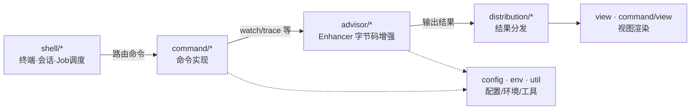

# core 模块总览

> 路径：`core/src/main/java/com/taobao/arthas/core/`（下文简称 `core/.../`）
> 在整体中的位置：**arthas 的大脑与心脏**。命令系统、字节码增强、Shell 交互、结果分发、视图渲染、MCP 桥接全部在此。

`core` 是体量最大的模块，本文档将其按功能域拆成 5 篇子文档。本页给出**全子包导航**和**内部架构**，帮助你快速定位。

---

## 全子包导航（按源码文件夹粒度）

| 源码包 | 职责一句话 | 详见 |
|---|---|---|
| `core/`（根级） | `Arthas`（attach 入口）、`GlobalOptions`/`Option`（全局开关） | [入口与全局选项](./core-入口与全局选项.md) |
| `core/server/` | **`ArthasBootstrap`**：核心单例，初始化 spy/类加载器增强/Shell/MCP | [入口与全局选项](./core-入口与全局选项.md) |
| `core/server/instrument/` | `ClassLoader_Instrument`：增强 `ClassLoader.loadClass` 保证 spy 可见 | [入口与全局选项](./core-入口与全局选项.md) |
| `core/security/` | 认证鉴权（用户名密码 / Bearer / 本地免认证） | [入口与全局选项](./core-入口与全局选项.md) |
| `core/advisor/` | **字节码增强核心**：`Enhancer`/`AdviceWeaver`/`SpyImpl`/监听器体系 | [字节码增强](./core-字节码增强.md) |
| `core/command/`（根级） | 命令骨架：`BuiltinCommandPack`/`CommandExecutorImpl`/`Constants` | [命令系统](./core-命令系统.md) |
| `core/command/basic1000/` | 基础命令：`help`/`reset`/`stop`/`cat`/`grep`/`vmoption`… | [命令系统](./core-命令系统.md) |
| `core/command/klass100/` | 类/字节码命令：`sc`/`sm`/`jad`/`dump`/`ognl`/`redefine`/`mc`/`classloader`… | [命令系统](./core-命令系统.md) |
| `core/command/monitor200/` | 监控诊断命令：`watch`/`trace`/`stack`/`monitor`/`tt`/`dashboard`/`thread`/`jvm`/`profiler`… | [命令系统](./core-命令系统.md) |
| `core/command/logger/` | 动态日志级别：`logger`（Log4j/Logback/Log4j2） | [命令系统](./core-命令系统.md) |
| `core/command/express/` | OGNL 表达式引擎：`Express`/`ExpressFactory`/`OgnlExpress` | [命令系统](./core-命令系统.md) |
| `core/command/hidden/` | 彩蛋隐藏命令：`july`/`thanks` | [命令系统](./core-命令系统.md) |
| `core/command/model/` | 命令返回的数据模型/VO 体系（100+ 类） | [命令系统](./core-命令系统.md) |
| `core/command/view/` | 命令结果视图渲染（`WatchView`/`TraceView`…） | [命令系统](./core-命令系统.md) |
| `core/shell/`（根级） | `Shell`/`ShellServer` 顶层接口 | [Shell 交互系统](./core-shell交互系统.md) |
| `core/shell/system/`(+impl) | `Job`/`Process`/`JobController` 抽象与实现 | [Shell 交互系统](./core-shell交互系统.md) |
| `core/shell/impl/` | `ShellServerImpl`/`ShellImpl` 服务端实现 | [Shell 交互系统](./core-shell交互系统.md) |
| `core/shell/command/`(+impl/internal) | `Command`/`CommandProcess`/命令注册；内部命令（grep/wc/tee 管道） | [Shell 交互系统](./core-shell交互系统.md) |
| `core/shell/cli/`(+impl) | 命令行分词 `CliToken`、补全 `Completion` | [Shell 交互系统](./core-shell交互系统.md) |
| `core/shell/session/`(+impl) | 会话状态 `Session`/`SessionManager` | [Shell 交互系统](./core-shell交互系统.md) |
| `core/shell/history/`(+impl) | 命令历史 `HistoryManager` | [Shell 交互系统](./core-shell交互系统.md) |
| `core/shell/handlers/`(+command/server/shell/term) | 各类事件 `Handler`（中断/挂起/关闭/补全…） | [Shell 交互系统](./core-shell交互系统.md) |
| `core/shell/term/`(+impl/http/httptelnet) | **终端与接入方式**：Telnet / HTTP / WebSocket(WebConsole) | [Shell 交互系统](./core-shell交互系统.md) |
| `core/shell/future/` | 异步 `Future` 机制 | [Shell 交互系统](./core-shell交互系统.md) |
| `core/config/` | `Configure` 启动配置 + `FeatureCodec` 编解码 | [支撑层](./core-支撑层.md) |
| `core/distribution/`(+impl) | **结果分发**：终端/tunnel/HTTP 多消费者 | [支撑层](./core-支撑层.md) |
| `core/env/`(+convert) | 环境/属性解析 + 类型转换 | [支撑层](./core-支撑层.md) |
| `core/util/affect/` | `EnhancerAffect`/`RowAffect` 影响统计 | [支撑层](./core-支撑层.md) |
| `core/util/matcher/` | 类/方法匹配器（通配/正则/精确/组合） | [支撑层](./core-支撑层.md) |
| `core/util/metrics/` | 速率计数器（dashboard/thread 用） | [支撑层](./core-支撑层.md) |
| `core/util/reflect/` | `ArthasReflectUtils` 反射工具 | [支撑层](./core-支撑层.md) |
| `core/util/collection/` | `GaStack` 自定义栈（trace 用） | [支撑层](./core-支撑层.md) |
| `core/util/usage/` | 命令用法帮助渲染 | [支撑层](./core-支撑层.md) |
| `core/view/` | **视图引擎**：`TableView`/`TreeView`/`KVView`/`ObjectView`/`Ansi` | [支撑层](./core-支撑层.md) |
| `core/mcp/`(+tool/function/*) | 命令→MCP 工具桥接 | [MCP/core-mcp桥接](../../03-MCP/core-mcp桥接.md) |
| `one/profiler/` | async-profiler Java 集成（`profiler` 命令底层） | [支撑层](./core-支撑层.md) |

---

## core 内部架构

**关键边界**：
- **`shell` ↔ `command`**：shell 把命令行解析成 `Job`/`Process`，调用命令的 `process(CommandProcess)`。
- **`command` ↔ `advisor`**：监控类命令（继承 `EnhancerCommand`）通过 `advisor/Enhancer` 做增强；类命令（`jad`/`sc`）直接用 `Instrumentation`。
- **`advisor` ↔ `spy`**：增强织入的是 [`spy/SpyAPI`](../../01-启动与attach/spy.md) 调用，运行时回调进 `advisor/SpyImpl`。
- **`distribution`/`view`**：所有命令结果都走分发器再到视图渲染。

---

## 阅读顺序

1. [入口与全局选项](./core-入口与全局选项.md) —— `ArthasBootstrap` 怎么完成初始化
2. [Shell 交互系统](./core-shell交互系统.md) —— 命令怎么被调度
3. [命令系统](./core-命令系统.md) —— 具体命令实现（最常查）
4. [字节码增强](./core-字节码增强.md) —— 最核心的魔法
5. [支撑层](./core-支撑层.md) —— 工具/分发/视图/profiler
