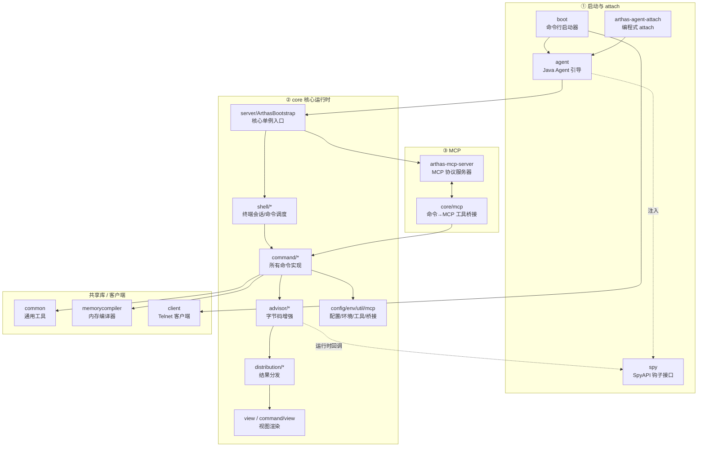

# Arthas 源码导航文档

> 基于 **arthas 4.3.0** 源码，按模块/文件夹粒度组织的源码导航与实现解析。
> 目标读者：需要快速定位 arthas 某项功能实现位置的**大模型 / code agent**，以及想理解 arthas 内部机制的工程师。

---

## 一、这是什么

Arthas 是阿里巴巴开源的 Java 应用诊断利器，能在不重启应用的前提下，通过 **Java Agent + Instrumentation 字节码增强** 实现方法观测（`watch`/`trace`）、类反编译（`jad`）、热更新（`redefine`）、线程/内存诊断（`thread`/`dashboard`）等能力。

本套文档以源码为依据，**按文件夹粒度** 划分模块，每个模块说明：

- 它在整体架构中的**职责与位置**；
- 包含哪些**关键类**（含相对路径）；
- 每个类的**一句话职责 + 核心入口方法**；
- 涉及该模块的**核心调用链**。

文档追求"准确 + 可定位"，而非穷举所有类——目的是让你（或你驱动的 agent）能拿着一个功能名词，迅速跳到对应的 `.java` 文件。

---

## 二、源码位置

- **arthas 源码根目录**：`reference/arthas/`
- 本文集中所有形如 `agent/src/main/java/.../AgentBootstrap.java` 的路径，**均相对于上述根目录**。
- 本文档目录：`reference/arthas-docs/`（与 `arthas` 源码平级）。

---

## 三、给 code agent 的使用指南

| 你想做的事 | 去哪里看 |
|---|---|
| 找某个**命令**（如 `watch`/`jad`/`thread`）的实现 | [`INDEX.md`](./INDEX.md) 的"命令 → 源码文件"速查表，或 [`02-核心运行时/core/core-命令系统.md`](./02-核心运行时/core/core-命令系统.md) |
| 理解 `watch`/`trace` 的**字节码魔法** | [`02-核心运行时/core/core-字节码增强.md`](./02-核心运行时/core/core-字节码增强.md) |
| 理解 arthas 如何**启动 / attach** 到目标 JVM | [`01-启动与attach/`](./01-启动与attach/README.md) |
| 理解命令行输入如何**路由到命令并执行** | [`02-核心运行时/core/core-shell交互系统.md`](./02-核心运行时/core/core-shell交互系统.md) |
| 理解 arthas 如何**暴露给大模型**（MCP） | [`03-MCP/`](./03-MCP/README.md) |
| 找**工具类 / 结果分发 / 视图渲染 / profiler** | [`02-核心运行时/core/core-支撑层.md`](./02-核心运行时/core/core-支撑层.md) |
| 全局**只看一张功能→文件映射表** | [`INDEX.md`](./INDEX.md) |

> 提示：每个文件夹都有一个 `README.md` 作为导航，先读它再看子文档。

---

## 四、整体架构



**一句话概括数据流**：

- **启动**：用户跑 `arthas-boot.jar` → `boot` 选进程、拉起 `arthas-core` 进程 → `agent` 的 `AgentBootstrap` 把 `spy` 注入目标 JVM BootstrapClassLoader → 反射调用 `core` 的 `ArthasBootstrap` 完成初始化、启动 Shell/MCP 服务。
- **命令**：终端输入 → `shell` 解析为 `Job`/`Process` → 路由到 `command` 下具体命令 → 命令通过 `advisor/Enhancer` 做字节码增强 → 运行时被增强的代码回调 `spy/SpyAPI` → 经 `SpyImpl` 分发到 `AdviceListener` → 结果经 `distribution` 分发、`view` 渲染回终端。
- **MCP**：大模型发 JSON-RPC `tools/call` → `arthas-mcp-server` 处理 → 经 `core/mcp` 桥接成 arthas 命令 → 复用 core 执行链路 → 结果转回 MCP 响应。

---

## 五、渐进式学习路径

建议按以下顺序阅读，由浅入深：

### 🟢 第 1 阶段：理解 arthas 怎么"挂"上去（启动链路）
1. [`01-启动与attach/boot.md`](./01-启动与attach/boot.md) —— 命令行启动器
2. [`01-启动与attach/agent.md`](./01-启动与attach/agent.md) —— Java Agent 引导
3. [`01-启动与attach/spy.md`](./01-启动与attach/spy.md) —— 钩子接口（为什么放 `java.arthas` 包）
4. [`01-启动与attach/arthas-agent-attach.md`](./01-启动与attach/arthas-agent-attach.md) —— 编程式 attach

### 🟡 第 2 阶段：理解命令怎么跑起来（core 主干）
5. [`02-核心运行时/core/README.md`](./02-核心运行时/core/README.md) —— core 总览
6. [`02-核心运行时/core/core-入口与全局选项.md`](./02-核心运行时/core/core-入口与全局选项.md) —— `ArthasBootstrap` 单例、全局选项
7. [`02-核心运行时/core/core-shell交互系统.md`](./02-核心运行时/core/core-shell交互系统.md) —— 终端/会话/Job 调度
8. [`02-核心运行时/core/core-命令系统.md`](./02-核心运行时/core/core-命令系统.md) —— 所有命令的注册与实现

### 🔴 第 3 阶段：理解最核心的魔法（字节码增强）
9. [`02-核心运行时/core/core-字节码增强.md`](./02-核心运行时/core/core-字节码增强.md) —— `Enhancer`/`AdviceWeaver`/`SpyImpl` 全链路

### 🟣 第 4 阶段：支撑能力与扩展
10. [`02-核心运行时/core/core-支撑层.md`](./02-核心运行时/core/core-支撑层.md) —— 配置/分发/环境/工具/视图/profiler
11. [`02-核心运行时/common.md`](./02-核心运行时/common.md) / [`memorycompiler.md`](./02-核心运行时/memorycompiler.md) / [`client.md`](./02-核心运行时/client.md) —— 共享库与客户端
12. [`03-MCP/arthas-mcp-server.md`](./03-MCP/arthas-mcp-server.md) + [`03-MCP/core-mcp桥接.md`](./03-MCP/core-mcp桥接.md) —— 大模型集成

---

## 六、文档目录结构

```
arthas-docs/
├── README.md                        ← 你在这里（总入口 + 架构 + 学习路径）
├── INDEX.md                         ← 功能 → 源码文件 速查表
├── 01-启动与attach/
│   ├── README.md                    ← 本组导航 + 启动/attach 总链路
│   ├── boot.md
│   ├── agent.md
│   ├── arthas-agent-attach.md
│   └── spy.md
├── 02-核心运行时/
│   ├── README.md                    ← 本组导航
│   ├── common.md
│   ├── memorycompiler.md
│   ├── client.md
│   └── core/
│       ├── README.md                ← core 总览 + 子包导航
│       ├── core-入口与全局选项.md
│       ├── core-命令系统.md
│       ├── core-字节码增强.md
│       ├── core-shell交互系统.md
│       └── core-支撑层.md
└── 03-MCP/
    ├── README.md                    ← 本组导航 + MCP 调用链
    ├── arthas-mcp-server.md
    └── core-mcp桥接.md
```

---

## 七、模块速览表

| 模块 | 路径 | 一句话职责 |
|---|---|---|
| boot | `boot/` | 命令行启动器：选进程、下载/查找 arthas、拉起 core 进程、连 telnet |
| agent | `agent/` | Java Agent 引导（`premain`/`agentmain`）与隔离类加载器 |
| arthas-agent-attach | `arthas-agent-attach/` | 在应用代码里编程式 attach arthas |
| spy | `spy/` | `SpyAPI` 钩子接口，注入目标 JVM，供增强代码回调 |
| common | `common/` | 全项目共享工具库（日志/反射/PID/端口/OS 等） |
| memorycompiler | `memorycompiler/` | 基于 JSR-199 的内存 Java 编译器（`mc`/`redefine` 依赖） |
| client | `client/` | 本地 Telnet 客户端（连 arthas telnet 服务） |
| core | `core/` | **核心**：命令系统、字节码增强、Shell 交互、结果分发、视图、MCP 桥接 |
| arthas-mcp-server | `arthas-mcp-server/` | 独立 MCP 协议服务器（JSON-RPC over HTTP/SSE） |
| core/mcp | `core/.../mcp/` | 把 arthas 命令包装成 MCP 工具的桥接层 |

> 本次覆盖范围：启动与 attach、核心运行时（core + common + memorycompiler + client）、MCP。`tunnel-*`、`web-ui`、`arthas-spring-boot-starter`、`arthas-vmtool`、`labs`、`testcase` 等模块不在本文档范围内。

---

## 八、四条核心调用链速查

### 链路 A：命令行启动
`boot/Bootstrap.main()` → `boot/ProcessUtils.startArthasCore()` →（新进程）`agent/.../AgentBootstrap.agentmain()` → `AgentBootstrap.bind()` → 反射 `core/.../server/ArthasBootstrap.getInstance()` → `ArthasBootstrap.initSpy()`（注入 spy）→ `ArthasBootstrap.bind()`（启动 Telnet/HTTP/MCP）→ `boot/ProcessUtils.startArthasClient()`（连 telnet）

### 链路 B：命令执行（以 `watch` 为例）
终端输入 → `core/.../shell/term/impl/TermImpl.readline()` → `shell/handlers/shell/ShellLineHandler` → `shell/system/impl/JobControllerImpl.createJob()` → `command/monitor200/WatchCommand.process()` → `EnhancerCommand.enhance()` → `core/.../advisor/Enhancer.enhance()`（字节码增强）

### 链路 C：字节码增强运行时回调
目标方法被调用 → 被 Enhancer 织入的 `SpyAPI.atEnter/atExit/atExceptionExit` → `core/.../advisor/SpyImpl` → `AdviceListenerManager.queryAdviceListeners()` → `WatchAdviceListener.before/afterReturning` → OGNL 求值 → `core/.../distribution` 分发 → `core/.../view` 渲染

### 链路 D：MCP 工具调用
大模型 HTTP POST `/mcp`（JSON-RPC `tools/call`）→ `arthas-mcp-server/.../handler/McpHttpRequestHandler` → `McpRequestHandler`（`tools/call`）→ `task/ServerTaskToolHandler` → `tool/DefaultToolCallback.call()` → `core/.../mcp/tool/function/...Tool`（如 `WatchTool`）→ `AbstractArthasTool.executeStreamable()` → `ArthasCommandContext` → core 的 `CommandExecutorImpl`

---

下一步建议：从 [`01-启动与attach/README.md`](./01-启动与attach/README.md) 开始，或直接查 [`INDEX.md`](./INDEX.md)。
